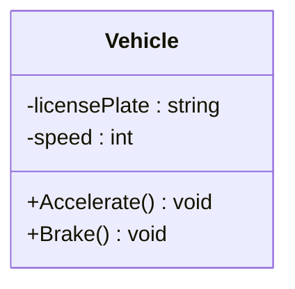
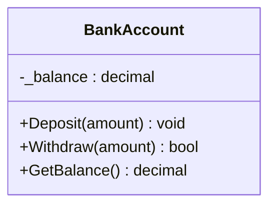
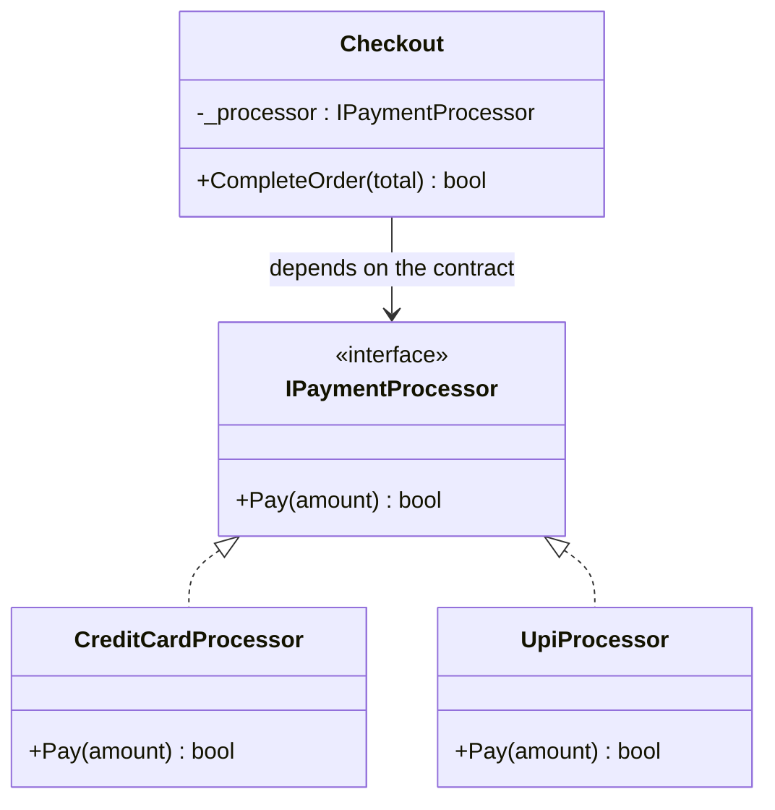
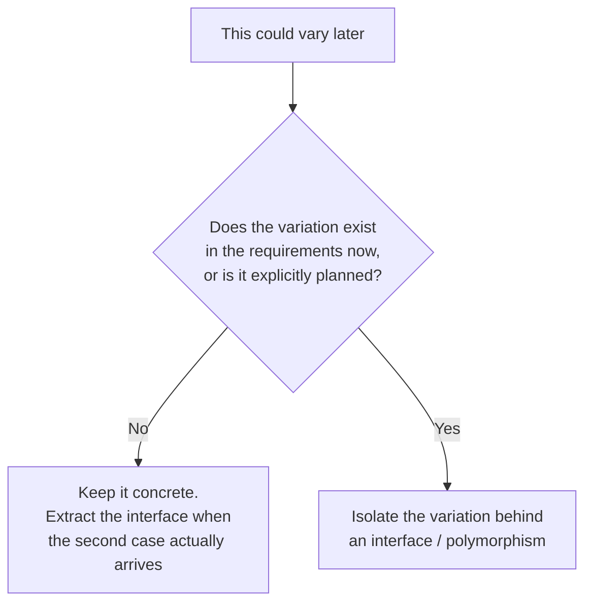
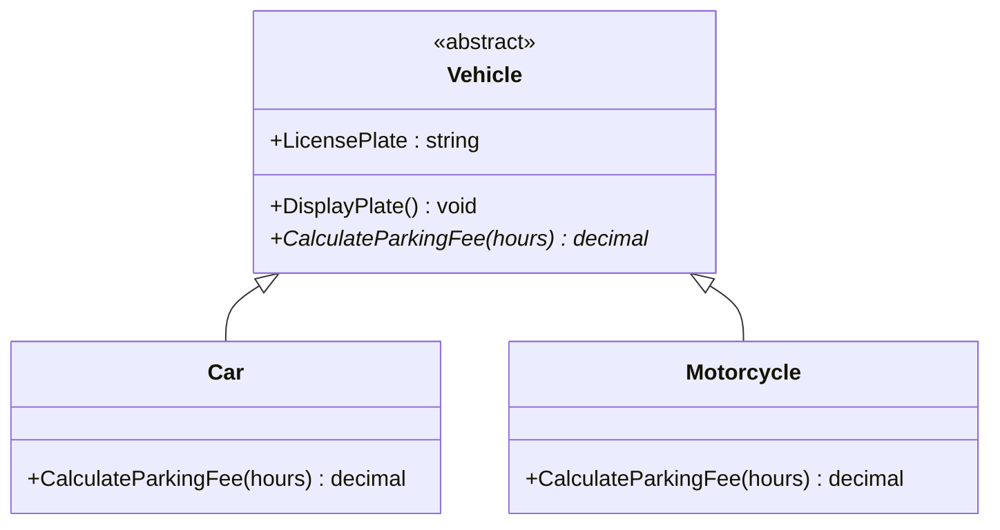
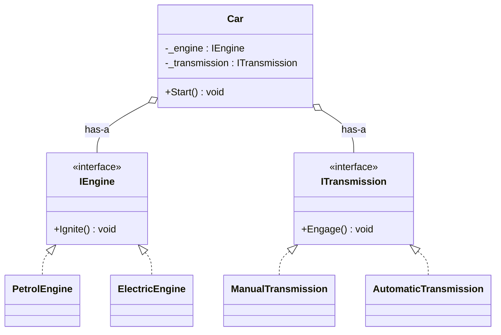

# OOP Basics for LLD Interviews

> **How to read this chapter.** Every concept below is self-contained: diagram,
> then the actual code, then the command to run it. Read straight through —
> you only need to open a `.cs` file when you want to *change* something.
> Each section ends with a **Try it** prompt; doing those is where the learning
> is. The diagrams and the snippets use the same names as the code, so nothing
> needs re-mapping in your head.

## 1. What is Low Level Design, and why does it care about OOP?

- **HLD (High Level Design)**: system-wide — services, databases, load balancers,
  message queues. "How do a million users hit this system."
- **LLD (Low Level Design)**: the internals of *one* component — classes,
  interfaces, their relationships, and responsibilities. "How do I model a
  Parking Lot / Elevator / Chess Game as code that a teammate could implement."

LLD interviews grade you on **object-oriented modeling**, not on tricky
algorithms. The interviewer wants to see:
1. You can turn a fuzzy prompt ("design a parking lot") into concrete
   requirements and actors.
2. You can partition responsibility across classes cleanly (no god objects).
3. You know the vocabulary — encapsulation, interfaces vs abstract classes,
   composition vs inheritance, the SOLID principles, and a handful of GoF
   design patterns — and can justify *why* you used one over another.
4. Your design can absorb a follow-up requirement ("now support hourly AND
   monthly parking passes") without a rewrite.

Everything in `00-Foundations` builds the vocabulary. Everything in
`01-Case-Studies` is deliberate practice applying it.

## 2. Class vs Object

- **Class**: a blueprint — field + method definitions, no memory allocated for
  the fields until instantiated.
- **Object**: a concrete instance of a class, with its own state in memory.



The box above is the **class** — the blueprint. An **object** is what you
get when you instantiate it:

```csharp
Vehicle v = new Vehicle("KA-01-1234");   // one object, its own licensePlate and speed
Vehicle w = new Vehicle("KA-02-5678");   // a second object, independent state
```

## 3. The four pillars

### 3.1 Encapsulation

Bundle state (fields) with the behavior that operates on it, and **hide the
internal state** behind a controlled interface (properties/methods), so the
object is always in a valid state. This is "information hiding" — callers
can't set a bank account balance to a negative number directly because the
field isn't exposed; they can only call `Withdraw()`, which enforces the rule.



```csharp
public class BankAccount
{
    private decimal _balance;                  // no caller can touch this

    public decimal GetBalance() => _balance;

    public bool Withdraw(decimal amount)
    {
        if (amount <= 0)
            throw new ArgumentException("Withdrawal amount must be positive.");

        if (amount > _balance)
            return false;   // invariant enforced HERE, not by the caller

        _balance -= amount;
        return true;
    }
}
```

The constructor rejects a negative opening balance too, so a `BankAccount`
never exists in an invalid state — not even for an instant.

📄 [`csharp/Encapsulation.cs`](csharp/Encapsulation.cs) · `dotnet run --project Runner encapsulation`

> **Try it:** make `_balance` public and set it to `-500` from `Run()`. That
> compiles — which is exactly the point. Now put it back and try to reach a
> negative balance through `Deposit`/`Withdraw` only. You can't.

**Interview signal**: fields are `private`, mutation happens through methods
that enforce invariants. If you catch yourself writing public mutable fields
in an interview, that's a red flag the interviewer will probe.

### 3.2 Abstraction

Expose *what* an object does, hide *how*. In C#, this is `interface` or
`abstract class`. Callers program against the abstraction and don't care
about the concrete implementation.



`Checkout` is the part that matters — it is the *caller*, and it never learns
which processor it got:

```csharp
public interface IPaymentProcessor
{
    bool Pay(decimal amount);
}

// Knows nothing about credit cards or UPI — only the contract.
// Add a new IPaymentProcessor later and this class is unchanged.
public class Checkout
{
    private readonly IPaymentProcessor _processor;

    public Checkout(IPaymentProcessor processor)
    {
        _processor = processor;
    }

    public bool CompleteOrder(decimal total) => _processor.Pay(total);
}
```

📄 [`csharp/Abstraction.cs`](csharp/Abstraction.cs) · `dotnet run --project Runner abstraction`

> **Try it:** swap `new CreditCardProcessor()` for `new UpiProcessor()` in
> `Run()`, then add a third processor (`class WalletProcessor : IPaymentProcessor`)
> and pass that instead. Note what you *didn't* have to edit: `Checkout`.
> That untouched class is the whole return on the abstraction.

**Interview signal**: abstraction is the mechanism that lets you add a new
implementation without touching existing callers. It's the seed of the
Open/Closed Principle (see
[`../03-SOLID-Principles/notes.md`](../03-SOLID-Principles/notes.md)) and of
most Strategy/Factory usage in case studies.

⚠️ **But "X could vary someday" is not a reason to add an interface.**
Abstraction has a real cost — an extra file, an indirection, and a signal
to readers that the design anticipates variation. Apply this test:



One implementation and no stated second case → write the concrete class.
The refactor later is cheap and your IDE does it for you. This is YAGNI,
and it's covered in full in
[`../06-Core-Design-Principles/notes.md`](../06-Core-Design-Principles/notes.md)
and [`../10-Anti-Patterns/notes.md`](../10-Anti-Patterns/notes.md) —
"premature abstraction" is the anti-pattern candidates most often commit
while trying to look sophisticated.

### 3.3 Inheritance

An "is-a" relationship — a subclass extends a base class, inheriting its
members and optionally overriding behavior.



```csharp
public abstract class Vehicle
{
    public string LicensePlate { get; }

    // Shared behavior — written once, inherited by every subtype.
    public void DisplayPlate() => Console.WriteLine($"Plate: {LicensePlate}");

    // Each subtype MUST supply its own pricing rule. `abstract` = no default.
    public abstract decimal CalculateParkingFee(int hours);
}

public class Car : Vehicle
{
    public override decimal CalculateParkingFee(int hours) => 20m + 10m * hours;
}

public class Motorcycle : Vehicle
{
    public override decimal CalculateParkingFee(int hours) => 10m + 5m * hours;
}
```

Note what earns the hierarchy here: `DisplayPlate()` is *shared behavior*, not
just a shared field. That is the bar inheritance has to clear.

📄 [`csharp/Inheritance.cs`](csharp/Inheritance.cs) · `dotnet run --project Runner inheritance`

> **Try it:** add `class Truck : Vehicle` without overriding
> `CalculateParkingFee`. The compiler refuses — an abstract member is a
> contract the base class forces every subtype to honour. Then delete
> `abstract` and give it a default body: now `Truck` silently inherits car-ish
> pricing. Which of those two failure modes would you rather have in an
> interview? (The compile error. Always.)

**Interview trap**: inheritance is overused by candidates who reach for it by
default. Prefer inheritance only for genuine "is-a" hierarchies with shared
*behavior*, not just shared *data*. If you're inheriting just to reuse a
couple of fields, you probably want composition instead (see below) — this is
literally the "favor composition over inheritance" GoF principle, and
interviewers listen for it.

### 3.4 Polymorphism

One interface, many implementations, resolved at **runtime** (dynamic /
subtype polymorphism — the kind LLD interviews care about) via virtual
dispatch. There's also **compile-time polymorphism** (method overloading),
which is a minor variant.

```csharp
var vehicles = new List<Vehicle>
{
    new Car("KA-01-1111"),
    new Motorcycle("KA-01-2222"),
    new Car("KA-01-3333"),
};

foreach (var vehicle in vehicles)
{
    // Declared type is Vehicle; the ACTUAL type decides which override runs.
    decimal fee = vehicle.CalculateParkingFee(hours: 2);
    Console.WriteLine($"{vehicle.LicensePlate}: {fee:C}");
}

// Compile-time polymorphism (overloading), for contrast — the compiler picks
// the method by argument type, and it's a far weaker tool.
private static int Add(int a, int b) => a + b;
private static double Add(double a, double b) => a + b;
```

📄 [`csharp/Polymorphism.cs`](csharp/Polymorphism.cs) · `dotnet run --project Runner polymorphism`

> **Try it:** rewrite that loop the bad way — `if (vehicle is Car) ... else if
> (vehicle is Motorcycle) ...` — and then add a `Truck`. Count the places you
> have to edit. That count is the argument for polymorphism, and it's the
> answer to give when an interviewer asks why you avoided a type switch.

**Interview signal**: this is exactly what lets you write
`foreach (var shape in shapes) shape.Draw();` without an `if/else` chain on
type. If your design has a big `switch` statement dispatching on a `type`
enum field, that's almost always a sign you should be using polymorphism
(and it violates Open/Closed — see SOLID notes).

## 4. Composition vs Inheritance ("has-a" vs "is-a")

| | Inheritance ("is-a") | Composition ("has-a") |
|---|---|---|
| Relationship | `Car` is-a `Vehicle` | `Car` has-a `Engine` |
| Coupling | Tight — subclass depends on base internals | Loose — depends only on an interface |
| Flexibility | Fixed at compile time | Can swap the composed object at runtime |
| Reuse | Reuses base class code | Reuses via delegation |
| LLD interview default | Use sparingly, for true taxonomies | **Prefer this** for most "component" relationships |



```csharp
public interface IEngine { void Ignite(); }
public interface ITransmission { void Engage(); }

// ONE concrete Car. It delegates the parts that vary.
public class Car
{
    private readonly string _model;
    private readonly IEngine _engine;
    private readonly ITransmission _transmission;

    public Car(string model, IEngine engine, ITransmission transmission)
    {
        _model = model;
        _engine = engine;
        _transmission = transmission;
    }

    public void Start()
    {
        _engine.Ignite();
        _transmission.Engage();
    }
}

// Same Car class every time — only the injected parts differ.
new Car("Hatchback", new PetrolEngine(),   new ManualTransmission()).Start();
new Car("City EV",   new ElectricEngine(), new AutomaticTransmission()).Start();
```

**Why the second axis is in there.** With one axis, inheritance looks fine —
`PetrolCar` and `ElectricCar`, done. Add transmission and a hierarchy needs
`PetrolManualCar`, `PetrolAutomaticCar`, `ElectricManualCar`,
`ElectricAutomaticCar`: 2 × 2 subclasses, then 3 × 3 the moment a third engine
and a third transmission appear. Composition keeps the axes separate and
combines them at runtime — 4 small classes cover all four behaviours.

This is not a verdict against inheritance. `Vehicle → Car / Motorcycle` above
is a genuine taxonomy with shared behaviour and one axis of variation, and a
hierarchy models it well. Composition earns its keep when the variation lives
in a *part*, or when the axes multiply.

📄 [`csharp/Composition.cs`](csharp/Composition.cs) · `dotnet run --project Runner composition`

> **Try it:** add a `HybridEngine` and run every engine × transmission
> combination. You wrote one class and got new behaviours for free. Now sketch
> the subclass names the inheritance version would have needed — that list is
> your answer when an interviewer asks "why composition here?"

This composition-first instinct is what separates strong LLD answers from ones
that end up with a rigid, deep inheritance tree by the 30-minute mark.

## 5. UML relationship cheat sheet (used constantly in `02-UML-Object-Oriented-Design`)

| Relationship | Meaning | Lifetime coupling | UML arrow |
|---|---|---|---|
| Association | "uses/knows about" | independent | plain line `-->` |
| Aggregation | "has-a", whole-part, part can outlive whole | independent (weak) | hollow diamond `o--` |
| Composition | "owns-a", whole-part, part dies with whole | dependent (strong) | filled diamond `*--` |
| Inheritance | "is-a" | — | hollow triangle `<\|--` |
| Realization | "implements" (interface) | — | dashed hollow triangle `<\|..` |
| Dependency | "temporarily uses" (e.g. method parameter) | none | dashed arrow `..>` |

## 6. Interface vs Abstract Class

| | Interface | Abstract class |
|---|---|---|
| Purpose | Pure contract — *what* | Partial implementation — *what* + some *how* |
| State (fields) | No instance fields (C# 8+ allows default methods but still no state) | Can hold fields/state |
| Multiple inheritance | A class can implement many | C# allows extending only **one** abstract class |
| When to use | Unrelated classes need the same capability (`IComparable`, `IPayable`) | Related classes share common code/state and a taxonomy |

**Interview rule of thumb**: default to interfaces for defining capabilities
("can this thing be `Payable`, `Comparable`, `Observable`?"). Reach for an
abstract class only when you have real shared implementation to put in the
base (e.g., every `Vehicle` subtype shares a `licensePlate` field and a
`Park()` method body).

## 7. Common interview variations on this topic

- "Explain encapsulation with an example from a system you designed." → tie it
  back to a case study (e.g., `ParkingSpot` hides its `isOccupied` flag behind
  `Assign()`/`Free()` so it can never be double-booked).
- "When would you use an abstract class over an interface, and vice versa?"
- "Why prefer composition over inheritance? Give an example where inheritance
  breaks down (the classic *Square-extends-Rectangle* / *Penguin-extends-Bird*
  violates Liskov Substitution — see `03-SOLID-Principles`)."
- "What's the difference between overloading and overriding?" (compile-time vs
  runtime polymorphism).

## 8. Recap — the code, and what each file is evidence of

The snippets above are excerpts; these are the full, runnable versions.

| § | File | Run | The claim it demonstrates |
|---|---|---|---|
| 3.1 | [`csharp/Encapsulation.cs`](csharp/Encapsulation.cs) | `dotnet run --project Runner encapsulation` | A `BankAccount` can't be driven into an invalid state from outside |
| 3.2 | [`csharp/Abstraction.cs`](csharp/Abstraction.cs) | `dotnet run --project Runner abstraction` | `Checkout` is untouched when a new payment method is added |
| 3.3 | [`csharp/Inheritance.cs`](csharp/Inheritance.cs) | `dotnet run --project Runner inheritance` | An abstract member forces every subtype to supply its own rule |
| 3.4 | [`csharp/Polymorphism.cs`](csharp/Polymorphism.cs) | `dotnet run --project Runner polymorphism` | A `List<Vehicle>` prices itself with no type switch |
| 4 | [`csharp/Composition.cs`](csharp/Composition.cs) | `dotnet run --project Runner composition` | One `Car` class covers every engine × transmission combination |

Tests for all five are in
[`Tests/LLD.Foundations.Tests/`](../../Tests/LLD.Foundations.Tests/)
(`OopBasicsTests.cs`, `OopCompositionTests.cs`) — worth reading, since each
test names the property the pillar is supposed to guarantee. Run them with
`dotnet test LLD-Claude.slnx`.

**Before moving on to [`02-UML`](../02-UML-Object-Oriented-Design/notes.md)**,
check you can answer without looking: why is `Checkout` the interesting class
in the abstraction example, and what would inheritance have cost you in the
composition example?
