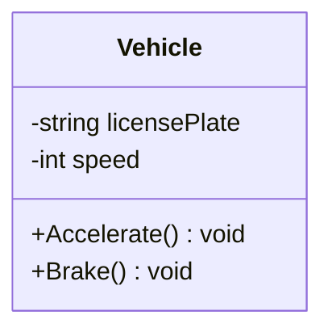
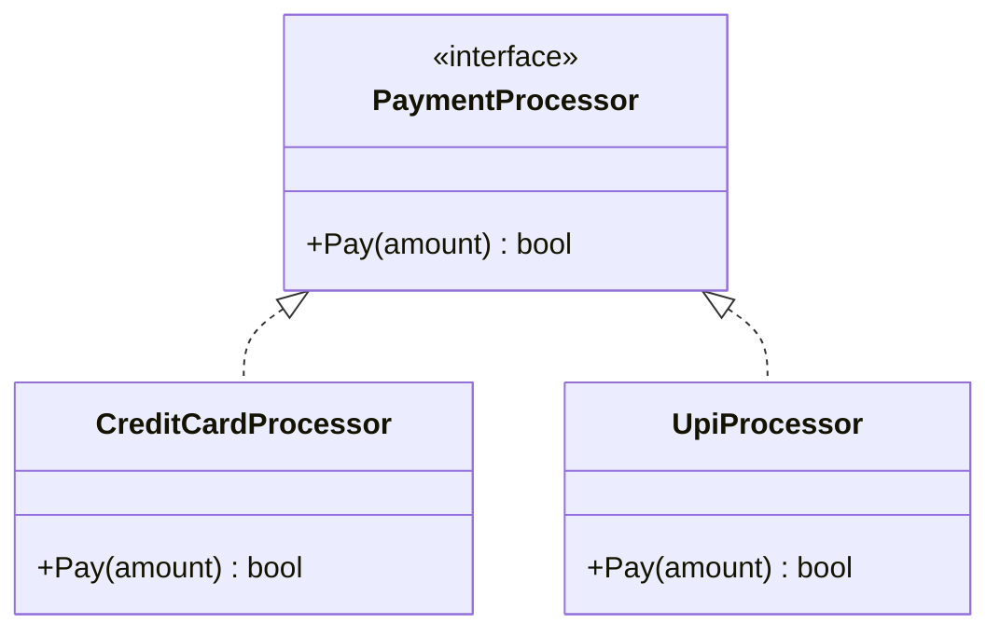
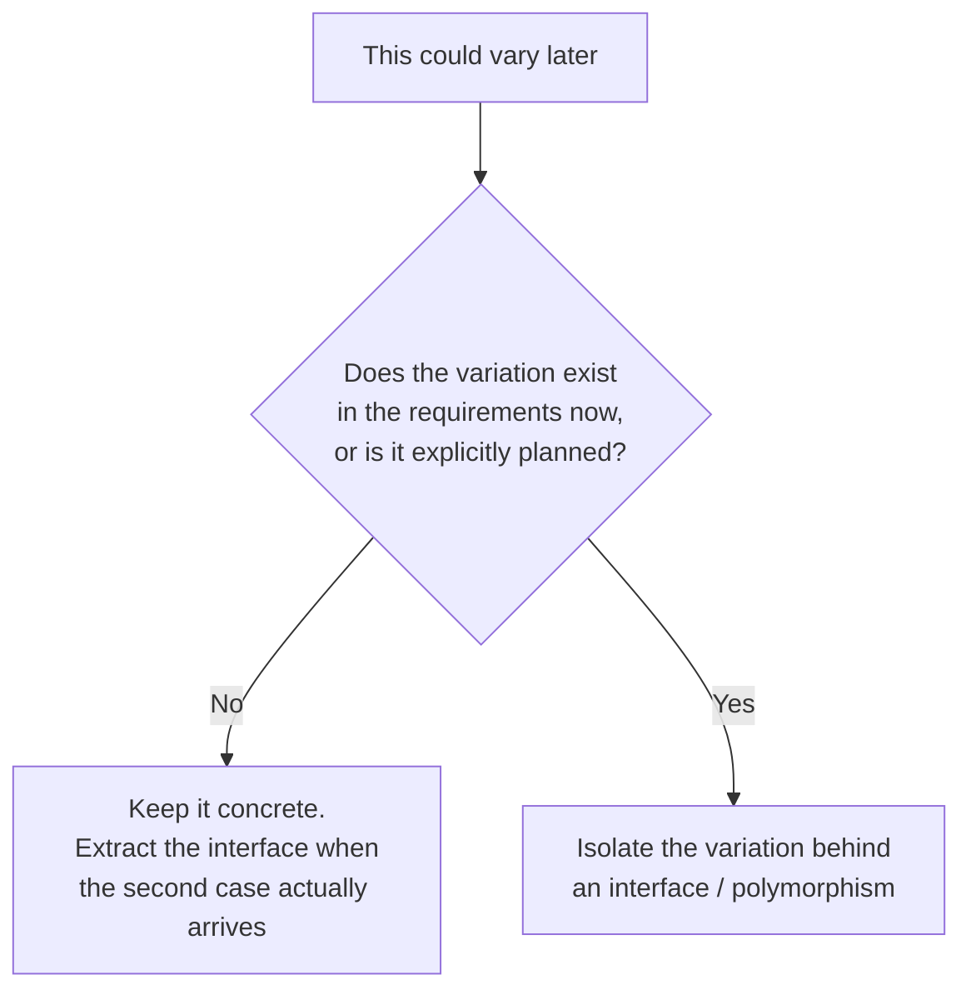
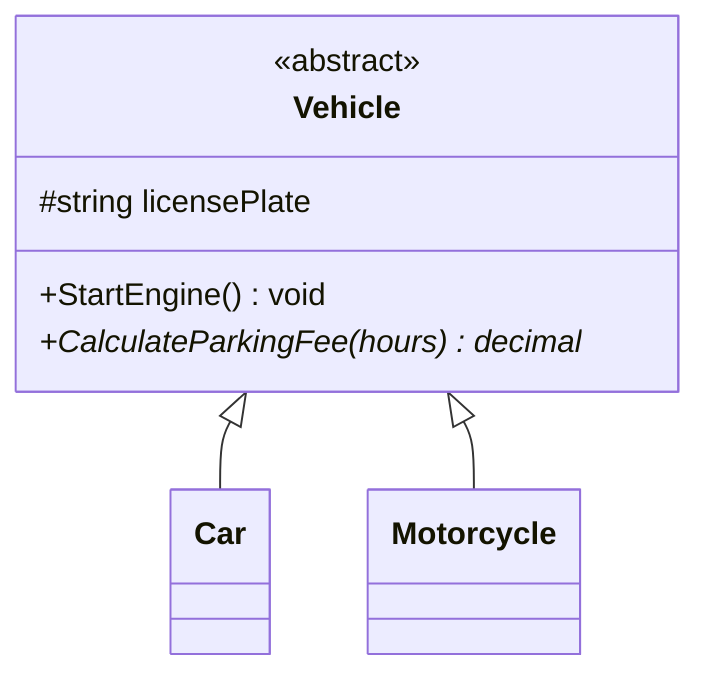
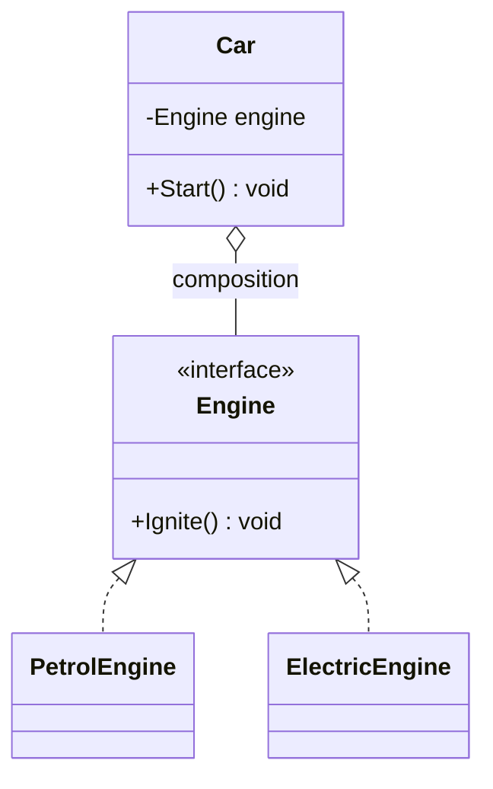

# OOP Basics for LLD Interviews

## 1. What is Low Level Design, and why does it care about OOP?

- **HLD (High Level Design)**: system-wide — services, databases, load balancers,
  message queues. "How do a million users hit this system."
- **LLD (Low Level Design)**: the internals of *one* component — classes,
  interfaces, their relationships, and responsibilities. "How do I model a
  Parking Lot / Elevator / Chess Game as code that a teammate could implement."

LLD interviews grade you on **object-oriented modeling**, not on tricky
algorithms. The interviewer wants to see:
1. You can turn a fuzzy prompt ("design a parking lot") into concrete
   requirements and actors.
2. You can partition responsibility across classes cleanly (no god objects).
3. You know the vocabulary — encapsulation, interfaces vs abstract classes,
   composition vs inheritance, the SOLID principles, and a handful of GoF
   design patterns — and can justify *why* you used one over another.
4. Your design can absorb a follow-up requirement ("now support hourly AND
   monthly parking passes") without a rewrite.

Everything in `00-Foundations` builds the vocabulary. Everything in
`01-Case-Studies` is deliberate practice applying it.

## 2. Class vs Object

- **Class**: a blueprint — field + method definitions, no memory allocated for
  the fields until instantiated.
- **Object**: a concrete instance of a class, with its own state in memory.



The box above is the **class** — the blueprint. An **object** is what you
get when you instantiate it:

```csharp
Vehicle v = new Vehicle("KA-01-1234");   // one object, its own licensePlate and speed
Vehicle w = new Vehicle("KA-02-5678");   // a second object, independent state
```

## 3. The four pillars

### 3.1 Encapsulation

Bundle state (fields) with the behavior that operates on it, and **hide the
internal state** behind a controlled interface (properties/methods), so the
object is always in a valid state. This is "information hiding" — callers
can't set a bank account balance to a negative number directly because the
field isn't exposed; they can only call `Withdraw()`, which enforces the rule.


**Interview signal**: fields are `private`, mutation happens through methods
that enforce invariants. If you catch yourself writing public mutable fields
in an interview, that's a red flag the interviewer will probe.

### 3.2 Abstraction

Expose *what* an object does, hide *how*. In C#, this is `interface` or
`abstract class`. Callers program against the abstraction and don't care
about the concrete implementation.



**Interview signal**: abstraction is the mechanism that lets you add a new
implementation without touching existing callers. It's the seed of the
Open/Closed Principle (see
[`../03-SOLID-Principles/notes.md`](../03-SOLID-Principles/notes.md)) and of
most Strategy/Factory usage in case studies.

⚠️ **But "X could vary someday" is not a reason to add an interface.**
Abstraction has a real cost — an extra file, an indirection, and a signal
to readers that the design anticipates variation. Apply this test:



One implementation and no stated second case → write the concrete class.
The refactor later is cheap and your IDE does it for you. This is YAGNI,
and it's covered in full in
[`../06-Core-Design-Principles/notes.md`](../06-Core-Design-Principles/notes.md)
and [`../10-Anti-Patterns/notes.md`](../10-Anti-Patterns/notes.md) —
"premature abstraction" is the anti-pattern candidates most often commit
while trying to look sophisticated.

### 3.3 Inheritance

An "is-a" relationship — a subclass extends a base class, inheriting its
members and optionally overriding behavior.



**Interview trap**: inheritance is overused by candidates who reach for it by
default. Prefer inheritance only for genuine "is-a" hierarchies with shared
*behavior*, not just shared *data*. If you're inheriting just to reuse a
couple of fields, you probably want composition instead (see below) — this is
literally the "favor composition over inheritance" GoF principle, and
interviewers listen for it.

### 3.4 Polymorphism

One interface, many implementations, resolved at **runtime** (dynamic /
subtype polymorphism — the kind LLD interviews care about) via virtual
dispatch. There's also **compile-time polymorphism** (method overloading),
which is a minor variant.

```csharp
Vehicle v = isMotorcycle ? new Motorcycle() : new Car();
decimal fee = v.CalculateParkingFee(3); // resolves to the right override at runtime
```

**Interview signal**: this is exactly what lets you write
`foreach (var shape in shapes) shape.Draw();` without an `if/else` chain on
type. If your design has a big `switch` statement dispatching on a `type`
enum field, that's almost always a sign you should be using polymorphism
(and it violates Open/Closed — see SOLID notes).

## 4. Composition vs Inheritance ("has-a" vs "is-a")

| | Inheritance ("is-a") | Composition ("has-a") |
|---|---|---|
| Relationship | `Car` is-a `Vehicle` | `Car` has-a `Engine` |
| Coupling | Tight — subclass depends on base internals | Loose — depends only on an interface |
| Flexibility | Fixed at compile time | Can swap the composed object at runtime |
| Reuse | Reuses base class code | Reuses via delegation |
| LLD interview default | Use sparingly, for true taxonomies | **Prefer this** for most "component" relationships |



A `Car` composed with an `Engine` interface can become an `ElectricCar` just
by injecting a different `Engine` implementation — no class hierarchy change
needed. This composition-first instinct is what separates strong LLD answers
from ones that end up with a rigid, deep inheritance tree by the 30-minute
mark.

## 5. UML relationship cheat sheet (used constantly in `02-UML-Object-Oriented-Design`)

| Relationship | Meaning | Lifetime coupling | UML arrow |
|---|---|---|---|
| Association | "uses/knows about" | independent | plain line `-->` |
| Aggregation | "has-a", whole-part, part can outlive whole | independent (weak) | hollow diamond `o--` |
| Composition | "owns-a", whole-part, part dies with whole | dependent (strong) | filled diamond `*--` |
| Inheritance | "is-a" | — | hollow triangle `<\|--` |
| Realization | "implements" (interface) | — | dashed hollow triangle `<\|..` |
| Dependency | "temporarily uses" (e.g. method parameter) | none | dashed arrow `..>` |

## 6. Interface vs Abstract Class

| | Interface | Abstract class |
|---|---|---|
| Purpose | Pure contract — *what* | Partial implementation — *what* + some *how* |
| State (fields) | No instance fields (C# 8+ allows default methods but still no state) | Can hold fields/state |
| Multiple inheritance | A class can implement many | C# allows extending only **one** abstract class |
| When to use | Unrelated classes need the same capability (`IComparable`, `IPayable`) | Related classes share common code/state and a taxonomy |

**Interview rule of thumb**: default to interfaces for defining capabilities
("can this thing be `Payable`, `Comparable`, `Observable`?"). Reach for an
abstract class only when you have real shared implementation to put in the
base (e.g., every `Vehicle` subtype shares a `licensePlate` field and a
`Park()` method body).

## 7. Common interview variations on this topic

- "Explain encapsulation with an example from a system you designed." → tie it
  back to a case study (e.g., `ParkingSpot` hides its `isOccupied` flag behind
  `Assign()`/`Free()` so it can never be double-booked).
- "When would you use an abstract class over an interface, and vice versa?"
- "Why prefer composition over inheritance? Give an example where inheritance
  breaks down (the classic *Square-extends-Rectangle* / *Penguin-extends-Bird*
  violates Liskov Substitution — see `03-SOLID-Principles`)."
- "What's the difference between overloading and overriding?" (compile-time vs
  runtime polymorphism).

## 8. Code in this folder

- `csharp/Encapsulation.cs` — `BankAccount` enforcing invariants through methods.
- `csharp/Abstraction.cs` — `IPaymentProcessor` with two implementations.
- `csharp/Inheritance.cs` — `Vehicle` → `Car` / `Motorcycle` abstract hierarchy.
- `csharp/Polymorphism.cs` — runtime dispatch over a `List<Vehicle>`.

Run any of them with `dotnet run --project Runner encapsulation`
(`abstraction`, `inheritance`, `polymorphism`).
