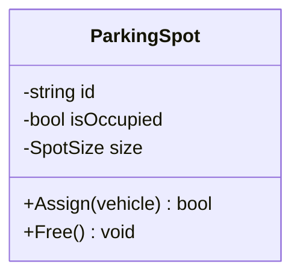
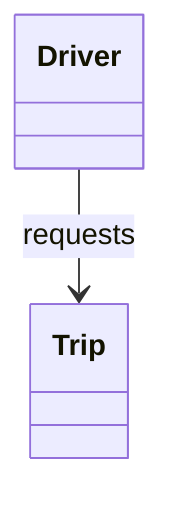
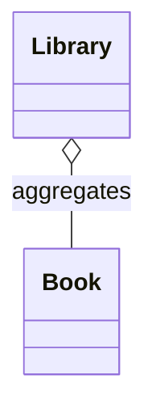
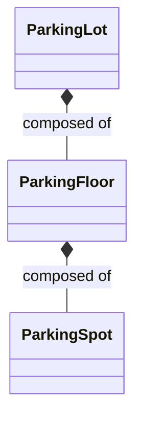
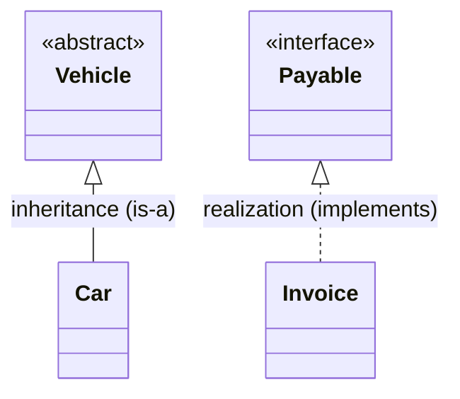
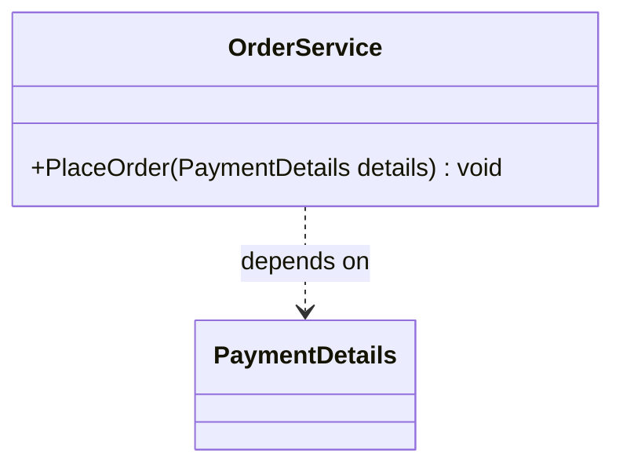
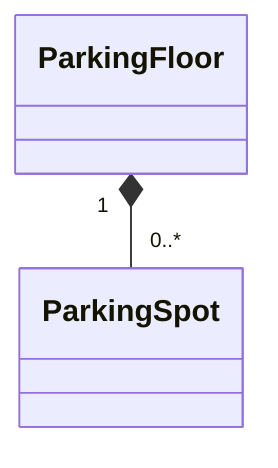
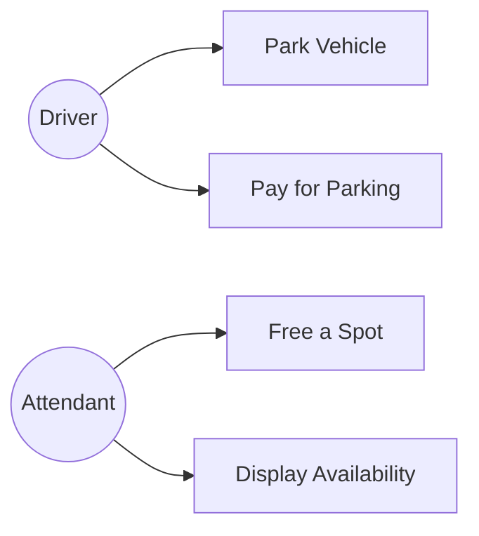
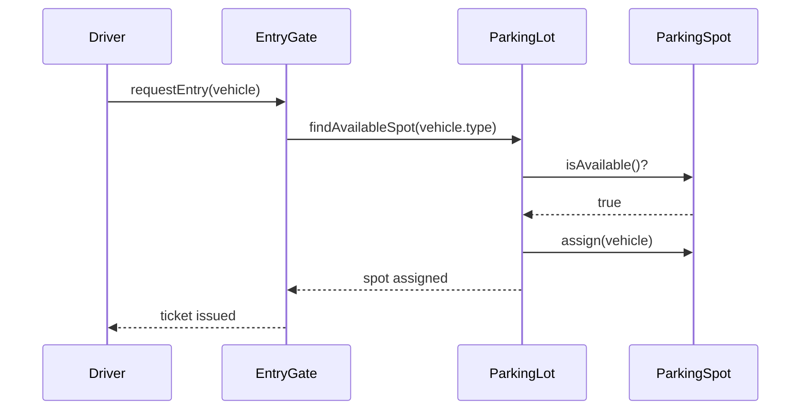
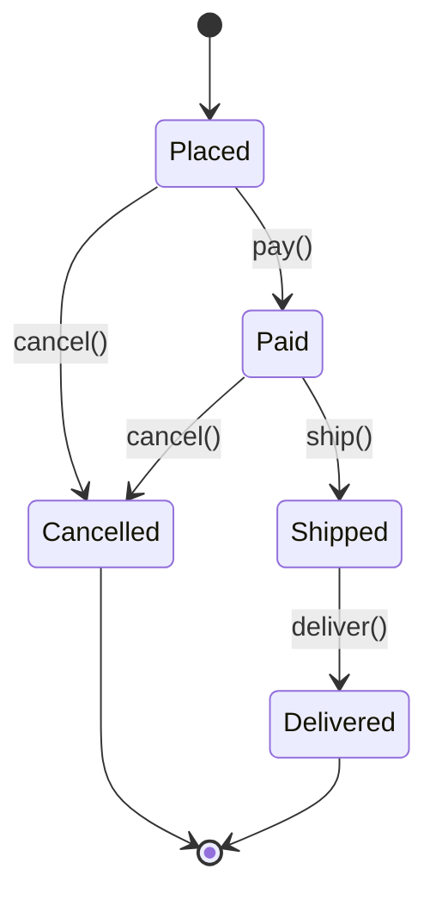

# UML & Object-Oriented Design

UML (Unified Modeling Language) is the diagramming vocabulary interviewers
expect you to speak fluently — not because they want a textbook-perfect
diagram, but because it's the fastest shared language for "here are my
classes and how they relate."

**Don't over-invest in UML.** The goal is communicating a design, not
notation fluency. Nobody will fail you for a slightly wrong arrowhead;
they will notice if you can't express containment or a lifecycle clearly.
Budget your effort:

| Diagram | Value in LLD interviews | Why |
|---|---|---|
| **Class diagram** | ★★★★★ | The main artifact of nearly every LLD round |
| **Sequence diagram** | ★★★★★ | Shows call order and surfaces concurrency issues |
| **State diagram** | ★★★★☆ | Essential wherever a lifecycle exists (order, elevator, ATM, ride) |
| **Use case diagram** | ★★☆☆☆ | A spoken actor→action list usually serves the same purpose faster |
| Activity / object / package / component | ★☆☆☆☆ | Rarely asked; recognize them, don't study them |

The three starred ones are covered below. That's enough for essentially
every LLD interview.

## 1. Class Diagram anatomy

- **Top compartment**: class name (abstract classes/interfaces italicized or
  marked `<<interface>>` / `<<abstract>>`).
- **Middle compartment**: attributes, formatted `visibility name: type`.
  - `-` private, `+` public, `#` protected, `~` package-private.
- **Bottom compartment**: methods, formatted `visibility name(params): returnType`.

## 2. Relationships — the part people get wrong in interviews

This is the single most-tested UML concept in LLD interviews: **aggregation
vs composition**. Get this right and you'll sound precise; mix them up and
it undercuts an otherwise-good design.

### 2.1 Association — "uses / knows about"

Two classes are linked, neither owns the other, no lifecycle coupling.

`Driver` knows about `Trip`, but a `Trip` isn't "part of" a `Driver` and
doesn't die when the `Driver` object does.

### 2.2 Aggregation — "has-a," weak ownership

Whole-part relationship, but **the part can outlive the whole**. Hollow
diamond on the "whole" side.

A `Library` has `Book`s, but if the `Library` object is destroyed, the
`Book`s still conceptually exist (they can be moved to another library).

### 2.3 Composition — "owns-a," strong ownership

Whole-part relationship where **the part cannot exist without the whole**.
Filled diamond on the "whole" side.

A `ParkingFloor` has no meaning outside its `ParkingLot`; if the lot is torn
down, the floors go with it. This is the relationship you reach for most
often in LLD case studies (`ParkingLot` → `Floor` → `Spot`, `Order` → `LineItem`).

### Deciding between them

Don't think about garbage collection — in C# the GC frees whatever is
unreachable regardless of which relationship you drew, so "will the object
be deleted?" is the wrong question and will mislead you (by that logic
every `List<T>` field would look like composition).

The real test is about **ownership and conceptual lifecycle**:

> **Composition**: the part belongs *exclusively* to this whole, is created
> and controlled by it, and has no meaningful independent existence. It
> can't be shared with or transferred to another whole.
>
> **Aggregation**: the whole references parts that exist independently of
> it, could belong to a different whole instead, and may outlive it.

| Example | Relationship | Why |
|---|---|---|
| `ParkingFloor` → `ParkingSpot` | Composition | A spot is defined by its floor; it can't be moved to another building |
| `Order` → `OrderLineItem` | Composition | A line item has no meaning outside its order |
| `Library` → `Book` | Aggregation | A book can be transferred to another library |
| `Team` → `Employee` | Aggregation | An employee exists before, after, and outside the team |

**Honest caveat worth knowing**: UML's aggregation semantics are famously
vague, and practitioners disagree about borderline cases. Interviewers care
that you can distinguish *strong exclusive ownership* from *a reference to
something independent* — they will not quibble over a hollow vs filled
diamond. If you're unsure, say which you mean in words.

### 2.4 Inheritance ("is-a") and Realization ("implements")

- Inheritance: solid line, hollow triangle, extends a base **class**.
- Realization: dashed line, hollow triangle, implements an **interface**.

### 2.5 Dependency — "temporarily uses"

The weakest relationship: one class uses another only within a method (as a
parameter, local variable, or return type), with no field holding a
reference.

### 2.6 Multiplicity

Written at each end of a relationship: `1`, `0..1`, `1..*`, `0..*` (a.k.a.
`*`), or an exact `n`.

Reads as: one `ParkingFloor` is composed of zero-or-more `ParkingSpot`s.

### 2.7 Full cheat sheet

| Relationship | Verb | Arrow | Lifecycle |
|---|---|---|---|
| Association | uses/knows | `-->` plain | independent |
| Aggregation | has-a (weak) | `o--` hollow diamond | part outlives whole |
| Composition | owns-a (strong) | `*--` filled diamond | part dies with whole |
| Inheritance | is-a | `<\|--` hollow triangle, solid line | — |
| Realization | implements | `<\|..` hollow triangle, dashed line | — |
| Dependency | temporarily uses | `..>` dashed arrow | none |

## 3. Use Case Diagram — nailing down scope in the first 5 minutes

Before any class diagram, a strong candidate spends a few minutes turning
"design a parking lot" into **actors** and **use cases**. This is also where
you ask clarifying questions (multiple entry gates? multiple vehicle types?
payment on entry or exit? reserved spots?).

Use case diagrams don't need to be fancy — a bullet list of "Actor → does
X" said out loud is often enough, but sketching it signals structured
thinking.

## 4. Sequence Diagram — for tricky flows

Useful when a flow has a non-obvious order of calls or concurrency concerns
(e.g. two drivers racing for the last spot). Shows objects as vertical
lifelines and calls as horizontal arrows over time.

You don't need to memorize sequence diagram syntax perfectly for a verbal
interview — the point is showing you can reason about *order of operations*
and *who calls whom*, which also surfaces concurrency issues (e.g. "what if
two drivers hit `findAvailableSpot` at the same time?" → leads into a
locking/thread-safety discussion, a very common senior-level follow-up).

## 4b. State Diagram — for anything with a lifecycle

Whenever an object moves through phases with rules about what's allowed in
each, sketch the state machine **before** writing the class. It gives you
your legal transitions, your illegal ones (i.e. your error cases), and your
test list, all at once.

Read it as: from `Shipped`, the *only* legal move is `deliver()` — so
`cancel()` from `Shipped` must be rejected. That's a requirement you'd
likely miss if you went straight to code.

This maps directly onto the
[State pattern](../04-Design-Patterns/Behavioral/State/notes.md), and applies
to Vending Machine, ATM, Elevator, Movie Booking, Car Rental, Chess, and
Cab Booking among others.

A useful companion artifact is a **state transition table**, which makes
gaps obvious in a way a diagram sometimes hides:

| From \ Event | pay() | ship() | deliver() | cancel() |
|---|---|---|---|---|
| **Placed** | Paid | ❌ | ❌ | Cancelled |
| **Paid** | ❌ | Shipped | ❌ | Cancelled |
| **Shipped** | ❌ | ❌ | Delivered | ❌ |
| **Delivered** | ❌ | ❌ | ❌ | ❌ |
| **Cancelled** | ❌ | ❌ | ❌ | ❌ |

Every ❌ is an error case you now know to handle deliberately.

## 5. From requirements to a class diagram — the mechanical steps

1. **Extract nouns** from the requirements → candidate classes
   (`ParkingLot`, `ParkingSpot`, `Vehicle`, `Ticket`, `Payment`).
2. **Extract verbs** → candidate methods (`park()`, `unpark()`, `pay()`).
3. **Group attributes** with the noun they describe.
4. **Decide relationships** using the aggregation/composition test above.
5. **Look for varying behavior** → that's where an interface + polymorphism
   replaces an `if/switch` on a type field (e.g. `VehicleType` enum driving
   fee calculation → instead, a `CalculateFee()` method overridden per
   `Vehicle` subclass).
6. **Apply SOLID** (next folder) to tighten the design.
7. **Reach for a design pattern** only when it solves a concrete problem you
   already identified — never bolt one on just to "use a pattern."

## 6. Common interview variations

- "Draw the class diagram for X" — expect this to be live, evolving as you
  talk, not a finished artifact you present once.
- "What's the difference between aggregation and composition? Give an
  example from your design." — always have a concrete example ready from
  whatever you just drew.
- "Walk me through what happens when two requests race for the same
  resource" — sequence diagram + concurrency discussion.
- "How would this diagram change if we needed to support Y?" — tests whether
  your relationships are flexible (interfaces/composition) or brittle
  (concrete classes wired together, deep inheritance).
