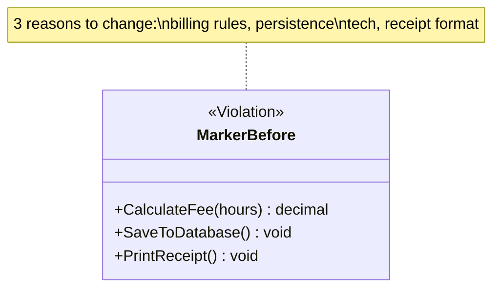
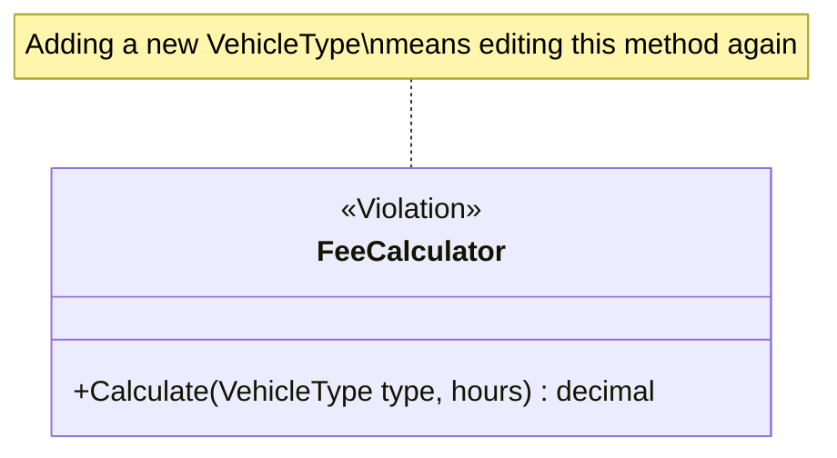
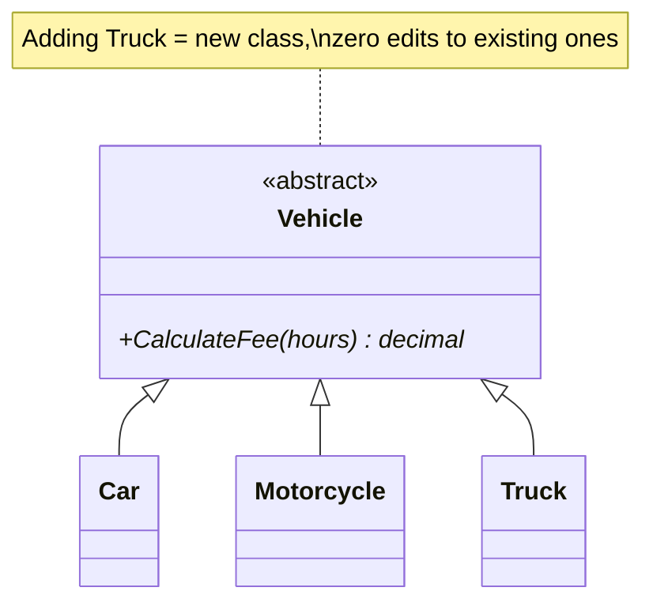
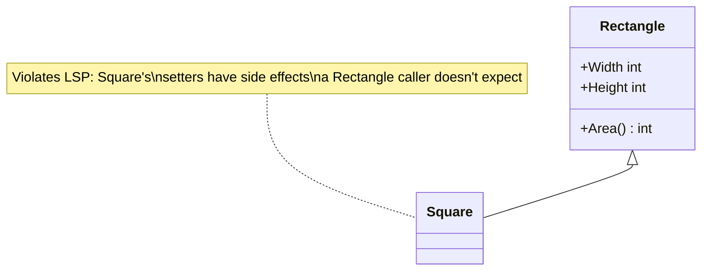
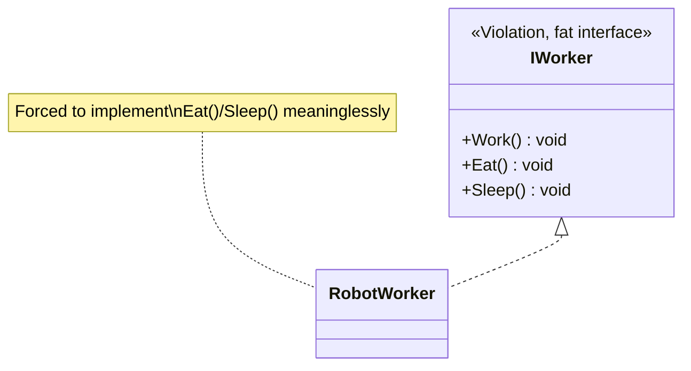
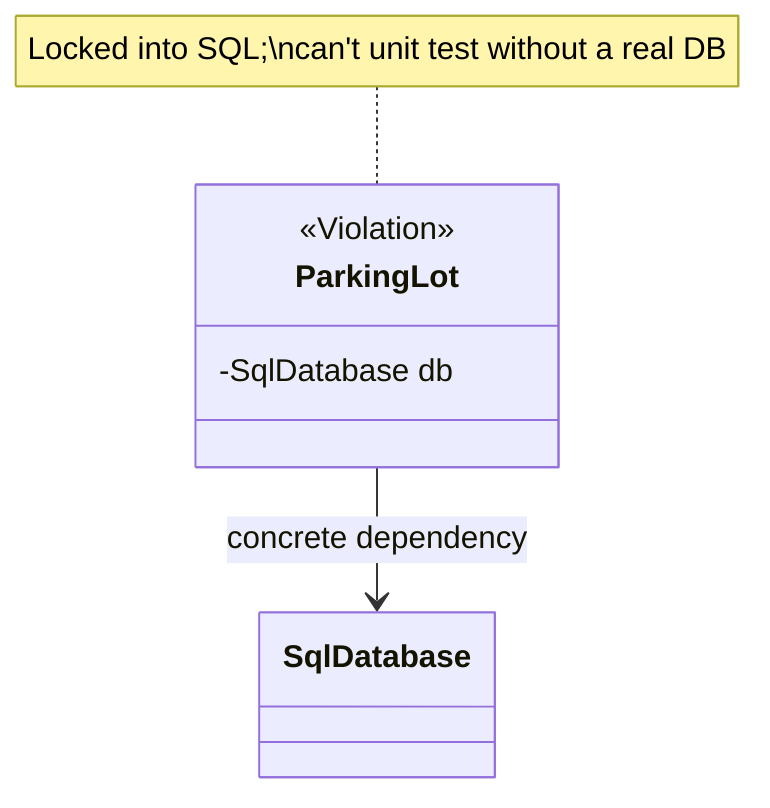
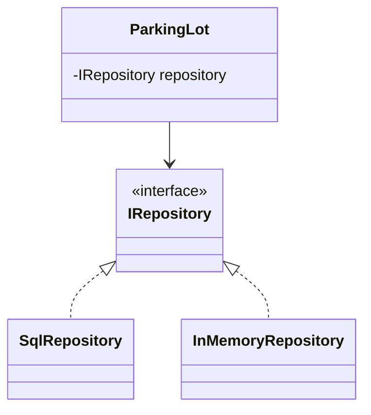

# SOLID Principles

SOLID is the single most-quoted vocabulary in LLD interviews. You don't need
to recite definitions — you need to **catch violations in your own design as
you draw it** and explain the fix. Each section below has a violation and a
fix, matching `csharp/*.cs` in this folder 1:1.

## S — Single Responsibility Principle

> A class should have only one reason to change.

"Responsibility" = an axis of change driven by a distinct stakeholder/concern
— not "does only one thing" literally (a class can have several methods and
still have a single responsibility).

Fix: split into `FeeCalculator`, `ParkingRepository`, `ReceiptPrinter` — each
changes for exactly one reason.

**Interview tell**: a class named `...Manager`, `...Service`, or `...Helper`
that has grown methods spanning persistence, business rules, and formatting
is almost always an SRP violation. Interviewers plant this deliberately in
prompts to see if you split it.

## O — Open/Closed Principle

> Open for extension, closed for modification.

You should be able to add new behavior **without editing existing, tested
code** — typically by adding a new class that implements an existing
interface, not by adding a new `if`/`case` branch to an existing method.

Fix:

**Interview tell**: any `switch(type)` or long `if/else if` chain over an
enum, especially one you can imagine growing — this is the #1 recurring
"can you improve this?" follow-up interviewers ask.

## L — Liskov Substitution Principle

> Subtypes must be substitutable for their base type without breaking
> correctness — callers shouldn't need to know which subtype they got.

Classic textbook violation: `Square extends Rectangle`. Setting `Width` on a
`Square` must also change `Height` to keep it a square — which breaks any
code that assumed setting `Width` on a `Rectangle` leaves `Height` alone.

Fix: don't force the inheritance. Model both as implementations of a shape
abstraction with only the behavior they actually share (`Area()`), not
mutable `Width`/`Height` setters that only make sense for one of them.

**Interview tell**: any subclass that overrides a method to throw
`NotSupportedException`, do nothing, or otherwise weaken the base contract
(e.g. `Penguin : Bird` overriding `Fly()` to throw) is an LSP violation —
means the hierarchy is modeling the wrong abstraction.

## I — Interface Segregation Principle

> Don't force a class to implement methods it doesn't need. Prefer several
> small, focused interfaces over one fat one.

Fix: split into `IWorkable`, `IFeedable`, `ISleepable`; `RobotWorker`
implements only `IWorkable`.

**Interview tell**: an interface implementation with a method body that's
empty, throws, or has a comment like `// not applicable` — that's ISP being
violated in real time.

## D — Dependency Inversion Principle

> High-level modules shouldn't depend on low-level modules; both should
> depend on abstractions. (Not the same as Dependency *Injection* — DI is
> one common technique for achieving DIP, but DIP is the design principle.)

Fix:

`ParkingLot` now depends on an abstraction; swap in `InMemoryRepository` for
unit tests, `SqlRepository` in production, with zero changes to
`ParkingLot`. This is also literally the **Strategy pattern** and the
**Dependency Injection** technique you'll use constantly in case studies.

**Interview tell**: constructing a concrete class with `new` deep inside a
business-logic class, instead of receiving an interface through the
constructor — makes the class untestable and rigid.

## How SOLID connects to design patterns (next folder)

- OCP is the direct motivation for **Strategy**, **Factory Method/Abstract
  Factory**, **Decorator**, and **Observer**.
- DIP is the direct motivation for **Dependency Injection**, **Strategy**,
  and **Bridge**.
- SRP is the direct motivation for **Facade** (pulls orchestration out of a
  bloated class) and **Command** (extracts "an action" into its own class).
- ISP shows up whenever you design a **role interface** instead of one big
  interface implemented by everything.

## Code in this folder

- `csharp/SRP.cs`, `OCP.cs`, `LSP.cs`, `ISP.cs`, `DIP.cs` — each has a
  `...Violation` namespace/region and a `...Fixed` one, so you can diff them.
- `typescript/solid-principles.ts` — condensed version of all five.

## Common interview variations

- "Here's a class — what SOLID principles does it violate?" (a live code
  review, often the actual interview format for a warm-up question).
- "Refactor this switch statement" → OCP + polymorphism.
- "Why is dependency injection useful?" → tie back to DIP + testability.
- "Give me a real example of LSP being violated" → Square/Rectangle or
  Bird/Penguin, and *why* it matters (breaks caller assumptions, not just
  "it's ugly").
