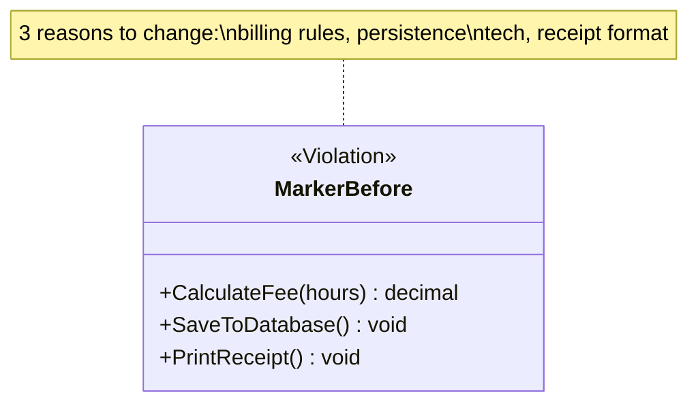
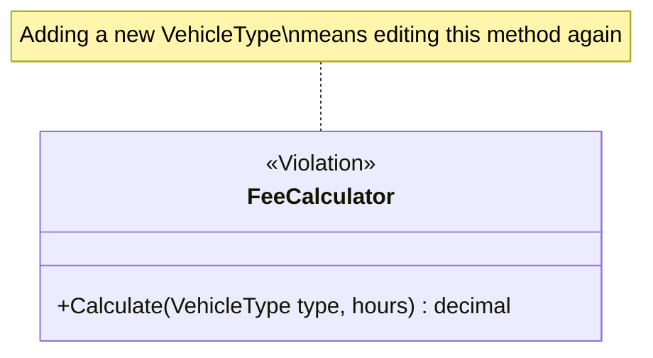
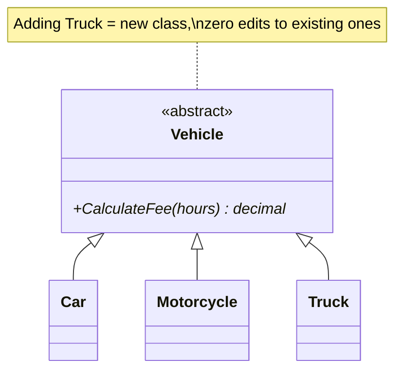
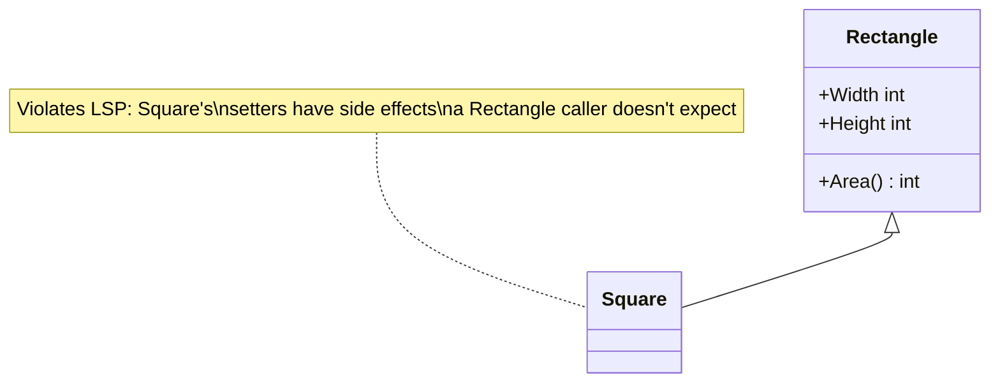
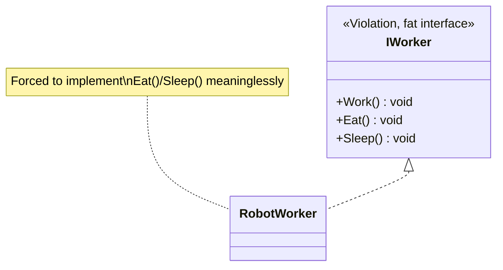
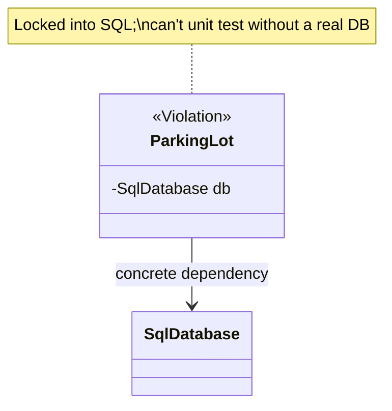
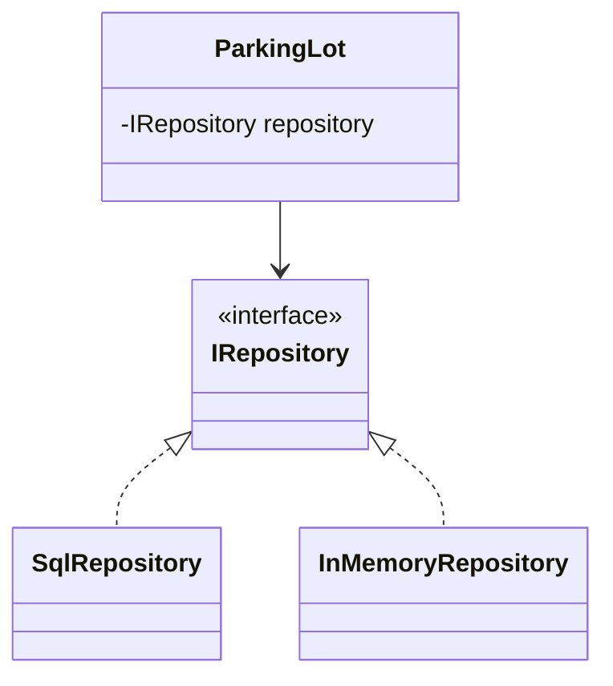

# SOLID Principles

SOLID is the single most-quoted vocabulary in LLD interviews. You don't need
to recite definitions — you need to **catch violations in your own design as
you draw it** and explain the fix. Each section below has a violation and a
fix, matching `csharp/*.cs` in this folder 1:1.

## S — Single Responsibility Principle

> A class should have only one reason to change.

"Responsibility" = an axis of change driven by a distinct stakeholder/concern
— not "does only one thing" literally (a class can have several methods and
still have a single responsibility).



Fix: split into `FeeCalculator`, `ParkingRepository`, `ReceiptPrinter` — each
changes for exactly one reason.

**Interview tell**: a class named `...Manager`, `...Service`, or `...Helper`
that has grown methods spanning persistence, business rules, and formatting
is almost always an SRP violation. Interviewers plant this deliberately in
prompts to see if you split it.

## O — Open/Closed Principle

> Open for extension, closed for modification.

You should be able to add new behavior **without editing existing, tested
code** — typically by adding a new class that implements an existing
interface, not by adding a new `if`/`case` branch to an existing method.



Fix:



**Interview tell**: a `switch`/`if-else if` chain over a type or category
that you'd have to **revisit every time a new behavior is introduced**.
That's the #1 recurring "can you improve this?" follow-up.

⚠️ **Not every switch is a violation.** A small switch over a genuinely
fixed set (days of the week, HTTP verbs, a closed protocol enum) is
perfectly good code, and replacing it with five classes makes things
worse. The signal isn't "a switch exists" — it's "this switch grows
whenever the domain grows." Say that distinction out loud if an
interviewer shows you a switch; reflexively answering "that violates OCP,
I'd add an interface" is a mild over-engineering tell.

Also worth naming: OCP is about **anticipated** axes of change. You cannot
make a class open to *every* kind of extension, and trying to produces
speculative abstraction. Pick the axis the requirements actually suggest
will vary. (See KISS/YAGNI in
[`../06-Core-Design-Principles/notes.md`](../06-Core-Design-Principles/notes.md).)

## L — Liskov Substitution Principle

> Subtypes must be substitutable for their base type without breaking
> correctness — callers shouldn't need to know which subtype they got.

Classic textbook violation: `Square extends Rectangle`. Setting `Width` on a
`Square` must also change `Height` to keep it a square — which breaks any
code that assumed setting `Width` on a `Rectangle` leaves `Height` alone.



Fix: don't force the inheritance. Model both as implementations of a shape
abstraction with only the behavior they actually share (`Area()`), not
mutable `Width`/`Height` setters that only make sense for one of them.

**Interview tell**: any subclass that overrides a method to throw
`NotSupportedException`, do nothing, or otherwise weaken the base contract
(e.g. `Penguin : Bird` overriding `Fly()` to throw) is an LSP violation —
means the hierarchy is modeling the wrong abstraction.

## I — Interface Segregation Principle

> Don't force a class to implement methods it doesn't need. Prefer several
> small, focused interfaces over one fat one.



Fix: split into `IWorkable`, `IFeedable`, `ISleepable`; `RobotWorker`
implements only `IWorkable`.

**Interview tell**: an interface implementation with a method body that's
empty, throws, or has a comment like `// not applicable` — that's ISP being
violated in real time.

## D — Dependency Inversion Principle

> High-level modules shouldn't depend on low-level modules; both should
> depend on abstractions. (Not the same as Dependency *Injection* — DI is
> one common technique for achieving DIP, but DIP is the design principle.)



Fix:



`ParkingLot` now depends on an abstraction; swap in `InMemoryRepository` for
unit tests, `SqlRepository` in production, with zero changes to
`ParkingLot`. This is also literally the **Strategy pattern** and the
**Dependency Injection** technique you'll use constantly in case studies.

**Interview tell**: a business-logic class **hard-wiring its own
infrastructure**, e.g. `private readonly SqlOrderRepository _repo = new();`
inside `OrderService`. That's what makes a class untestable and rigid.

⚠️ **`new` is not banned.** DIP is about not depending on volatile,
*infrastructure* details (databases, HTTP clients, file systems, clocks,
third-party SDKs) — not about eliminating object creation. These are all
completely fine:

```csharp
var money = new Money(100, "INR");        // value object — no reason to inject
var ticket = new Ticket(spot, DateTime.Now); // domain object the class owns
return new List<Order>();                  // plain data structure
```

The question to ask is: *"would I ever want to substitute this in a test or
a different deployment?"* If yes → inject the abstraction. If it's a value
object or an owned domain object, `new` is the right call and injecting it
would be pointless ceremony.

## SOLID vs over-engineering — read this before you apply any of it

SOLID describes forces to balance, not rules to maximize. Each principle
has a failure mode when pushed too far:

| Principle | Pushed too far becomes |
|---|---|
| SRP | Dozens of one-method classes; the logic is now scattered and harder to follow than the "god class" was |
| OCP | Speculative interfaces for variation that never arrives (YAGNI) |
| LSP | Refusing all inheritance, even where a taxonomy is genuinely correct |
| ISP | A separate interface per method; implementers declare six interfaces to do one job |
| DIP | Injecting everything, including value objects and `DateTime`; a constructor with nine parameters and an IoC container to understand before you can read any code |

An interface with exactly one implementation, added "for flexibility," is a
liability until a second implementation exists: it adds a file, an
indirection, and a lie about the design's intent.

**The interview move**: when asked "should you add an abstraction here?",
being able to say *"no — there's one implementation and the requirements
don't suggest a second; I'd extract the interface when the second one
appears"* is a **stronger** answer than adding it. Interviewers are
watching for judgment, and reflexive abstraction is a common mid-level
tell. Complementary principles (KISS, YAGNI, and the rest) are in
[`../06-Core-Design-Principles/notes.md`](../06-Core-Design-Principles/notes.md).

## How SOLID connects to design patterns (next folder)

- OCP is the direct motivation for **Strategy**, **Factory Method/Abstract
  Factory**, **Decorator**, and **Observer**.
- DIP is the direct motivation for **Dependency Injection**, **Strategy**,
  and **Bridge**.
- SRP is the direct motivation for **Facade** (pulls orchestration out of a
  bloated class) and **Command** (extracts "an action" into its own class).
- ISP shows up whenever you design a **role interface** instead of one big
  interface implemented by everything.

## Code in this folder

- `csharp/SRP.cs`, `OCP.cs`, `LSP.cs`, `ISP.cs`, `DIP.cs` — each has a
  `...Violation` namespace/region and a `...Fixed` one, so you can diff them.
- `typescript/solid-principles.ts` — condensed version of all five.

## Common interview variations

- "Here's a class — what SOLID principles does it violate?" (a live code
  review, often the actual interview format for a warm-up question).
- "Refactor this switch statement" → OCP + polymorphism.
- "Why is dependency injection useful?" → tie back to DIP + testability.
- "Give me a real example of LSP being violated" → Square/Rectangle or
  Bird/Penguin, and *why* it matters (breaks caller assumptions, not just
  "it's ugly").
