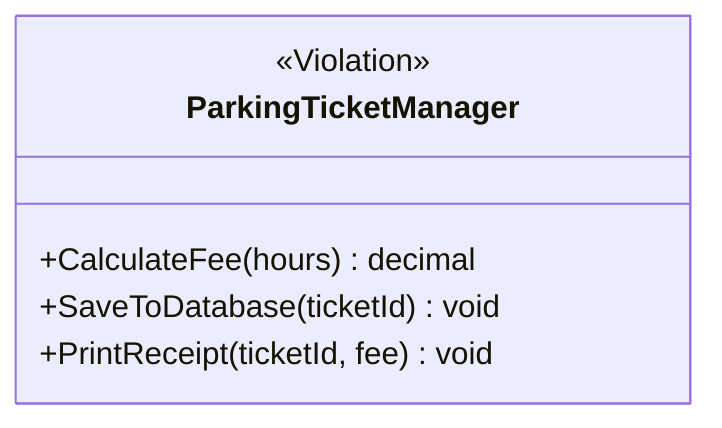
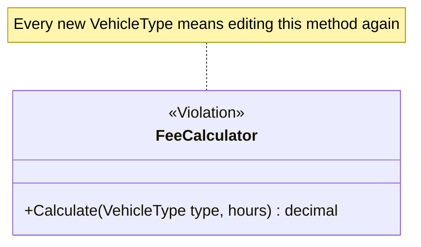
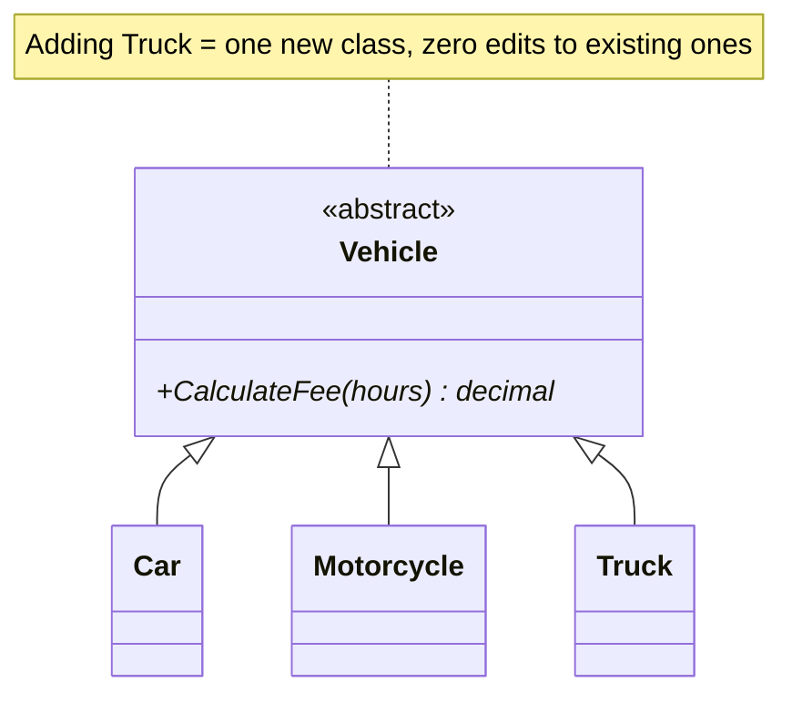
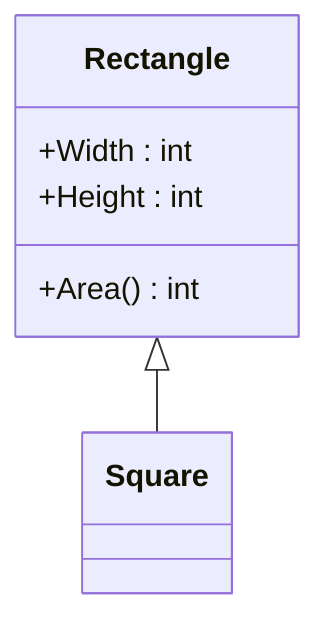
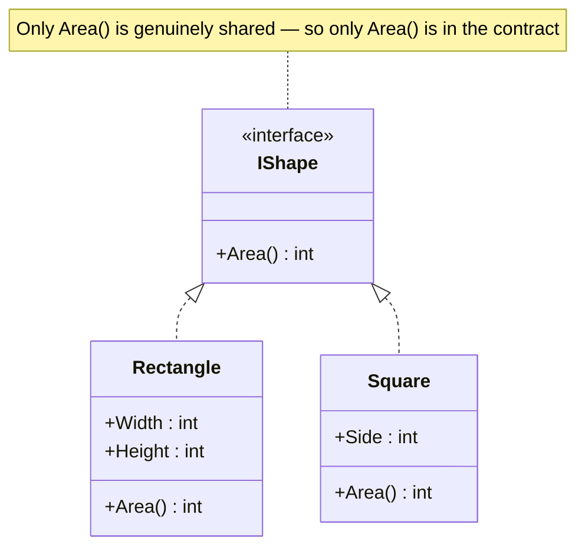
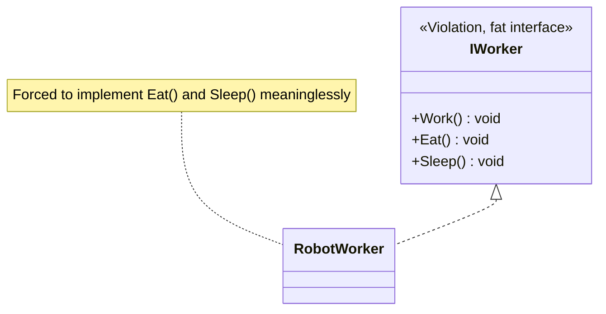
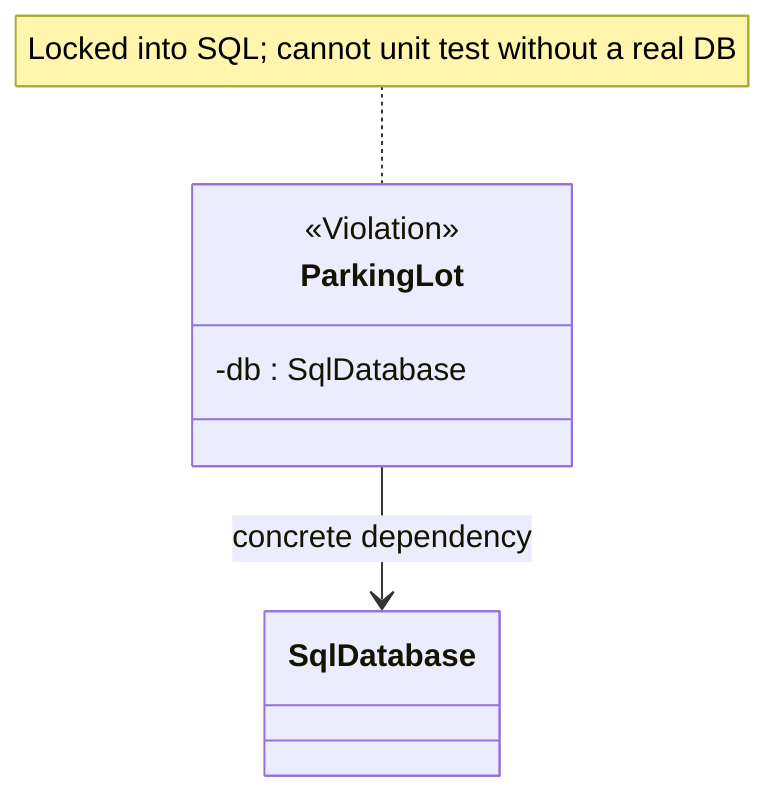
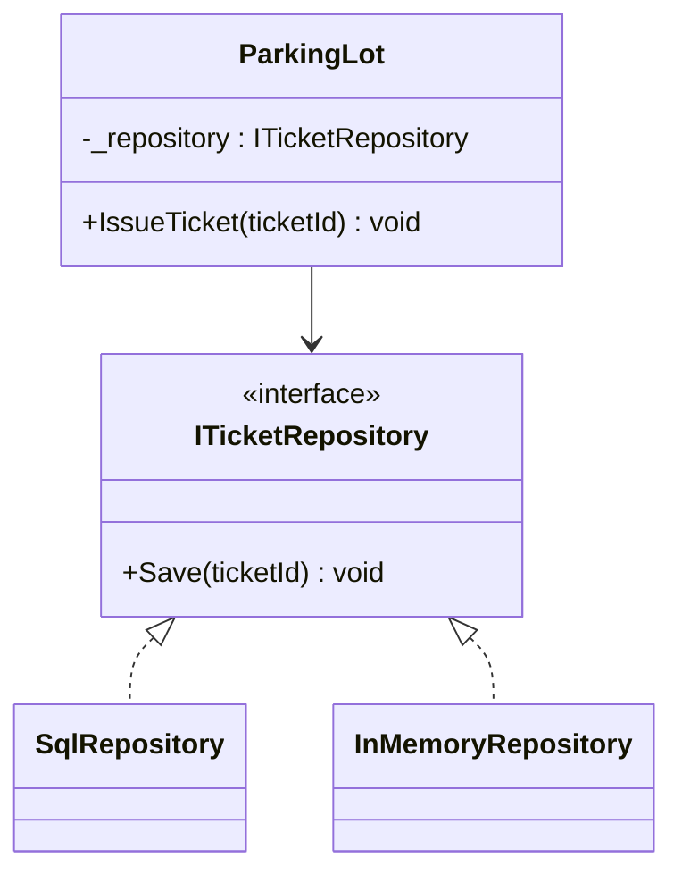

# SOLID Principles

SOLID is the single most-quoted vocabulary in LLD interviews. You don't need
to recite definitions — you need to **catch violations in your own design as
you draw it** and explain the fix.

> **How to read this chapter.** Each principle is self-contained: diagram →
> the violation in code → the fix in code → the command to run both. Read
> straight through; open a `.cs` file only when you want to *change*
> something. The **Try it** prompts are where the learning is — most of them
> ask you to feel the cost of the violation rather than just read about it.
> Names in the diagrams match the code exactly.

## S — Single Responsibility Principle

> A class should have only one reason to change.

"Responsibility" = an axis of change driven by a distinct stakeholder/concern
— not "does only one thing" literally (a class can have several methods and
still have a single responsibility).



That class has **three** reasons to change: the billing rules, the
persistence technology, and the receipt format. Three separate concerns,
three separate stakeholders, one class.

```csharp
// ❌ Violation — three axes of change in one class
public class ParkingTicketManager
{
    public decimal CalculateFee(int hours) => 20m + 10m * hours;   // billing rules
    public void SaveToDatabase(string ticketId) { ... }            // persistence tech
    public void PrintReceipt(string ticketId, decimal fee) { ... } // receipt format
}

// ✅ Fix — each class changes for exactly one reason
public class FeeCalculator     { public decimal CalculateFee(int hours) => 20m + 10m * hours; }
public class ParkingRepository { public void Save(string ticketId) { ... } }
public class ReceiptPrinter    { public void Print(string ticketId, decimal fee) { ... } }
```

📄 [`csharp/SRP.cs`](csharp/SRP.cs) · `dotnet run --project Runner srp`

> **Try it:** the requirement "receipts must now be emailed as PDF" arrives.
> In the violation, find every place you'd touch and what you'd have to
> re-test. In the fix, only `ReceiptPrinter` moves. That blast-radius
> difference *is* SRP — it's not about class size.

**Interview tell**: a class named `...Manager`, `...Service`, or `...Helper`
that has grown methods spanning persistence, business rules, and formatting
is almost always an SRP violation. Interviewers plant this deliberately in
prompts to see if you split it.

## O — Open/Closed Principle

> Open for extension, closed for modification.

You should be able to add new behavior **without editing existing, tested
code** — typically by adding a new class that implements an existing
interface, not by adding a new `if`/`case` branch to an existing method.



Fix:



```csharp
// ❌ Violation — every new VehicleType reopens this method
public decimal Calculate(VehicleType type, int hours) => type switch
{
    VehicleType.Car        => 20m + 10m * hours,
    VehicleType.Motorcycle => 10m +  5m * hours,
    _ => throw new ArgumentOutOfRangeException(nameof(type)),
};

// ✅ Fix — a new type is a new class; nothing existing is edited
public abstract class Vehicle { public abstract decimal CalculateFee(int hours); }

public class Car        : Vehicle { public override decimal CalculateFee(int h) => 20m + 10m * h; }
public class Motorcycle : Vehicle { public override decimal CalculateFee(int h) => 10m +  5m * h; }
public class Truck      : Vehicle { public override decimal CalculateFee(int h) => 40m + 20m * h; }
```

📄 [`csharp/OCP.cs`](csharp/OCP.cs) · `dotnet run --project Runner ocp`

> **Try it:** add a `Bus` to both versions. In the violation you edit a
> method other vehicles already depend on — and every existing branch needs
> re-testing. In the fix you add a file and touch nothing that already works.

**Interview tell**: a `switch`/`if-else if` chain over a type or category
that you'd have to **revisit every time a new behavior is introduced**.
That's the #1 recurring "can you improve this?" follow-up.

⚠️ **Not every switch is a violation.** A small switch over a genuinely
fixed set (days of the week, HTTP verbs, a closed protocol enum) is
perfectly good code, and replacing it with five classes makes things
worse. The signal isn't "a switch exists" — it's "this switch grows
whenever the domain grows." Say that distinction out loud if an
interviewer shows you a switch; reflexively answering "that violates OCP,
I'd add an interface" is a mild over-engineering tell.

Also worth naming: OCP is about **anticipated** axes of change. You cannot
make a class open to *every* kind of extension, and trying to produces
speculative abstraction. Pick the axis the requirements actually suggest
will vary. (See KISS/YAGNI in
[`../06-Core-Design-Principles/notes.md`](../06-Core-Design-Principles/notes.md).)

## L — Liskov Substitution Principle

> Subtypes must be substitutable for their base type without breaking
> correctness — callers shouldn't need to know which subtype they got.

Classic textbook violation: `Square extends Rectangle`. Setting `Width` on a
`Square` must also change `Height` to keep it a square — which breaks any
code that assumed setting `Width` on a `Rectangle` leaves `Height` alone.



`Square` violates LSP because its setters carry a side effect a
`Rectangle` caller has no way to anticipate: setting `Width` silently
changes `Height` too.

Fix: don't force the inheritance. Model both as implementations of a shape
abstraction with only the behavior they actually share (`Area()`), not
mutable `Width`/`Height` setters that only make sense for one of them.



```csharp
// ❌ Violation — the override breaks a promise Rectangle made
public class Square : Rectangle
{
    public override int Width  { get => base.Width;  set { base.Width = value; base.Height = value; } }
    public override int Height { get => base.Height; set { base.Width = value; base.Height = value; } }
}

Rectangle r = new Square();
r.Width = 5;
r.Height = 10;            // caller expects Width to still be 5...
Console.WriteLine(r.Area()); // 100, where a Rectangle caller predicted 50

// ✅ Fix — share only Area(); both are immutable, so no setter can lie
public interface IShape { int Area(); }

public class Rectangle : IShape { /* Width, Height set once in ctor */ }
public class Square    : IShape { /* Side set once in ctor */ }
```

Note *why* the fix works: the shapes became **immutable**. LSP violations
often disappear the moment you stop exposing setters, because there's no
longer a mutation whose side effects a subtype can redefine.

📄 [`csharp/LSP.cs`](csharp/LSP.cs) · `dotnet run --project Runner lsp-violation` then `lsp`

> **Try it:** run `lsp-violation` and read the number. Nothing threw, nothing
> failed to compile — the code is simply, silently wrong. That's what makes
> LSP violations dangerous compared to the other four.

**Interview tell**: any subclass that overrides a method to throw
`NotSupportedException`, do nothing, or otherwise weaken the base contract
(e.g. `Penguin : Bird` overriding `Fly()` to throw) is an LSP violation —
means the hierarchy is modeling the wrong abstraction.

## I — Interface Segregation Principle

> Don't force a class to implement methods it doesn't need. Prefer several
> small, focused interfaces over one fat one.



Fix: split into `IWorkable`, `IFeedable`, `ISleepable`; `RobotWorker`
implements only `IWorkable`.

```csharp
// ❌ Violation — RobotWorker is forced to answer questions that don't apply
public class RobotWorker : IWorker
{
    public void Work()  => Console.WriteLine("Robot working.");
    public void Eat()   => throw new NotSupportedException("Robots don't eat.");
    public void Sleep() => throw new NotSupportedException("Robots don't sleep.");
}

// ✅ Fix — role interfaces; implement only what applies
public interface IWorkable  { void Work(); }
public interface IFeedable  { void Eat(); }
public interface ISleepable { void Sleep(); }

public class HumanWorker : IWorkable, IFeedable, ISleepable { /* all three */ }
public class RobotWorker : IWorkable { public void Work() => ...; }   // and nothing else
```

📄 [`csharp/ISP.cs`](csharp/ISP.cs) · `dotnet run --project Runner isp`

> **Try it:** in the violation, write a method taking `IWorker` that calls
> `Eat()`. It compiles, and it throws at runtime for robots — the type system
> was actively lying to you. In the fix, a method taking `IFeedable` simply
> can't be handed a `RobotWorker`; the compiler catches it.

**Interview tell**: an interface implementation with a method body that's
empty, throws, or has a comment like `// not applicable` — that's ISP being
violated in real time.

## D — Dependency Inversion Principle

> High-level modules shouldn't depend on low-level modules; both should
> depend on abstractions. (Not the same as Dependency *Injection* — DI is
> one common technique for achieving DIP, but DIP is the design principle.)



Fix:



```csharp
// ❌ Violation — high-level policy constructs its own low-level detail
public class ParkingLot
{
    private readonly SqlDatabase _db = new();   // welded to SQL; untestable
    public void IssueTicket(string ticketId) => _db.Save(ticketId);
}

// ✅ Fix — both sides depend on the abstraction
public interface ITicketRepository { void Save(string ticketId); }

public class ParkingLot
{
    private readonly ITicketRepository _repository;

    // Dependency Injection is the mechanism; DIP is the goal.
    public ParkingLot(ITicketRepository repository) => _repository = repository;

    public void IssueTicket(string ticketId) => _repository.Save(ticketId);
}

new ParkingLot(new SqlRepository());       // production
new ParkingLot(new InMemoryRepository());  // unit test, no database in sight
```

📄 [`csharp/DIP.cs`](csharp/DIP.cs) · `dotnet run --project Runner dip`

> **Try it:** write a unit test asserting that issuing a ticket saved it —
> first against the violation, then the fix. The violation forces you to
> stand up a database (or give up). Difficulty of testing is the most
> reliable DIP detector you have, and it's the one interviewers probe.

`ParkingLot` now depends on an abstraction; swap in `InMemoryRepository` for
unit tests, `SqlRepository` in production, with zero changes to
`ParkingLot`. **Dependency Injection** — handing the implementation in
through the constructor — is the technique that achieves this, and you'll
use it constantly in case studies.

⚠️ **This is not the Strategy pattern**, and interviewers do probe the
difference. Both hold an interface reference, but:

| | This (DIP + DI) | [Strategy](../04-Design-Patterns/Behavioral/Strategy/notes.md) |
|---|---|---|
| What the interface represents | A **dependency** — a collaborator that does a job (persistence, email, clock) | An **algorithm** — one of several interchangeable ways to compute the same thing |
| How many implementations at runtime | Usually one per environment (SQL in prod, in-memory in tests) | Several, meaningfully coexisting and chosen per case |
| Why you'd swap it | To change infrastructure or isolate a test | To get different *business behavior* |

`IOrderRepository` is a dependency. `IPricingStrategy` with `Regular`,
`Premium`, and `Discount` implementations is a Strategy. Depending on an
interface is necessary for Strategy but nowhere near sufficient —
**every** Strategy uses DIP, but most DIP is not Strategy.

**Interview tell**: a business-logic class **hard-wiring its own
infrastructure**, e.g. `private readonly SqlOrderRepository _repo = new();`
inside `OrderService`. That's what makes a class untestable and rigid.

⚠️ **`new` is not banned.** DIP is about not depending on volatile,
*infrastructure* details (databases, HTTP clients, file systems, clocks,
third-party SDKs) — not about eliminating object creation. These are all
completely fine:

```csharp
var money = new Money(100, "INR");        // value object — no reason to inject
var ticket = new Ticket(spot, DateTime.Now); // domain object the class owns
return new List<Order>();                  // plain data structure
```

The question to ask is: *"would I ever want to substitute this in a test or
a different deployment?"* If yes → inject the abstraction. If it's a value
object or an owned domain object, `new` is the right call and injecting it
would be pointless ceremony.

## SOLID vs over-engineering — read this before you apply any of it

SOLID describes forces to balance, not rules to maximize. Each principle
has a failure mode when pushed too far:

| Principle | Pushed too far becomes |
|---|---|
| SRP | Dozens of one-method classes; the logic is now scattered and harder to follow than the "god class" was |
| OCP | Speculative interfaces for variation that never arrives (YAGNI) |
| LSP | Refusing all inheritance, even where a taxonomy is genuinely correct |
| ISP | A separate interface per method; implementers declare six interfaces to do one job |
| DIP | Injecting everything, including value objects and `DateTime`; a constructor with nine parameters and an IoC container to understand before you can read any code |

An interface with exactly one implementation, added "for flexibility," is a
liability until a second implementation exists: it adds a file, an
indirection, and a lie about the design's intent.

**The interview move**: when asked "should you add an abstraction here?",
being able to say *"no — there's one implementation and the requirements
don't suggest a second; I'd extract the interface when the second one
appears"* is a **stronger** answer than adding it. Interviewers are
watching for judgment, and reflexive abstraction is a common mid-level
tell. Complementary principles (KISS, YAGNI, and the rest) are in
[`../06-Core-Design-Principles/notes.md`](../06-Core-Design-Principles/notes.md).

## How SOLID connects to design patterns (next folder)

These are patterns whose structure **often helps support** a given
principle — not definitions of them. Each pattern has its own primary
intent, and reducing patterns to SOLID mappings will mislead you (Bridge
below is the clearest example):

- **OCP** is frequently served by **Strategy**, **Factory Method**,
  **Decorator**, and **Observer** — all let you add behavior by adding a
  class rather than editing one.
- **DIP** is served by **Dependency Injection** as a technique. Strategy
  *relies on* DIP, but the reverse doesn't hold — see the warning in the
  DIP section above.
- **SRP** is served by **Facade** (pulls orchestration out of a bloated
  class) and **Command** (extracts "an action" into its own class).
- **ISP** shows up whenever you design a **role interface** instead of one
  big interface implemented by everything.
- **Bridge** is *not* really a DIP pattern, despite holding an interface
  reference. Its actual purpose is letting **two independently varying
  dimensions** evolve without an N×M class explosion. Describing it as
  "DIP" would lose the entire point.

## Recap — the code, and what each file is evidence of

Every file holds a `...Violation` namespace and a `...Fixed` one, so you can
read them side by side. The snippets above are excerpts; these run.

| Principle | File | Run | The claim it demonstrates |
|---|---|---|---|
| S | [`csharp/SRP.cs`](csharp/SRP.cs) | `srp` | Splitting by axis of change shrinks the blast radius of a new requirement |
| O | [`csharp/OCP.cs`](csharp/OCP.cs) | `ocp` | A new vehicle type costs one new class and zero edits |
| L | [`csharp/LSP.cs`](csharp/LSP.cs) | `lsp-violation`, `lsp` | A subtype override silently produces a wrong answer — no exception |
| I | [`csharp/ISP.cs`](csharp/ISP.cs) | `isp` | Role interfaces turn a runtime throw into a compile error |
| D | [`csharp/DIP.cs`](csharp/DIP.cs) | `dip` | The same `ParkingLot` runs against SQL or in-memory, untouched |

Prefix each with `dotnet run --project Runner`.

## Common interview variations

- "Here's a class — what SOLID principles does it violate?" (a live code
  review, often the actual interview format for a warm-up question).
- "Refactor this switch statement" → OCP + polymorphism.
- "Why is dependency injection useful?" → tie back to DIP + testability.
- "Give me a real example of LSP being violated" → Square/Rectangle or
  Bird/Penguin, and *why* it matters (breaks caller assumptions, not just
  "it's ugly").
