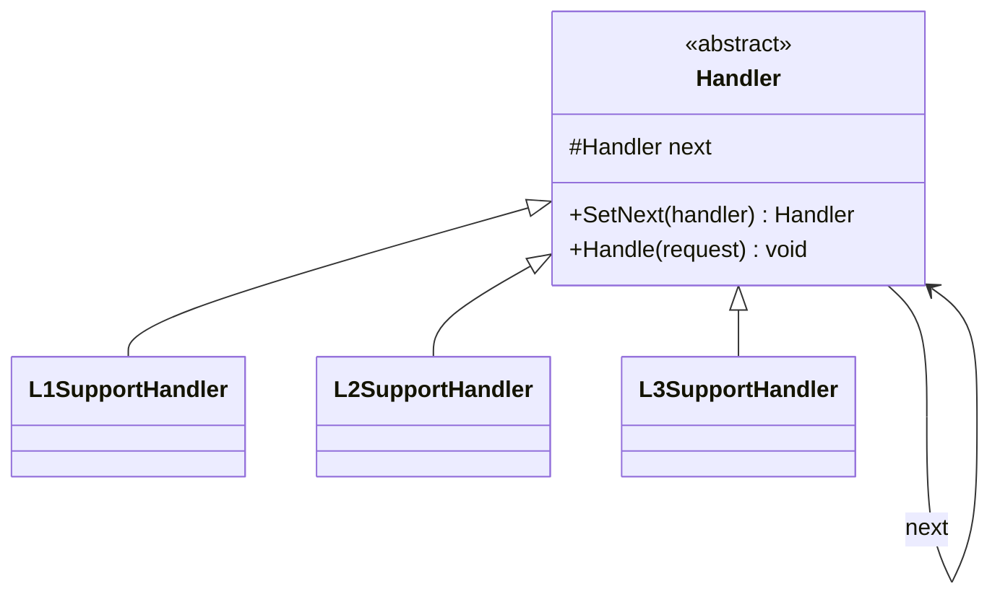

# Chain of Responsibility

**Category**: Behavioral
**Intent**: Pass a request along a chain of handlers; each handler decides
either to process the request or pass it to the next handler in the chain.
The sender doesn't know which handler will end up handling it.

## Structure

Each handler holds a reference to the **next** handler. `Handle()` either
resolves the request or forwards it (`_next?.Handle(request)`). Adding a new
tier means adding a new handler and re-wiring the chain — no existing
handler's code changes.

## When to use

- A request can be handled by **one of several candidate handlers**, and
  you don't want the sender coupled to which one, or don't want a giant
  `if/else if` picking a handler.
- Real examples: support-ticket escalation (L1 → L2 → L3), middleware/
  request pipelines (auth → logging → rate-limiting → business logic,
  exactly how ASP.NET Core and Express middleware work), approval
  workflows (manager → director → VP, based on amount thresholds), event
  bubbling in UI frameworks.

## Interview variations

- "A support ticket should go to L1, escalate to L2 if unresolved, then L3
  — how do you avoid the sender knowing about all three tiers?" → Chain of
  Responsibility.
- "How is this different from just calling three methods in sequence in the
  caller?" → the caller (client) doesn't decide the sequence or which
  handler ultimately processes it — that logic lives in the handlers
  themselves, so tiers can be added/reordered without touching the caller.
- "What happens if no handler in the chain can process the request?" →
  design decision — either a default/fallback handler at the end, or the
  chain returns "unhandled" and the caller decides what to do.
