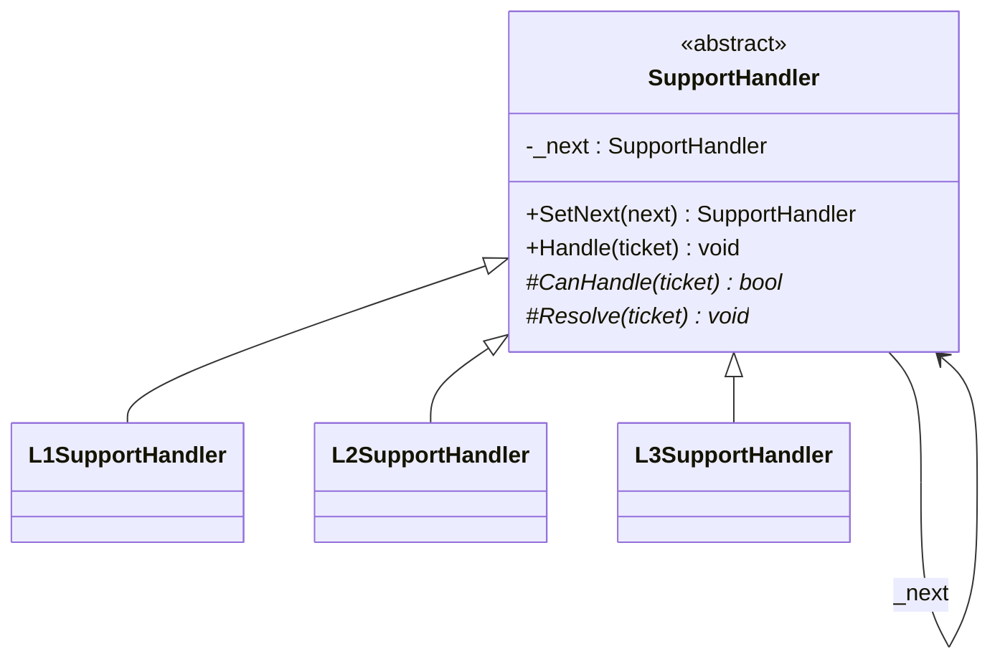
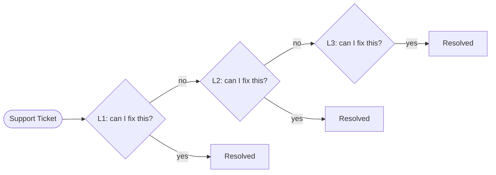

# Chain of Responsibility

**Category**: Behavioral
**Intent**: Pass a request along a chain of handlers; each handler decides
either to process the request or pass it to the next handler in the chain.
The sender doesn't know which handler will end up handling it.

## Structure





```csharp
public abstract class SupportHandler
{
    private SupportHandler? _next;

    public SupportHandler SetNext(SupportHandler next)
    {
        _next = next;
        return next;              // lets callers chain SetNext calls fluently
    }

    // The traversal logic lives ONCE here, in the base class.
    public void Handle(SupportTicket ticket)
    {
        if (CanHandle(ticket))   Resolve(ticket);
        else if (_next != null)  _next.Handle(ticket);
        else                     Console.WriteLine($"No handler could resolve: {ticket.Description}");
    }

    // Subclasses supply only "is this mine?" and "how do I do it?"
    protected abstract bool CanHandle(SupportTicket ticket);
    protected abstract void Resolve(SupportTicket ticket);
}

public class L1SupportHandler : SupportHandler
{
    protected override bool CanHandle(SupportTicket t) => t.Severity == TicketSeverity.Low;
    protected override void Resolve(SupportTicket t)   => Console.WriteLine($"[L1] Resolved: {t.Description}");
}

// Wiring the chain — the caller only ever talks to l1.
l1.SetNext(l2).SetNext(l3);
l1.Handle(new SupportTicket("App crashing", TicketSeverity.Critical));  // ends up at L3
```

Each handler holds a reference to the **next** handler. `Handle()` either
resolves the request or forwards it. Adding a new tier means adding a new
handler and re-wiring the chain — no existing handler's code changes.

Worth noticing: this is [Template Method](../TemplateMethod/notes.md) in the
base class. `Handle()` is a fixed skeleton; `CanHandle`/`Resolve` are the
varying steps. Patterns compose far more often than the one-per-problem
framing suggests.

📄 [`ChainOfResponsibility.cs`](ChainOfResponsibility.cs) · `dotnet run --project Runner chain`

> **Try it:** send a `Medium` ticket into a chain wired `l1 → l3` (skipping
> L2). It falls through to the "no handler" branch. Now ask which is correct
> for *your* domain — silently dropping it, a fallback handler, or throwing?
> That's the design decision the pattern forces you to make explicitly, and
> interviewers ask about it.

## When to use

- A request can be handled by **one of several candidate handlers**, and
  you don't want the sender coupled to which one, or don't want a giant
  `if/else if` picking a handler.
- Real examples: support-ticket escalation (L1 → L2 → L3), middleware/
  request pipelines (auth → logging → rate-limiting → business logic,
  exactly how ASP.NET Core and Express middleware work), approval
  workflows (manager → director → VP, based on amount thresholds), event
  bubbling in UI frameworks.

## Interview variations

- "A support ticket should go to L1, escalate to L2 if unresolved, then L3
  — how do you avoid the sender knowing about all three tiers?" → Chain of
  Responsibility.
- "How is this different from just calling three methods in sequence in the
  caller?" → the caller (client) doesn't decide the sequence or which
  handler ultimately processes it — that logic lives in the handlers
  themselves, so tiers can be added/reordered without touching the caller.
- "What happens if no handler in the chain can process the request?" →
  design decision — either a default/fallback handler at the end, or the
  chain returns "unhandled" and the caller decides what to do.
