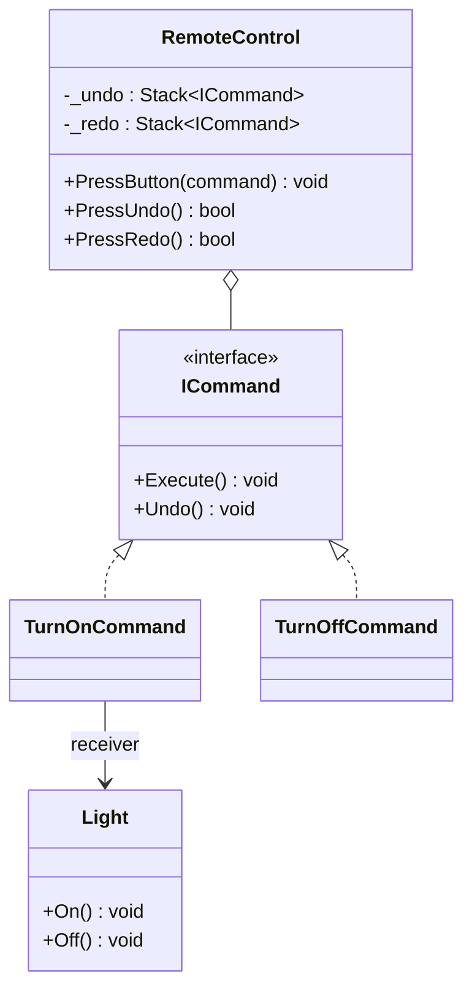

# Command

**Category**: Behavioral
**Intent**: Turn a request/action into a standalone object, so it can be
passed around, queued, logged, and — critically — **undone**, without the
sender needing to know anything about how the receiver executes it.

## Structure



`RemoteControl` doesn't know it's controlling a `Light` — it just receives an
`ICommand` and calls `Execute()`. The command object knows both the
**receiver** (`Light`) and the **action** (`On()`), and gets pushed onto a
history stack so `Undo()` reverses exactly that action later.

```csharp
public class TurnOnCommand : ICommand
{
    private readonly Light _light;                 // the receiver
    public void Execute() => _light.On();
    public void Undo()    => _light.Off();         // knows how to reverse itself
}

// The invoker: knows only ICommand, never Light.
public class RemoteControl
{
    private readonly Stack<ICommand> _undo = new();
    private readonly Stack<ICommand> _redo = new();

    public void PressButton(ICommand command)
    {
        command.Execute();
        _undo.Push(command);
        _redo.Clear();          // a new action invalidates the redo branch
    }

    public bool PressUndo()
    {
        if (_undo.Count == 0) return false;
        var command = _undo.Pop();
        command.Undo();
        _redo.Push(command);
        return true;
    }

    public bool PressRedo() { /* mirror image: pop _redo, Execute, push _undo */ }
}
```

**Two stacks, not one** — that's what buys you redo. Execute pushes onto undo
and clears redo; undo moves a command undo→redo; redo moves it back.

📄 [`Command.cs`](Command.cs) · `dotnet run --project Runner command`

> **Try it:** press undo twice, then execute a *new* command, then try redo.
> Nothing happens — `_redo.Clear()` discarded the branch. Delete that one line
> and redo will happily "replay" a command from a history that no longer
> exists, corrupting the state. One line, and it's the difference between an
> editor that works and one that doesn't.

## When to use

- You need **undo/redo** (text editors, drawing apps).
- You need to **queue, log, or schedule** actions for later/async execution.
- You want to **decouple the object that invokes an action from the object
  that knows how to perform it** (e.g. a generic `RemoteControl` /
  menu button that can be bound to any command).
- Macro commands: a `CompositeCommand` holding a list of `ICommand`s,
  executing/undoing them as one unit (this itself borrows from Composite).

## When NOT to use

- Simple, one-off method calls with no need for undo/queue/log — wrapping
  every action in a Command object is unnecessary ceremony.

## Interview variations

- "Add undo/redo to this text editor design." → Command with **two
  stacks**: execute pushes onto undo and clears redo; undo moves a command
  from undo→redo; redo moves it back. Mention that `Undo()` needs each
  command to remember enough state to reverse itself (e.g.
  `InsertTextCommand` stores what was inserted and where, so `Undo()` can
  delete exactly that).
- "Why does a new action clear the redo stack?" → once you branch off the
  history, the old redo path is unreachable. Every real editor works this
  way, and it's a nice detail to volunteer.
- "What if an action can't cleanly reverse itself?" → snapshot the state
  instead with [Memento](../Memento/notes.md), or store the prior value
  inside the command.
- "How would you support macro/batch actions (run several commands as
  one)?" → `CompositeCommand : ICommand` holding `List<ICommand>`.
- "How would you queue commands to run later?" → in-process, a
  `Queue<ICommand>` works directly, since each command already carries
  everything it needs to run.
- "How would you persist a command log and replay it after a restart?" →
  be careful here; the naive answer is wrong. You generally **cannot
  serialize the command objects themselves** — `TurnOnCommand` holds a
  live reference to a `Light`, which isn't meaningful once the process
  dies. Real systems persist a **command/event DTO** and reconstruct the
  command on replay:

  ```jsonc
  { "type": "TurnOnLight", "lightId": "L-123", "at": "2026-08-16T10:00:00Z" }
  ```

  On replay you resolve `lightId` to the current `Light` instance and
  build a fresh `TurnOnCommand`. That resolve-then-reconstruct step is
  the whole point, and noticing it is a genuine seniority signal (it's
  the same insight behind event sourcing).
