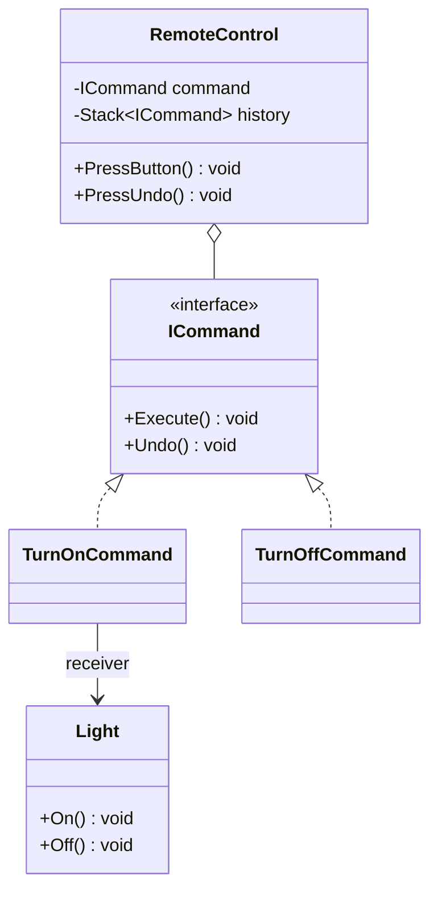

# Command

**Category**: Behavioral
**Intent**: Turn a request/action into a standalone object, so it can be
passed around, queued, logged, and — critically — **undone**, without the
sender needing to know anything about how the receiver executes it.

## Structure

`RemoteControl` doesn't know it's controlling a `Light` — it just holds an
`ICommand` and calls `Execute()`. The command object knows both the
**receiver** (`Light`) and the **action** (`On()`), and can push itself onto
a history stack so `Undo()` reverses exactly that action later.

## When to use

- You need **undo/redo** (text editors, drawing apps).
- You need to **queue, log, or schedule** actions for later/async execution.
- You want to **decouple the object that invokes an action from the object
  that knows how to perform it** (e.g. a generic `RemoteControl` /
  menu button that can be bound to any command).
- Macro commands: a `CompositeCommand` holding a list of `ICommand`s,
  executing/undoing them as one unit (this itself borrows from Composite).

## When NOT to use

- Simple, one-off method calls with no need for undo/queue/log — wrapping
  every action in a Command object is unnecessary ceremony.

## Interview variations

- "Add undo/redo to this text editor design." → Command, with a history
  stack; mention `Undo()` needs each command to remember enough state to
  reverse itself (e.g. `InsertTextCommand` stores what was inserted and
  where, so `Undo()` can delete exactly that).
- "How would you support macro/batch actions (run several commands as
  one)?" → `CompositeCommand : ICommand` holding `List<ICommand>`.
- "How would you queue commands to run later or replay a log of actions?" →
  since each `ICommand` is just an object, store/serialize the list and
  replay by calling `Execute()` on each in order.
