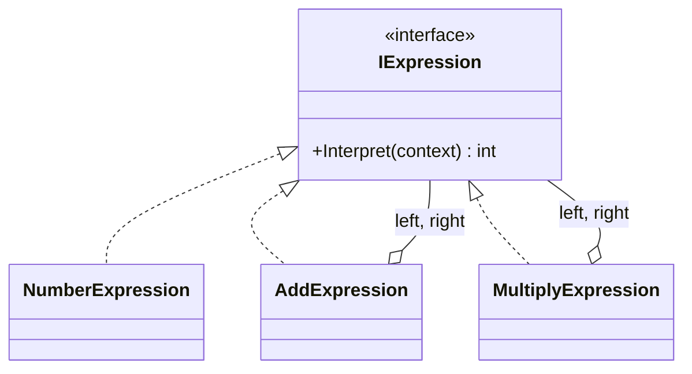

# Interpreter

**Category**: Behavioral
**Intent**: Given a language, define a representation for its grammar
along with an interpreter that uses the representation to evaluate
sentences in that language.

> **Set expectations first**: this is the **least useful GoF pattern for
> LLD interviews** — it's here for completeness (it's the 23rd pattern)
> and because recognizing it is occasionally handy. It is Tier C in the
> [importance ranking](../../README.md). Read it once, don't drill it.

## Structure



Each grammar rule becomes a class. **Terminal** expressions (a literal
number, a variable) are leaves; **non-terminal** expressions (add,
multiply) hold child expressions and combine their results. Evaluating is
a recursive walk of the resulting tree.

Note the shape: this is a [Composite](../../Structural/Composite/notes.md)
tree whose shared operation happens to be "evaluate me."

```csharp
public interface IExpression { int Interpret(Context context); }

// Terminals (leaves) — recursion stops here.
public class NumberExpression   : IExpression { public int Interpret(Context c) => _value; }
public class VariableExpression : IExpression { public int Interpret(Context c) => c.Get(_name); }

// Non-terminals — hold children and combine their results.
public class AddExpression : IExpression
{
    private readonly IExpression _left, _right;
    public int Interpret(Context c) => _left.Interpret(c) + _right.Interpret(c);
}

// Represents  x + (2 * y)  — note the tree is built BY HAND.
IExpression expression = new AddExpression(
    new VariableExpression("x"),
    new MultiplyExpression(
        new NumberExpression(2),
        new VariableExpression("y")));

var context = new Context().Set("x", 10).Set("y", 5);
expression.Interpret(context);   // 20

// Same tree, different context — no rebuild needed.
expression.Interpret(new Context().Set("x", 1).Set("y", 1));  // 3
```

Look at what's *absent* from that snippet: nothing turns the string
`"x + 2 * y"` into the tree. That's parsing, and it's the bulk of the real
work — see below.

📄 [`Interpreter.cs`](Interpreter.cs) · `dotnet run --project Runner interpreter`

> **Try it:** add a `SubtractExpression` (easy — one class). Then try to make
> the evaluator respect operator precedence in `2 + 3 * 4`. You can't, at this
> layer: precedence is decided when the tree is *built*, and the pattern
> hands you the tree already built. Feeling that limit is the fastest way to
> understand why this pattern is Tier C.

## When to use

- You have a **simple, stable grammar** you need to evaluate repeatedly —
  a filter/rule expression language, a calculator, simple query or
  business-rule DSLs.

## When NOT to use — which is most of the time

- **The grammar is non-trivial.** One class per rule doesn't scale; real
  languages use a parser generator (ANTLR) or a hand-written
  parser + AST, not this pattern.
- **You need parsing.** Interpreter covers *evaluating* an already-built
  tree. Turning `"2 + 3 * 4"` into that tree is parsing, and the pattern
  says nothing about it — a common misconception worth knowing.
- **A simpler mechanism exists.** For "let users configure a rule," a
  [Strategy](../Strategy/notes.md), a predicate/`Func<T,bool>`, or a
  composable specification object is almost always the better answer.

## Interview variations

- "Design a calculator / expression evaluator." → Interpreter is a
  legitimate answer for the *evaluation* half; say clearly that parsing is
  a separate concern.
- "Design a rules engine where admins configure conditions." → you can
  mention Interpreter, but the stronger answer is usually composable
  predicate objects (`And`, `Or`, `Not` wrapping simple conditions) —
  same recursive-tree idea, far less ceremony.
- "How does this relate to Composite?" → identical tree structure;
  Composite is about uniform part-whole treatment, Interpreter adds the
  specific meaning "each node evaluates itself in a context."
