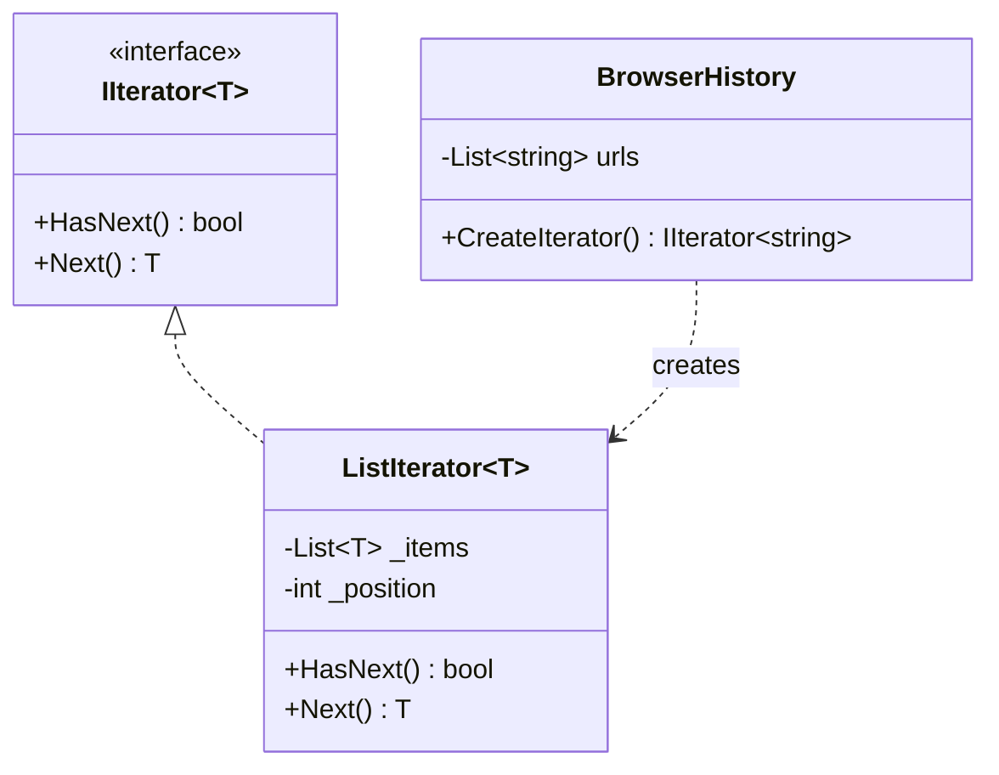

# Iterator

**Category**: Behavioral
**Intent**: Provide a way to traverse the elements of a collection
sequentially without exposing its underlying representation (array, linked
list, tree, etc.) to the code doing the traversal.

## Structure



```csharp
public interface IIterator<T>
{
    bool HasNext();
    T Next();
}

public class ListIterator<T> : IIterator<T>
{
    private readonly List<T> _items;
    private int _position;                       // each iterator owns its cursor

    public bool HasNext() => _position < _items.Count;
    public T Next()       => _items[_position++];
}

public class BrowserHistory
{
    private readonly List<string> _urls = new();

    // Client gets an iterator, never the raw List<string>.
    public IIterator<string> CreateIterator() => new ListIterator<string>(_urls);
}
```

The client only ever calls `HasNext()`/`Next()` — it never touches
`BrowserHistory`'s internal `List<string>` directly, so the collection is
free to switch its internal storage (array → linked list → tree) without
breaking any client code.

## Why this matters less in modern C# than in the original GoF book

C# has this pattern **built into the language**: any class implementing
`IEnumerable<T>`/`IEnumerator<T>` automatically works with `foreach`, LINQ,
and collection expressions. `yield return` writes the iterator state
machine for you, so you never hand-roll the interface methods.

(Most modern languages did the same — Java's `Iterable`, Python's
`__iter__`, JavaScript's `Symbol.iterator`. It's worth knowing this is a
general trend, not a C# quirk.)

```csharp
// The same class, the idiomatic way. `yield return` writes the state
// machine — this IS Iterator, with language support instead of IIterator.
public class BrowserHistoryEnumerable : IEnumerable<string>
{
    private readonly List<string> _urls = new();

    public IEnumerator<string> GetEnumerator()
    {
        foreach (var url in _urls)
            yield return url;
    }

    IEnumerator IEnumerable.GetEnumerator() => GetEnumerator();
}

foreach (var url in history2)   // works purely because of IEnumerable<T>
    Console.WriteLine(url);
```

So in an interview you rarely need to *implement* Iterator from scratch —
you need to **recognize** that `foreach` support is exactly this pattern
already solved for you, and know how to add it to a custom collection type
when asked.

📄 [`Iterator.cs`](Iterator.cs) · `dotnet run --project Runner iterator`

> **Try it:** create two iterators over the same `BrowserHistory` and advance
> them at different rates. They don't interfere — each owns its `_position`,
> which is precisely why the cursor lives in the iterator and not the
> collection. Then call `history.Visit(...)` mid-traversal and see what your
> hand-rolled iterator does versus what `foreach` over the `IEnumerable`
> version does (the latter throws; yours doesn't). Concurrent modification is
> a favourite follow-up.

## When to use

- You have a **custom collection/data structure** (e.g. a tree, a custom
  cache with eviction order, a paginated remote result set) and want
  consumers to traverse it with standard language syntax, without knowing
  its internal shape.
- You need **multiple simultaneous, independent traversals** over the same
  collection (each iterator keeps its own position/cursor).

## Interview variations

- "How would you make your custom `BrowserHistory` class work with
  `foreach`?" → implement `IEnumerable<T>` (often via `yield return`), which
  *is* the Iterator pattern in idiomatic C#.
- "What if you need to traverse a tree in multiple orders (in-order, level-
  order)?" → separate iterator implementations (or separate `yield`-based
  methods) per traversal strategy, same underlying tree.
