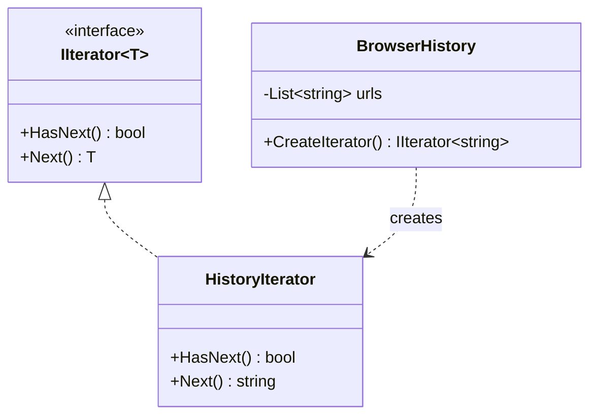

# Iterator

**Category**: Behavioral
**Intent**: Provide a way to traverse the elements of a collection
sequentially without exposing its underlying representation (array, linked
list, tree, etc.) to the code doing the traversal.

## Structure

The client only ever calls `HasNext()`/`Next()` — it never touches
`BrowserHistory`'s internal `List<string>` directly, so the collection is
free to switch its internal storage (array → linked list → tree) without
breaking any client code.

## Why this matters less in modern C#/TypeScript than in the original GoF book

Both languages have this pattern **built into the language itself**:

- **C#**: any class implementing `IEnumerable<T>`/`IEnumerator<T>`
  automatically works with `foreach`, LINQ, etc. `yield return` lets you
  write a custom iterator without hand-rolling the interface methods.
- **TypeScript**: the `Symbol.iterator` protocol makes any object usable
  with `for...of`, spread syntax, and destructuring, the same way.

So in an interview, you rarely need to *implement* Iterator from scratch —
you need to **recognize** that `foreach`/`for...of` support is exactly this
pattern already solved for you, and know how to add it to a custom
collection type when asked.

## When to use

- You have a **custom collection/data structure** (e.g. a tree, a custom
  cache with eviction order, a paginated remote result set) and want
  consumers to traverse it with standard language syntax, without knowing
  its internal shape.
- You need **multiple simultaneous, independent traversals** over the same
  collection (each iterator keeps its own position/cursor).

## Interview variations

- "How would you make your custom `BrowserHistory` class work with
  `foreach`?" → implement `IEnumerable<T>` (often via `yield return`), which
  *is* the Iterator pattern in idiomatic C#.
- "What if you need to traverse a tree in multiple orders (in-order, level-
  order)?" → separate iterator implementations (or separate `yield`-based
  methods) per traversal strategy, same underlying tree.
