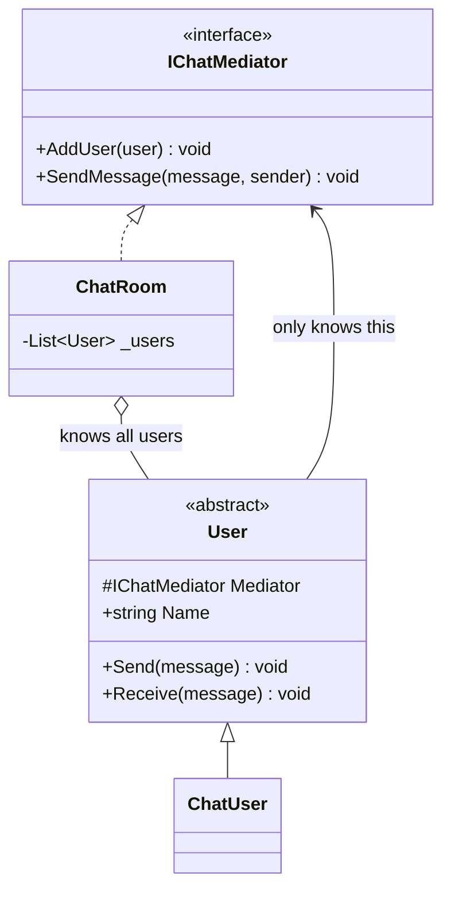

# Mediator

**Category**: Behavioral
**Intent**: Define an object that centralizes how a set of objects
("colleagues") interact, so those objects don't reference each other
directly — replacing many-to-many chatter (N² connections) with one-to-many
through a single mediator.

## The problem: N² wiring

Without a mediator, a chat room with 5 users where everyone can message
everyone directly means each `User` object holds references to every other
`User` — adding a 6th user means updating 5 existing objects. This is the
classic "tightly coupled peer web" problem.

## Structure



Alice, Bob and Carol are **instances** of `ChatUser`, not subclasses — users
differ by data, not behaviour, so one concrete class is enough. (A subclass
per user would be exactly the mistake
[`01-OOP-Basics`](../../../01-OOP-Basics/notes.md) §4 warns about.)

```csharp
public abstract class User
{
    protected readonly IChatMediator Mediator;   // the ONLY thing a user knows

    public void Send(string message) => Mediator.SendMessage(message, this);
    public void Receive(string message) => Console.WriteLine($"{Name} received: {message}");
}

// Concrete mediator: knows every user, routes messages. Users never hold
// references to each other.
public class ChatRoom : IChatMediator
{
    private readonly List<User> _users = new();

    public void AddUser(User user) => _users.Add(user);

    public void SendMessage(string message, User sender)
    {
        foreach (var user in _users)
            if (user != sender)                  // no echo back to the sender
                user.Receive($"[{sender.Name}]: {message}");
    }
}

var room = new ChatRoom();
var alice = new ChatUser(room, "Alice");
room.AddUser(alice);                             // registration, not rewiring
alice.Send("Hey everyone!");
```

Every `User` only knows about the `IChatMediator` interface, never about
other `User`s directly. `ChatRoom` (the concrete mediator) knows about all
users and handles routing. Adding a 6th user means registering it with the
mediator — zero changes to existing `User` objects.

📄 [`Mediator.cs`](Mediator.cs) · `dotnet run --project Runner mediator`

> **Try it:** add direct messaging (`SendTo(recipient, message)`), then
> read-receipts, then a mute list. Each goes into `ChatRoom`. Watch it swell —
> that's the god-object risk in the trade-offs section happening in front of
> you. Mediator doesn't remove coupling, it *relocates* it to one place; the
> bet is that one fat class beats N² thin ones, and it isn't always true.

## When to use

- Many objects need to communicate but you want to avoid a tangled web of
  direct references between all of them — centralize the interaction logic
  in one place.
- Real examples: chat rooms, air traffic control (planes don't talk to
  each other directly, they talk to the tower), UI dialogs where many
  widgets need to react to each other's changes (a `FormMediator`
  coordinating field validation/enabling).

## Mediator vs Facade — restated from Facade's notes

Facade is one-directional simplification for an external caller into a
subsystem; the subsystem classes don't know the facade exists. Mediator is
about the **peers themselves** routing their communication through a
central point — the colleagues are aware of and designed around the
mediator.

## Mediator vs Observer

They can combine (a mediator often uses Observer internally to notify
colleagues), but the *intent* differs: Observer is a **one-to-many
broadcast** from a single subject; Mediator is about **coordinating
many-to-many** interactions among peers, centralizing what would otherwise
be direct references between them.

## Interview variations

- "Design a chat room where users can message each other without every
  `User` holding references to every other `User`." → Mediator, by name.
- "How do you add a new user without modifying existing ones?" → register
  with the mediator only; existing `User` objects are untouched.
- "What's the risk of overusing Mediator?" → the mediator itself can become
  a god object accumulating too much logic — worth flagging as a trade-off
  if the interviewer pushes on it.
