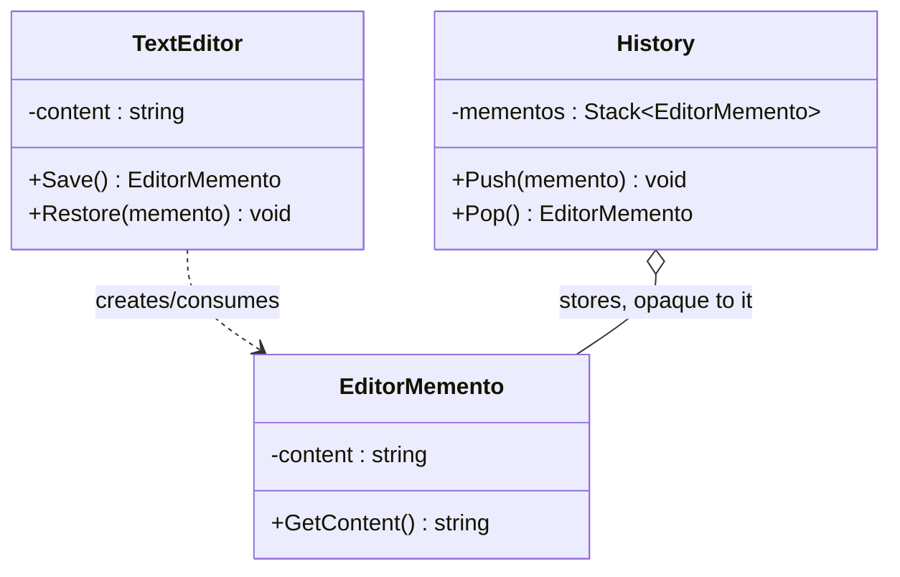

# Memento

**Category**: Behavioral
**Intent**: Capture and externalize an object's internal state so it can be
restored later, **without violating encapsulation** — the object being
saved controls exactly what gets captured, and nothing outside it can poke
at that internal state directly.

## Structure — the three-role split is the whole point



- **Originator** (`TextEditor`): owns the real state, knows how to create a
  `Memento` snapshot of itself and how to restore from one.
- **Memento** (`EditorMemento`): an immutable snapshot. Only the originator
  can read its full contents in any meaningful way — outside code (the
  caretaker) treats it as an opaque token.
- **Caretaker** (`History`): stores mementos (e.g. in a stack for undo) but
  **never looks inside them** — it just hands them back to the originator
  later.

```csharp
// MEMENTO — immutable snapshot. Note `internal`: the caretaker can hold one
// but cannot read it. That access modifier IS the encapsulation guarantee.
public sealed class EditorMemento
{
    internal string Content { get; }
    internal EditorMemento(string content) => Content = content;
}

// ORIGINATOR — owns the real state; decides what a snapshot means.
public class TextEditor
{
    private string _content = "";

    public EditorMemento Save() => new(_content);
    public void Restore(EditorMemento memento) => _content = memento.Content;
}

// CARETAKER — stores mementos, never inspects them.
public class History
{
    private readonly Stack<EditorMemento> _mementos = new();
    public void Push(EditorMemento memento) => _mementos.Push(memento);
    public EditorMemento? Pop() => _mementos.Count > 0 ? _mementos.Pop() : null;
}

editor.Type("Hello");
history.Push(editor.Save());        // checkpoint
editor.Type(" Oops typo");
editor.Restore(history.Pop()!);     // back to "Hello"
```

This separation is the answer to *"why not just make the fields public and
copy them?"* — because that would break encapsulation (see
[`../../../01-OOP-Basics/notes.md`](../../../01-OOP-Basics/notes.md)).
Memento lets the originator control exactly what's saved and how restoration
happens, while an external `History`/`Caretaker` only manages *when* to
save/restore, never *what*.

📄 [`Memento.cs`](Memento.cs) · `dotnet run --project Runner memento`

> **Try it:** from inside `History`, try to read `memento.Content`. It won't
> compile from another assembly — that's the pattern being enforced by the
> language rather than by convention. Then note the limit: `internal` means
> *same assembly*, so within this project `History` technically could. Real
> encapsulation here is a design contract the access modifier only
> approximates, and saying so is a better interview answer than claiming it's
> airtight.
>
> Second experiment: change `_content` from `string` to `StringBuilder` and
> watch the snapshot silently stop working — you'd be storing a live
> reference, not a copy. Same defensive-copy trap as
> [Builder](../../Creational/Builder/notes.md) and
> [Prototype](../../Creational/Prototype/notes.md). Mementos of mutable state
> must deep-copy.

## When to use

- **Undo/redo** functionality (text editors, drawing tools).
- **Checkpoints/save states** (game save files, transaction rollback
  points, wizard/form "go back a step").

## Memento vs Command (they often appear together for undo)

Command captures an **action** to reverse (with enough info to undo that
specific action). Memento captures a **snapshot of state** to restore
wholesale. Some undo systems use Command for the "what changed" and Memento
for "restore this exact prior state" — pick based on whether reversing the
*action* or restoring a *snapshot* is cheaper/more correct for the case.

## Interview variations

- "Add undo to a text editor by snapshotting state, not by reversing each
  keystroke individually — how do you do that without exposing the
  editor's internals?" → Memento, with the three-role diagram.
- "Why not just deep-copy the object's fields into a caretaker directly?" →
  breaks encapsulation; the memento pattern keeps the *originator*
  responsible for what "state" means and how to restore it, so its
  internal representation can change without breaking the caretaker.
