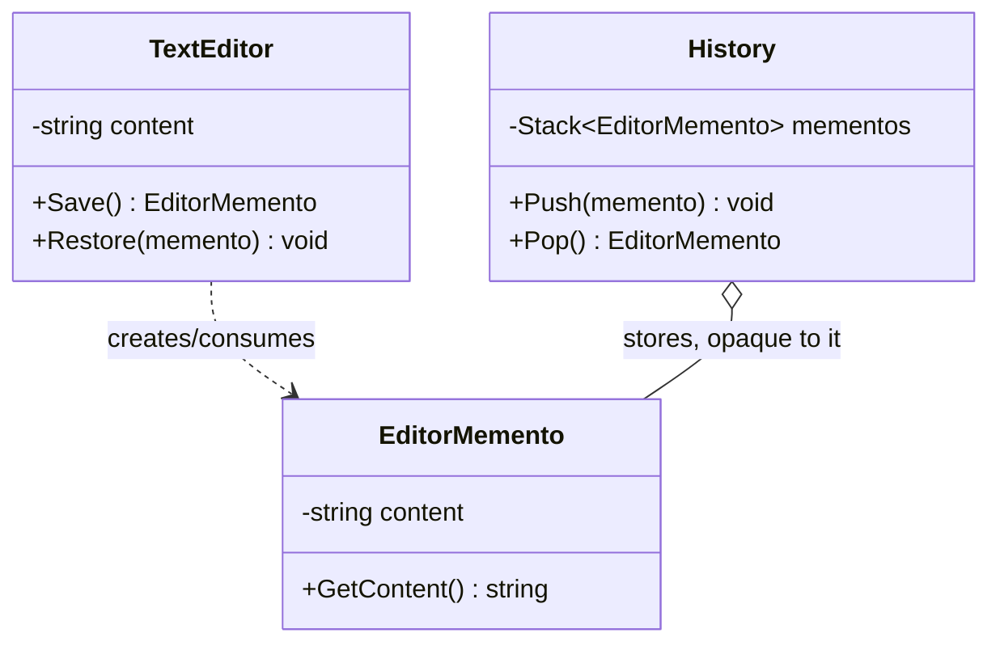

# Memento

**Category**: Behavioral
**Intent**: Capture and externalize an object's internal state so it can be
restored later, **without violating encapsulation** — the object being
saved controls exactly what gets captured, and nothing outside it can poke
at that internal state directly.

## Structure — the three-role split is the whole point

- **Originator** (`TextEditor`): owns the real state, knows how to create a
  `Memento` snapshot of itself and how to restore from one.
- **Memento** (`EditorMemento`): an immutable snapshot. Only the originator
  can read its full contents in any meaningful way — outside code (the
  caretaker) treats it as an opaque token.
- **Caretaker** (`History`): stores mementos (e.g. in a stack for undo) but
  **never looks inside them** — it just hands them back to the originator
  later.

This separation is the answer to *"why not just make the fields public and
copy them?"* — because that would break encapsulation (see
`01-OOP-Basics`). Memento lets the originator control exactly what's saved
and how restoration happens, while an external `History`/`Caretaker` only
manages *when* to save/restore, never *what*.

## When to use

- **Undo/redo** functionality (text editors, drawing tools).
- **Checkpoints/save states** (game save files, transaction rollback
  points, wizard/form "go back a step").

## Memento vs Command (they often appear together for undo)

Command captures an **action** to reverse (with enough info to undo that
specific action). Memento captures a **snapshot of state** to restore
wholesale. Some undo systems use Command for the "what changed" and Memento
for "restore this exact prior state" — pick based on whether reversing the
*action* or restoring a *snapshot* is cheaper/more correct for the case.

## Interview variations

- "Add undo to a text editor by snapshotting state, not by reversing each
  keystroke individually — how do you do that without exposing the
  editor's internals?" → Memento, with the three-role diagram.
- "Why not just deep-copy the object's fields into a caretaker directly?" →
  breaks encapsulation; the memento pattern keeps the *originator*
  responsible for what "state" means and how to restore it, so its
  internal representation can change without breaking the caretaker.
