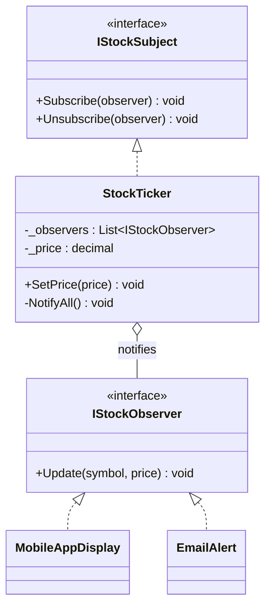

# Observer

**Category**: Behavioral
**Intent**: Define a one-to-many dependency between objects so that when one
object (the **subject**) changes state, all its dependents (**observers**)
are notified automatically — without the subject knowing anything concrete
about them beyond the shared interface.

Extremely common in LLD interviews any time the prompt has "notify" in it:
seat-availability alerts, stock price tickers, event/notification systems,
YouTube channel subscriptions.

## Structure



```csharp
public interface IStockObserver { void Update(string symbol, decimal price); }

public class StockTicker : IStockSubject
{
    private readonly List<IStockObserver> _observers = new();

    public void Subscribe(IStockObserver o)   => _observers.Add(o);
    public void Unsubscribe(IStockObserver o) => _observers.Remove(o);

    public void SetPrice(decimal price)
    {
        _price = price;
        NotifyAll();                  // push model: send the new state directly
    }

    private void NotifyAll()
    {
        foreach (var observer in _observers)
            observer.Update(_symbol, _price);   // no idea what any of them are
    }
}

// Observers can carry their own logic — EmailAlert stays quiet below its threshold.
public class EmailAlert : IStockObserver
{
    public void Update(string symbol, decimal price)
    {
        if (price >= _threshold)
            Console.WriteLine($"[Email] Alert: {symbol} crossed {_threshold:C}");
    }
}
```

`StockTicker` holds a list of `IStockObserver`s. When its price changes, it
loops over the list calling `Update(...)` on each — it never needs to know
whether an observer is a mobile display, an email alert, or something added
next month.

📄 [`Observer.cs`](Observer.cs) · `dotnet run --project Runner observer`

> **Try it:** make one observer throw inside `Update`. Every observer after it
> in the list silently stops receiving the notification, and the exception
> surfaces inside `SetPrice` — as if the *price change* failed. One
> misbehaving subscriber breaking the publisher is the classic Observer
> failure mode, and "how do you isolate observer failures?" is a real
> follow-up. (Try/catch per observer is the usual first answer.)

## Push vs Pull

- **Push model**: subject sends the changed data directly in `Update(data)`
  (shown above). Simple, but couples the observer interface to a specific
  payload shape.
- **Pull model**: subject just sends `Update(subjectRef)`; observers call
  back into the subject (`subject.GetPrice()`) to pull whatever data they
  need. More flexible when different observers need different subsets of
  state, at the cost of an extra call.

## When to use

- Multiple parts of the system need to react to a state change in one
  object, and that object shouldn't need to know the concrete types of
  everything reacting to it (decoupling publishers from subscribers).

## Observer vs Pub-Sub (a very common follow-up)

| | Observer (GoF) | Pub-Sub |
|---|---|---|
| Coupling | Subject holds direct references to observers | Publisher and subscriber don't know about each other at all — a broker/event bus sits between them |
| Typical scope | In-process, single application | Often distributed, across services (e.g. Kafka, SNS/SQS) |
| Delivery | Synchronous, in the notifying call | Often asynchronous, queued |

Interviewers sometimes ask you to note that Observer is the in-process
building block; a distributed notification system in a case study
(e.g. "design a notification service") usually escalates this to a
message-broker-based pub-sub, worth mentioning as the natural next step.

## Interview variations

- "Users should get notified the instant a parking spot frees up — how do
  you design that?" → Observer.
- "What if there are a huge number of observers, or notification should not
  block the caller?" → async dispatch / a queue between subject and
  observers — segues into pub-sub / message queues (HLD territory, good to
  flag the boundary).
- "Push or pull — which would you use here and why?"
