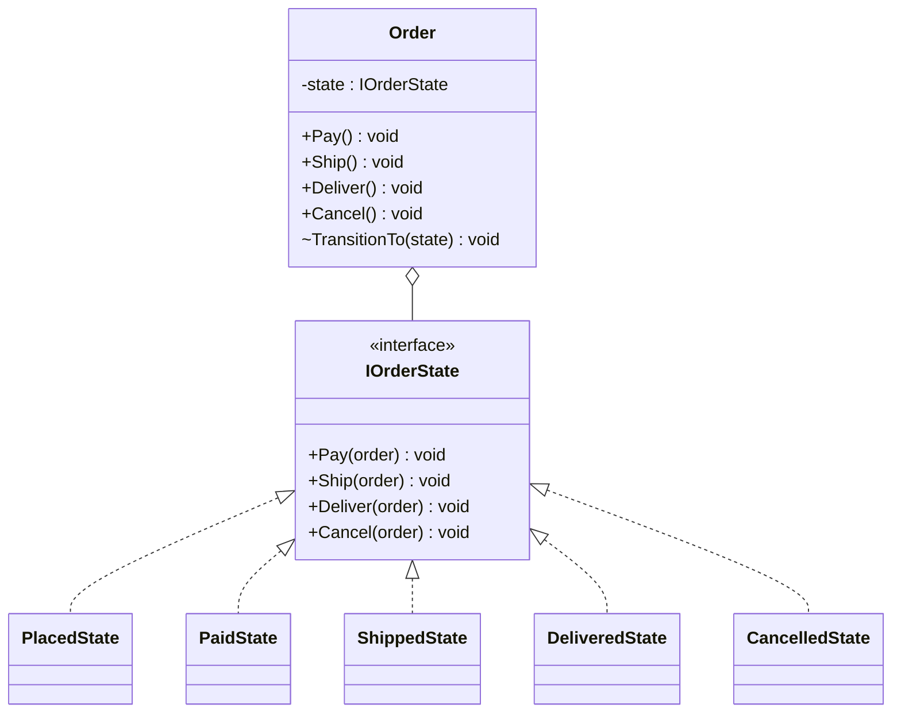
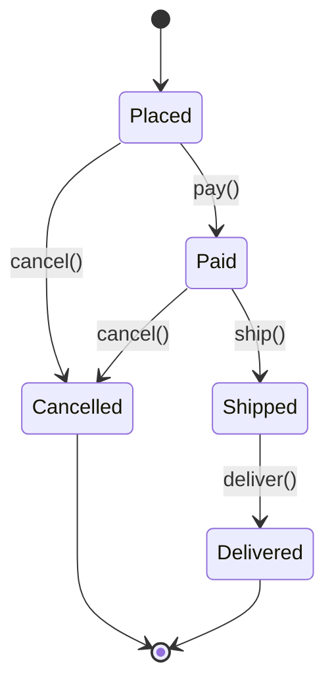

# State

**Category**: Behavioral
**Intent**: Let an object alter its behavior when its internal state
changes — the object appears to change class. Replaces a large
`if/switch` on a `status` field, scattered across many methods, with one
class per state.

Extremely common in case studies with an explicit lifecycle: `Order`
(Placed → Paid → Shipped → Delivered → Cancelled), `ElevatorState` (Idle →
Moving → DoorsOpen), `TrafficLight` (Red → Green → Yellow), a vending
machine's states.

## The problem it replaces

```csharp
// Before: every method re-checks status, and every new status means
// touching every method. Classic OCP violation, and easy to leave a
// branch out by mistake.
public class Order
{
    public OrderStatus Status;

    public void Ship()
    {
        if (Status == OrderStatus.Paid) Status = OrderStatus.Shipped;
        else throw new InvalidOperationException($"Cannot ship from {Status}");
    }

    public void Cancel()
    {
        if (Status == OrderStatus.Placed || Status == OrderStatus.Paid) Status = OrderStatus.Cancelled;
        else throw new InvalidOperationException($"Cannot cancel from {Status}");
    }
    // ... every method needs its own status-checking logic
}
```

## Structure



**Note the `~` (internal) on `TransitionTo`.** The state classes need to
drive transitions, but it must *not* be public — a public `SetState` lets
any caller slam the order into an arbitrary state and bypass every rule,
which defeats the whole point of the pattern. Scope it to the assembly
(C# `internal`) so only the state classes can call it. Interviewers do
notice this: "who is allowed to change the state?" is a natural follow-up,
and "anyone, it's public" is the wrong answer.



```csharp
// Each state knows exactly which transitions are legal FROM ITSELF.
public class PaidState : IOrderState
{
    public string Name => "Paid";
    public void Pay(Order order)     => throw new InvalidOperationException("Order is already paid.");
    public void Ship(Order order)    => order.TransitionTo(new ShippedState());
    public void Deliver(Order order) => throw new InvalidOperationException("Cannot deliver an unshipped order.");
    public void Cancel(Order order)  => order.TransitionTo(new CancelledState());
}

public class Order
{
    private IOrderState _state = new PlacedState();
    public string Status => _state.Name;

    // `internal`, NOT public — see the note above.
    internal void TransitionTo(IOrderState next) => _state = next;

    // No status-checking if/switch anywhere in Order. It just delegates.
    public void Pay()     => _state.Pay(this);
    public void Ship()    => _state.Ship(this);
    public void Deliver() => _state.Deliver(this);
    public void Cancel()  => _state.Cancel(this);
}
```

Each state class knows exactly which transitions are legal from itself, and
either performs the transition (`order.TransitionTo(new ShippedState())`) or
rejects it. `Order` delegates every lifecycle method to
`_state.Ship(this)`/`_state.Cancel(this)` — it no longer contains any
status-checking `if` chains itself.

Compare the two versions on one question: *"which transitions are legal from
Paid?"* In the `switch` version you read every method in the class and hope
you didn't miss one. Here you read `PaidState`, and it's four lines. That
locality is the real win — bigger than the OCP argument usually given.

📄 [`State.cs`](State.cs) · `dotnet run --project Runner state`

> **Try it:** add a `Returned` state reachable only from `Delivered`. You'll
> write one new class and edit exactly one existing line
> (`DeliveredState.Cancel`… or rather a new `Return` method on the interface —
> notice that adding a new *trigger* touches all five states, while adding a
> new *state* touches almost nothing). That asymmetry is the pattern's real
> trade-off, and it's the same shape as the Visitor trade-off.

## When to use

- An object's behavior legitimately depends on a **finite set of states**
  with **well-defined legal transitions between them**, and that logic is
  currently duplicated across multiple methods as status checks.

## State vs Strategy — restated from Strategy's notes

The class shape is nearly identical. The difference is *who* changes the
active implementation and *why*:
- **Strategy**: the **client** picks an algorithm once, from the outside.
- **State**: the **object itself** switches its own current state as a
  natural consequence of things happening to it — transitions are part of
  the state's own logic, not decided externally.

## Interview variations

- "Model an order's lifecycle so illegal transitions (e.g. shipping a
  cancelled order) are impossible by construction." → State pattern,
  draw the state diagram first.
- "What's the difference between State and Strategy?" (know this cold, see
  above and `../Strategy/notes.md`).
- "How do you add a new state (e.g. `Returned`) later?" → new class
  implementing the state interface; OCP win, same story as every other
  polymorphism-over-switch pattern.
