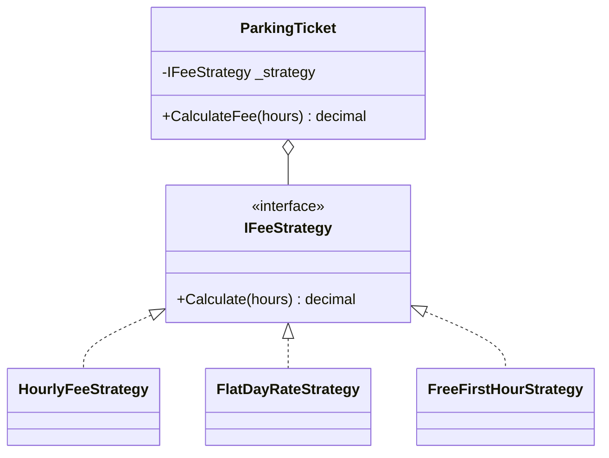

# Strategy

**Category**: Behavioral
**Intent**: Define a family of interchangeable algorithms, encapsulate each
one, and make them swappable at runtime — the class using the algorithm is
decoupled from which specific one it's using.

This is **the single most-used pattern in LLD interviews**. Nearly every
case study has at least one Strategy: fare calculation, discount rules,
sorting/matching logic, parking fee rules, route-finding.

## Structure



```csharp
public interface IFeeStrategy { decimal Calculate(int hours); }

public class HourlyFeeStrategy     : IFeeStrategy { public decimal Calculate(int h) => 10m * h; }
public class FlatDayRateStrategy   : IFeeStrategy { public decimal Calculate(int h) => 50m; }
public class FreeFirstHourStrategy : IFeeStrategy { public decimal Calculate(int h) => h <= 1 ? 0m : 10m * (h - 1); }

// Depends only on the interface. New pricing schemes are ADDED, never
// bolted into this class.
public class ParkingTicket
{
    private readonly IFeeStrategy _strategy;
    public ParkingTicket(IFeeStrategy strategy) => _strategy = strategy;
    public decimal CalculateFee(int hours) => _strategy.Calculate(hours);
}

new ParkingTicket(new FreeFirstHourStrategy()).CalculateFee(3);  // 20
new ParkingTicket(new HourlyFeeStrategy()).CalculateFee(3);      // 30
```

`ParkingTicket` doesn't know or care *how* the fee is computed — it just
calls `_strategy.Calculate(hours)`. Swapping pricing schemes (hourly, flat
daily rate, first-hour-free promo) means adding a new class, never editing
`ParkingTicket`. This is the pattern-shaped version of the OCP fix shown in
[`../../../03-SOLID-Principles/notes.md`](../../../03-SOLID-Principles/notes.md).

📄 [`Strategy.cs`](Strategy.cs) · `dotnet run --project Runner strategy`

> **Try it:** add a `WeekendRateStrategy`. Notice you never opened
> `ParkingTicket` — that untouched class is the whole point, and it's the
> sentence to say out loud in an interview. Then ask yourself the harder
> question: if there were only ever *one* fee rule, would you still add the
> interface? (No — see [YAGNI](../../../06-Core-Design-Principles/notes.md).)

## When to use

- A behavior has **multiple interchangeable variants**, selected at
  runtime (by config, user choice, or context) — and you want to avoid a
  `switch`/`if-else` chain choosing between them inline.
- You want each variant unit-testable in isolation.

## Strategy vs State — the other big mix-up

Structurally near-identical (a class holds an interface reference, swaps
implementations). The difference is **who decides to swap, and why**:

| | Strategy | State |
|---|---|---|
| Who picks the implementation | The **client/caller**, usually once, based on configuration | The **object itself**, transitioning automatically as things happen |
| Purpose | Interchangeable **algorithms** doing the same conceptual job | Modeling an object's **lifecycle**, where behavior legitimately differs by phase |
| Example | Pick a `FeeStrategy` when the ticket is created | An `Order` moves Placed → Shipped → Delivered on its own, each state limiting what's allowed next |

See `../State/notes.md` for the State-pattern version of this comparison.

## Interview variations

- "How would you support multiple pricing schemes (hourly / flat-rate /
  membership) without a `switch` on an enum?" → Strategy, straight OCP
  motivation.
- "What's the difference between Strategy and State?" (see table above —
  asked constantly, know it cold).
- "How would a client choose which strategy to use?" → constructor
  injection, a factory, or configuration — tie back to DIP.
