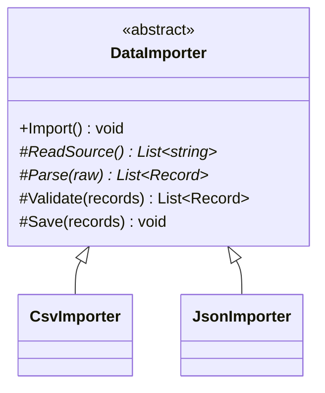

# Template Method

**Category**: Behavioral
**Intent**: Define the **skeleton of an algorithm** in a base class method,
deferring specific steps to subclasses — the overall sequence of steps is
fixed and shared; only individual steps vary.

## Structure



`Import()` is **not** overridden by subclasses. It's the template: it
calls the steps below it in a fixed order that subclasses cannot reorder
or skip.

```csharp
// The template — fixed sequence, lives once in the base class, never
// duplicated or reordered by subclasses.
public void Import()
{
    var raw = ReadSource();
    var records = Parse(raw);
    var valid = Validate(records); // has a default implementation subclasses can reuse
    Save(valid);
}
```

The three kinds of step are the thing to notice:

```csharp
public abstract class DataImporter
{
    public void Import() { ... }   // NOT virtual — the sequence is the contract

    // 1. abstract — subclass MUST supply it
    protected abstract List<string> ReadSource();
    protected abstract List<Record> Parse(List<string> raw);

    // 2. virtual "hook" — sensible default, subclass MAY override
    protected virtual List<Record> Validate(List<Record> records) =>
        records.Where(r => !string.IsNullOrWhiteSpace(r.RawLine)).ToList();

    // 3. plain — subclass CANNOT change it
    protected void Save(List<Record> records) => ...;
}

public class CsvImporter : DataImporter
{
    protected override List<string> ReadSource() => new() { "id,name", "1,Alice", "2,Bob" };
    protected override List<Record> Parse(List<string> raw) =>
        raw.Skip(1).Select(line => new Record(line)).ToList();   // skip CSV header
}
```

`CsvImporter` and `JsonImporter` each override only `ReadSource()` and
`Parse()` — the overall pipeline (read → parse → validate → save) is
written exactly once, in the base class, and can't be accidentally
reordered or skipped by a subclass.

Choosing `abstract` vs `virtual` vs plain for each step **is** the design
work here: you're deciding, per step, whether a subclass must, may, or must
not vary it. That's a sharper question than "should I use Template Method?"
and a good thing to narrate aloud.

📄 [`TemplateMethod.cs`](TemplateMethod.cs) · `dotnet run --project Runner template`

> **Try it:** override `Validate` in `JsonImporter` to reject records without
> an `id`. That's the hook doing its job. Now try to make `CsvImporter` save
> *before* validating — you can't without editing the base class, and that
> impossibility is the entire point of the pattern.

## When to use

- Multiple classes implement the **same overall algorithm/process** with
  only specific steps differing — you want the shared sequence in exactly
  one place (DRY), while still allowing per-subclass customization of
  individual steps.
- Common real examples: data import/export pipelines, game turn loops
  (`StartTurn → PlayTurn → EndTurn`, shared across game types), test
  framework lifecycle (`SetUp → RunTest → TearDown`), report generation.

## Template Method vs Strategy

| | Template Method | Strategy |
|---|---|---|
| Mechanism | **Inheritance** — subclasses override specific steps of a fixed base algorithm | **Composition** — a whole algorithm is swapped in as an object |
| Granularity | Varies individual **steps** within one algorithm | Varies the **entire algorithm** as one unit |
| Flexibility | Fixed at compile time (which subclass you instantiate) | Swappable at runtime (which strategy object you inject) |

If you need to swap behavior *at runtime*, prefer Strategy. If the overall
sequence is genuinely fixed and shared, and only specific steps legitimately
vary per subtype, Template Method is the more direct fit — and is a case
where inheritance (rather than composition) is actually the right call, per
the composition-vs-inheritance discussion in `01-OOP-Basics`.

## Interview variations

- "Multiple report types share the same generate → format → export flow,
  but the formatting step differs — how do you avoid duplicating the
  pipeline in every report class?" → Template Method.
- "Why not Strategy here?" → the *entire sequence* is shared and fixed;
  only isolated steps vary — inheritance-based step overriding is a more
  direct fit than swapping a whole algorithm object.
