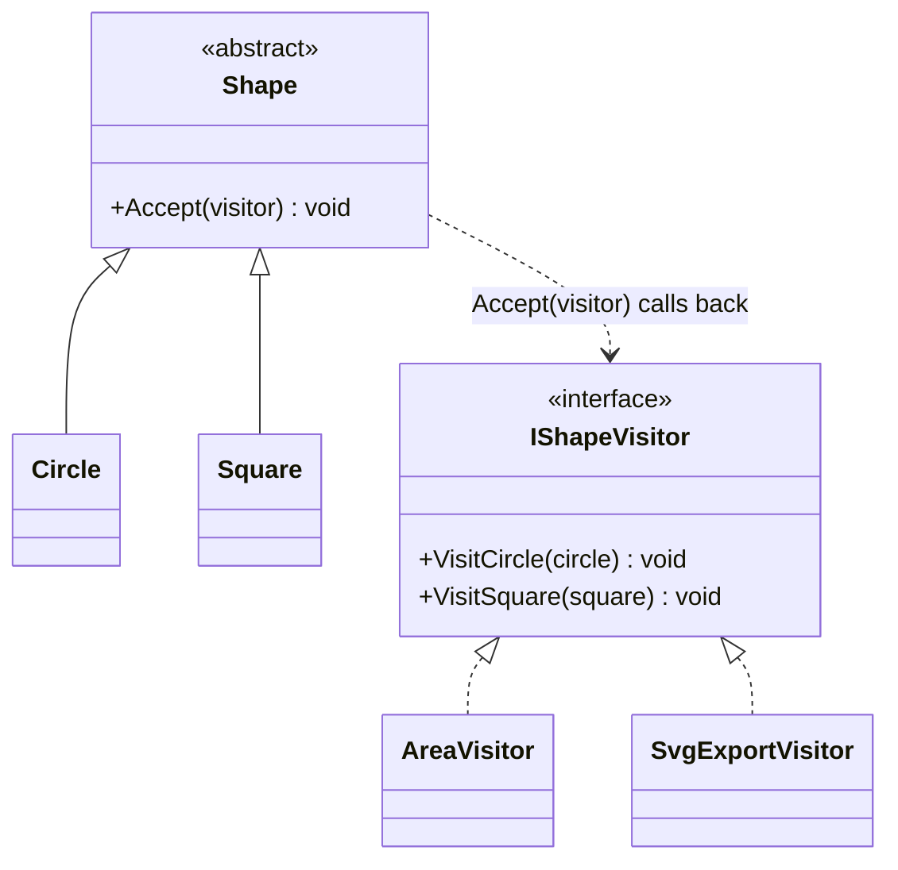

# Visitor

**Category**: Behavioral
**Intent**: Represent an operation to be performed on the elements of an
object structure (e.g. a class hierarchy) **without changing the classes of
the elements** — lets you add new operations by adding new visitor classes,
instead of adding a new method to every element class.

This is the most conceptually dense pattern here and the least frequently
needed in a 45-minute interview — understand it well enough to recognize
when it's the right answer, but don't over-invest relative to Strategy/
Observer/Factory/State, which come up far more often.

## The problem it solves: the "expression problem"

You have a class hierarchy (`Circle`, `Square`, `Triangle` — all
`Shape`s) and need to add operations across all of them (`Area()`,
`Export to SVG`, `Export to JSON`, `Render`...). Two axes want to grow:
**new shape types** and **new operations**. Put operations as methods on
each shape class, and every new operation means editing every shape class.
Visitor flips this: operations live in visitor classes; adding an operation
means adding one new visitor, touching zero existing shape classes.

## Structure

The trick is **double dispatch**: `shape.Accept(visitor)` calls
`visitor.VisitCircle(this)` (or `VisitSquare(this)`) — the compiler picks
the right `Visit...` overload based on the *actual* runtime type of the
shape, achieved by having each concrete shape's `Accept` call the
type-specific method directly, rather than a single generic `Visit(Shape)`
that would need its own type-check.

## When to use

- The class hierarchy is **stable** (new element types rarely added) but
  you expect to **add many new operations** over it — Visitor inverts the
  usual cost so new operations are cheap and new element types are
  expensive (the opposite trade-off from a normal polymorphic method).
- Real examples: compiler ASTs (many operations — type-check, optimize,
  generate code — over a fixed set of node types), exporting a document
  structure to multiple formats.

## When NOT to use

- If new element types are added often (more often than new operations),
  Visitor is the wrong trade-off — every new element type requires adding a
  `Visit...` method to every existing visitor. Prefer plain polymorphism
  (a method on each shape) in that case.

## Interview variations

- "You need to add Area, Perimeter, and SVG-export operations to a Shape
  hierarchy, and expect more export formats later, but shape types are
  fixed." → Visitor, with the double-dispatch explanation.
- "What's the downside of Visitor?" → adding a new element type means
  touching every visitor; only worth it when operations grow faster than
  element types (state this trade-off explicitly, it's what shows real
  understanding vs. name-recall).
