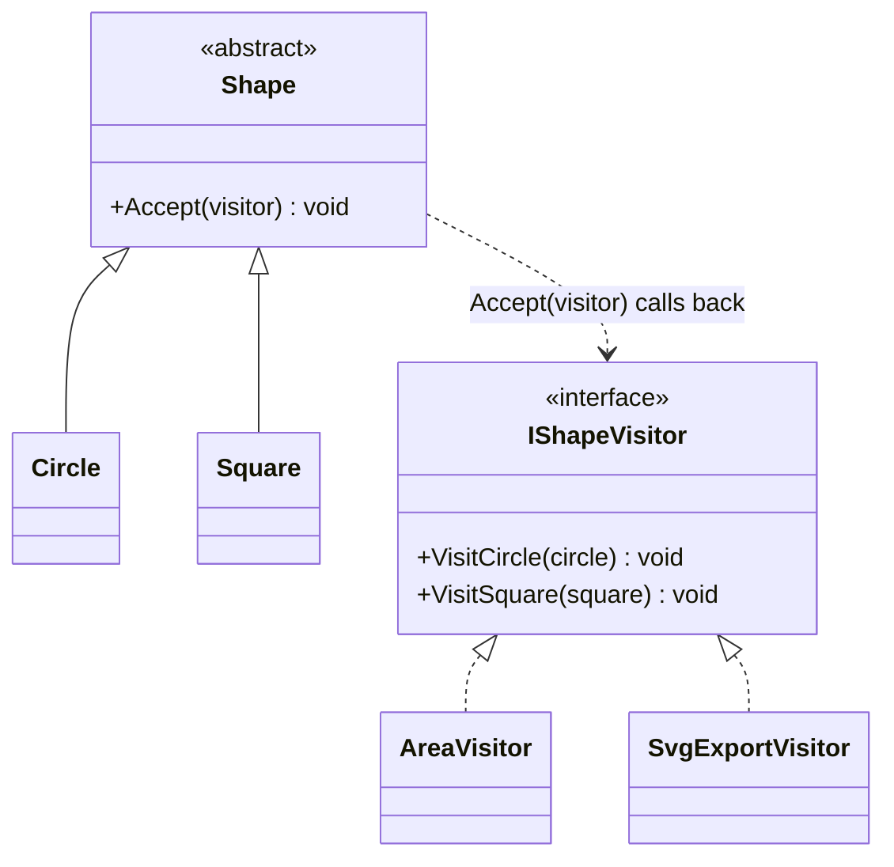

# Visitor

**Category**: Behavioral
**Intent**: Represent an operation to be performed on the elements of an
object structure (e.g. a class hierarchy) **without changing the classes of
the elements** — lets you add new operations by adding new visitor classes,
instead of adding a new method to every element class.

This is the most conceptually dense pattern here and the least frequently
needed in a 45-minute interview — understand it well enough to recognize
when it's the right answer, but don't over-invest relative to Strategy/
Observer/Factory/State, which come up far more often.

## The problem it solves: the "expression problem"

You have a class hierarchy (`Circle`, `Square`, `Triangle` — all
`Shape`s) and need to add operations across all of them (`Area()`,
`Export to SVG`, `Export to JSON`, `Render`...). Two axes want to grow:
**new shape types** and **new operations**. Put operations as methods on
each shape class, and every new operation means editing every shape class.
Visitor flips this: operations live in visitor classes; adding an operation
means adding one new visitor, touching zero existing shape classes.

## Structure



```csharp
public abstract class Shape
{
    public abstract void Accept(IShapeVisitor visitor);
}

public class Circle : Shape
{
    public double Radius { get; }
    // Dispatch #2: Circle knows it's a Circle, so it names the exact method.
    public override void Accept(IShapeVisitor visitor) => visitor.VisitCircle(this);
}

public class Square : Shape
{
    public override void Accept(IShapeVisitor visitor) => visitor.VisitSquare(this);
}

// New operation #1 — zero changes to Circle/Square.
public class AreaVisitor : IShapeVisitor
{
    public double TotalArea { get; private set; }
    public void VisitCircle(Circle c) => TotalArea += Math.PI * c.Radius * c.Radius;
    public void VisitSquare(Square s) => TotalArea += s.Side * s.Side;
}

// New operation #2 — again, zero changes to Circle/Square.
public class SvgExportVisitor : IShapeVisitor { ... }

var areaVisitor = new AreaVisitor();
foreach (var shape in shapes)
    shape.Accept(areaVisitor);       // Dispatch #1: virtual call on Shape
```

The trick is **double dispatch**, and it's worth naming both halves:

1. `shape.Accept(visitor)` — an ordinary virtual call, resolved on the
   runtime type of the *shape*.
2. Inside that override, `visitor.VisitCircle(this)` — resolved on the
   runtime type of the *visitor*.

Two virtual dispatches combine to select one behaviour from the
(shape × visitor) grid. C# only dispatches on one type per call, so the
`Accept` indirection is how you fake dispatching on two. That's the entire
reason `Accept` exists, and it's the thing to say when asked "why not just a
`Visit(Shape)` method?" — that version would need a type-check inside the
visitor, which is precisely what the pattern is avoiding.

## When to use

- The class hierarchy is **stable** (new element types rarely added) but
  you expect to **add many new operations** over it — Visitor inverts the
  usual cost so new operations are cheap and new element types are
  expensive (the opposite trade-off from a normal polymorphic method).
- Real examples: compiler ASTs (many operations — type-check, optimize,
  generate code — over a fixed set of node types), exporting a document
  structure to multiple formats.

## When NOT to use

- If new element types are added often (more often than new operations),
  Visitor is the wrong trade-off — every new element type requires adding a
  `Visit...` method to every existing visitor. Prefer plain polymorphism
  (a method on each shape) in that case.

📄 [`Visitor.cs`](Visitor.cs) · `dotnet run --project Runner visitor`

> **Try it:** do both halves and feel the asymmetry. First add a
> `PerimeterVisitor` — one new file, nothing else touched. Then add a
> `Triangle` shape — and watch the compiler walk you through *every* visitor
> demanding a `VisitTriangle`. That's the trade-off in the section above, and
> having actually felt it is what lets you answer "when would you *not* use
> Visitor?" convincingly.

## Interview variations

- "You need to add Area, Perimeter, and SVG-export operations to a Shape
  hierarchy, and expect more export formats later, but shape types are
  fixed." → Visitor, with the double-dispatch explanation.
- "What's the downside of Visitor?" → adding a new element type means
  touching every visitor; only worth it when operations grow faster than
  element types (state this trade-off explicitly, it's what shows real
  understanding vs. name-recall).
