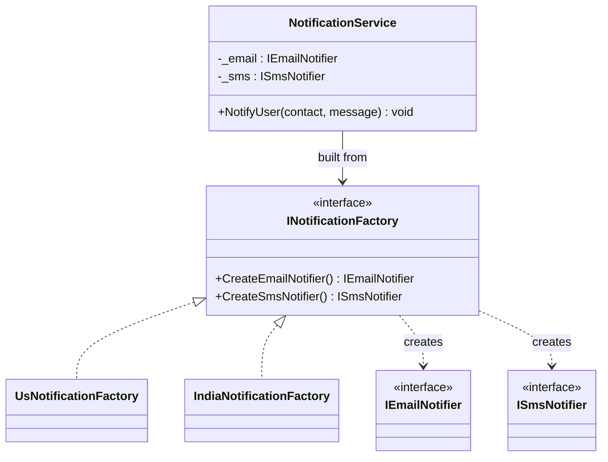

# Abstract Factory

**Category**: Creational
**Intent**: Provide an interface for creating **families of related
objects** without specifying their concrete classes — so that swapping the
whole family (e.g. one vendor/theme/region for another) is a one-line change.

## Structure



`UsNotificationFactory` creates `SesEmailNotifier` + `TwilioSmsNotifier`;
`IndiaNotificationFactory` creates `SendgridEmailNotifier` + `MsgClueSmsNotifier`.

```csharp
// One interface, one creation method per product in the family.
public interface INotificationFactory
{
    IEmailNotifier CreateEmailNotifier();
    ISmsNotifier   CreateSmsNotifier();
}

public class IndiaNotificationFactory : INotificationFactory
{
    public IEmailNotifier CreateEmailNotifier() => new SendgridEmailNotifier();
    public ISmsNotifier   CreateSmsNotifier()   => new MsgClueSmsNotifier();
}

// The client never names a concrete notifier.
public class NotificationService
{
    private readonly IEmailNotifier _email;
    private readonly ISmsNotifier _sms;

    public NotificationService(INotificationFactory factory)
    {
        _email = factory.CreateEmailNotifier();
        _sms   = factory.CreateSmsNotifier();   // guaranteed to match the email one
    }
}

new NotificationService(new IndiaNotificationFactory());  // swapping regions
new NotificationService(new UsNotificationFactory());     // is a one-line change
```

`NotificationService` is the class that matters — it depends only on
`INotificationFactory`, `IEmailNotifier`, `ISmsNotifier`, so swapping regions
swaps one factory instance.

📄 [`AbstractFactory.cs`](AbstractFactory.cs) · `dotnet run --project Runner abstractfactory`

> **Try it:** try to construct a `NotificationService` that pairs SES email
> with MsgClue SMS. You can't get there through a factory — and *that
> impossibility is the pattern's entire purpose*. Then add
> `CreatePushNotifier()` to the interface and watch both concrete factories
> break. Both properties come from the same design decision; know both before
> you propose it.

## Factory Method vs Abstract Factory, concretely

| | Factory Method | Abstract Factory |
|---|---|---|
| Creates | one product | a **family** of related products |
| Shape | one method | an interface with several creation methods |
| Example | `VehicleFactory.Create(type) -> Vehicle` | `UiFactory.CreateButton()` + `CreateCheckbox()`, matched per theme |

An Abstract Factory is often literally implemented as several Factory
Methods grouped behind one interface — so Factory Method is a building
block *of* Abstract Factory, not a competing choice.

## When to use

- You need to guarantee that a set of created objects are **used together
  and stay consistent** (don't accidentally mix a `DarkButton` with a
  `LightCheckbox`).
- Common real cases: cross-platform UI toolkits, database-vendor-specific
  driver families, region/locale-specific service implementations.

## When NOT to use

- If there's only one product varying, not a family — that's plain Factory
  Method; Abstract Factory adds structure you don't need yet.
- Adding a new *product type* to the family (e.g. `CreatePushNotifier()`)
  means editing the interface **and every concrete factory** — a real
  maintenance cost worth mentioning if asked about trade-offs.

## Interview variations

- "How would you support notifications for a new country?" → add a new
  concrete factory implementing the existing interface; nothing else
  changes (OCP win).
- "What if the interface itself needs a new creation method?" → acknowledge
  the cost: every existing concrete factory must implement it (this is the
  known trade-off of Abstract Factory, good to state proactively).
