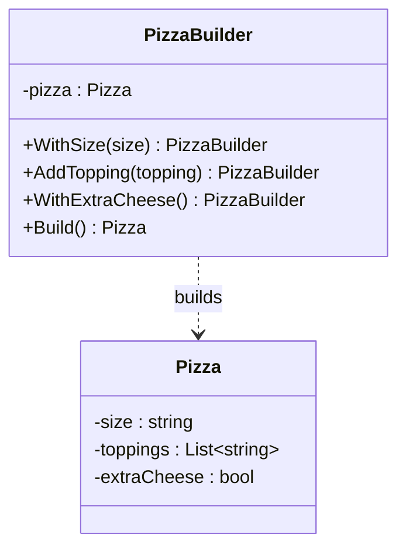

# Builder

**Category**: Creational
**Intent**: Separate the construction of a complex object from its
representation, so the same step-by-step construction process can produce
different configurations — and callers don't have to deal with a
constructor that takes ten optional parameters.

## Structure



## The problem it solves: telescoping constructors

```csharp
// Without Builder — unreadable, error-prone (which bool is which?)
var pizza = new Pizza("Large", new[] { "Mushroom", "Olives" }, true, false, null, true);
```

```csharp
// With Builder — reads like a sentence, optional pieces are opt-in
Pizza pizza = new PizzaBuilder()
    .WithSize("Large")
    .AddTopping("Mushroom")
    .AddTopping("Olives")
    .WithExtraCheese()
    .Build();
```

The builder itself — note that every step returns `this`, which is what makes
the chaining work:

```csharp
public class PizzaBuilder
{
    private string _size = "Medium";              // sensible default
    private readonly List<string> _toppings = new();
    private bool _extraCheese;

    public PizzaBuilder WithSize(string size)     { _size = size;       return this; }
    public PizzaBuilder AddTopping(string t)      { _toppings.Add(t);   return this; }
    public PizzaBuilder WithExtraCheese()         { _extraCheese = true; return this; }

    public Pizza Build() => new(_size, _toppings.ToList(), _extraCheese);
    //                                          ^^^^^^^^^ see below
}
```

### The `.ToList()` is not incidental ⭐

`Build()` hands `Pizza` a **copy** of the toppings. Pass `_toppings` directly
and the builder keeps a live reference to the very same `List` the
"immutable" `Pizza` exposes — so calling `AddTopping()` after `Build()` would
mutate a pizza that was already finished. Declaring the property as
`IReadOnlyList<string>` stops *callers* from mutating it; it does nothing to
stop the builder.

This is a favourite follow-up ("is your immutable object actually
immutable?"), and it generalizes: **a readonly interface over a collection
you still hold a mutable reference to is not immutability.**

## When to use

- An object has **many optional fields/parameters** and you want a readable,
  self-documenting construction call (fixes "constructor with 8 booleans").
- Construction has **multiple valid step orderings or partial states**
  worth modeling explicitly (e.g. an `HttpRequestBuilder`).
- You want the constructed object to be **immutable** once built — the
  builder mutates a work-in-progress, `Build()` returns a finished,
  read-only object.

## When NOT to use

- A handful of required fields and no optional ones — a normal constructor
  is simpler and the Builder is pure ceremony.

📄 [`Builder.cs`](Builder.cs) · `dotnet run --project Runner builder`

> **Try it:** delete the `.ToList()` in `Build()`, then in `Run()` keep the
> builder in a variable, call `Build()`, and *then* `AddTopping("Anchovy")`.
> Print the pizza you already built. It changed. Put the `.ToList()` back and
> watch it stop. That's the whole defensive-copy lesson in about four lines.

## Builder vs Factory

Factory answers "**which class** should I instantiate?" (a decision).
Builder answers "**how do I assemble** this one complex object step by
step?" (a process). They compose fine together: a factory can return a
builder, or a builder can internally use a factory to pick sub-component
types.

## Interview variations

- "This constructor has 6 optional parameters, how would you clean it up?"
  → Builder, with a code sample.
- "How do you make the built object immutable?" → builder holds mutable
  work-in-progress fields; `Build()` copies them into a `readonly`/`init`-only
  target object.
- Fluent interface style (`.WithX().WithY()`) is expected — mention method
  chaining returning `this`/the builder type.
