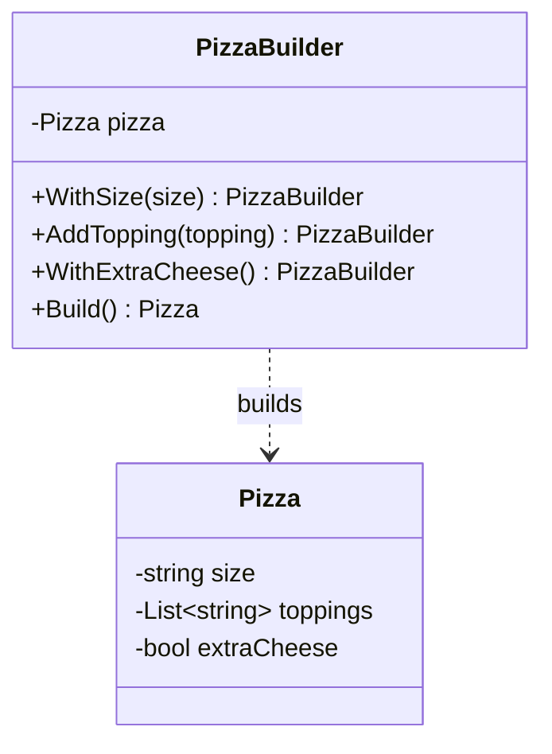

# Builder

**Category**: Creational
**Intent**: Separate the construction of a complex object from its
representation, so the same step-by-step construction process can produce
different configurations — and callers don't have to deal with a
constructor that takes ten optional parameters.

## Structure



## The problem it solves: telescoping constructors

```csharp
// Without Builder — unreadable, error-prone (which bool is which?)
var order = new Order(id: 1, customerId: 42, items: items, discount: 0,
    isGift: true, giftMessage: null, expressShipping: false, notes: "");
```

```csharp
// With Builder — reads like a sentence, optional pieces are opt-in
var order = new OrderBuilder()
    .For(customerId: 42)
    .WithItems(items)
    .AsGift()
    .Build();
```

## When to use

- An object has **many optional fields/parameters** and you want a readable,
  self-documenting construction call (fixes "constructor with 8 booleans").
- Construction has **multiple valid step orderings or partial states**
  worth modeling explicitly (e.g. an `HttpRequestBuilder`).
- You want the constructed object to be **immutable** once built — the
  builder mutates a work-in-progress, `Build()` returns a finished,
  read-only object.

## When NOT to use

- A handful of required fields and no optional ones — a normal constructor
  is simpler and the Builder is pure ceremony.

## Builder vs Factory

Factory answers "**which class** should I instantiate?" (a decision).
Builder answers "**how do I assemble** this one complex object step by
step?" (a process). They compose fine together: a factory can return a
builder, or a builder can internally use a factory to pick sub-component
types.

## Interview variations

- "This constructor has 6 optional parameters, how would you clean it up?"
  → Builder, with a code sample.
- "How do you make the built object immutable?" → builder holds mutable
  work-in-progress fields; `Build()` copies them into a `readonly`/`init`-only
  target object.
- Fluent interface style (`.WithX().WithY()`) is expected — mention method
  chaining returning `this`/the builder type.
