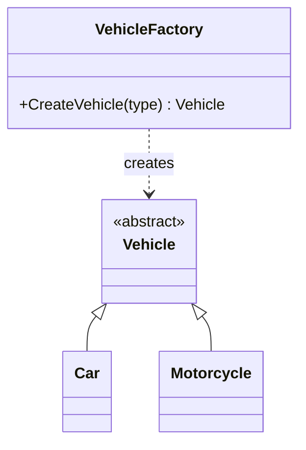

# Factory Method

**Category**: Creational
**Intent**: Define an interface for creating an object, but let the
decision of *which concrete class to instantiate* be centralized in one
place (a factory), instead of scattered `new` calls / `switch` statements
throughout the codebase.

## Structure

This is the pattern you almost always reach for immediately after applying
OCP to remove a type-switch (see `03-SOLID-Principles/notes.md`, the OCP
section) — the polymorphic hierarchy solves "how do these types *behave*
differently," and the Factory solves "how do I *create* the right one
without a switch statement leaking into every caller."

## When to use

- Object creation involves logic (which subtype, how to configure it) that
  you don't want duplicated at every call site.
- You want callers to depend only on the base type/interface, never on
  concrete constructors — keeps callers open/closed too.

## Factory Method vs Abstract Factory

- **Factory Method**: one method, creates **one product** (possibly of
  varying subtype based on an input parameter).
- **Abstract Factory**: an interface with **several factory methods**,
  creating a **family of related products** that are meant to be used
  together (see `../AbstractFactory/notes.md`).

## Interview variations

- "Where would the `switch` on vehicle type live if not in `FeeCalculator`?"
  → in a `VehicleFactory.CreateVehicle(type)`, isolated to one place.
- "What if creating a `Car` requires reading configuration / hitting a
  registry?" → still lives inside the factory; callers remain unaffected.
- Often appears embedded inside a case study rather than asked standalone —
  e.g. "how do you create the right `Shape` from user input in the Chess or
  Tic-Tac-Toe case study" is a Factory Method question in disguise.
