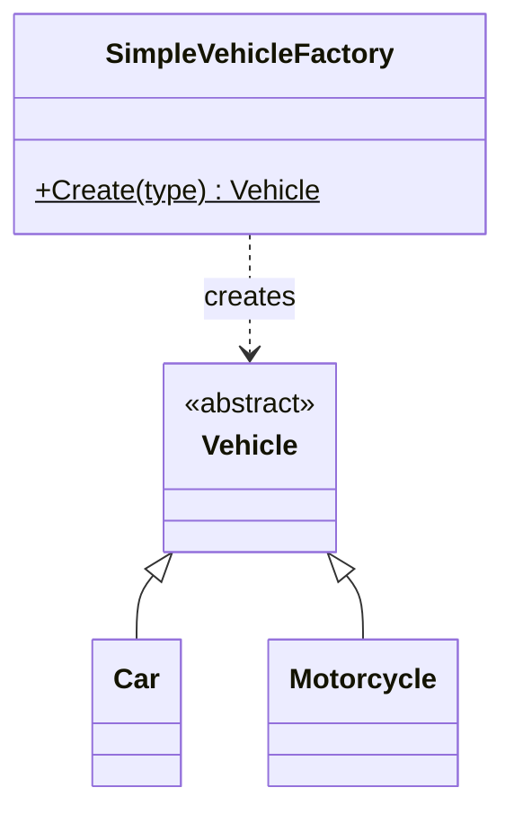
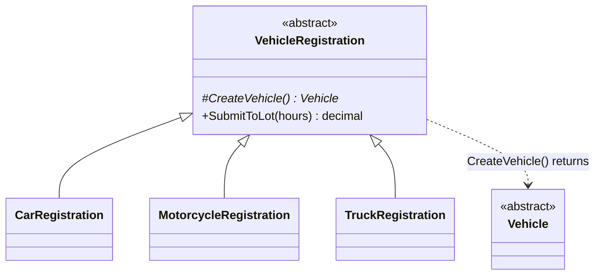

# Factory Method (and Simple Factory)

**Category**: Creational
**Intent (GoF)**: Define an interface for creating an object, but let
**subclasses decide which class to instantiate**. Factory Method lets a
class defer instantiation to subclasses.

⚠️ **Read this section first — it's a common interview trap.** Three
different things get casually called "factory," and interviewers do ask
you to distinguish them:

| Name | Is it a GoF pattern? | Mechanism |
|---|---|---|
| **Simple Factory** (a.k.a. Static Factory) | ❌ No — an idiom, not a GoF pattern | One class/method holds a `switch` mapping a type token → concrete class |
| **Factory Method** | ✅ Yes | A **creator class hierarchy**; an abstract method is overridden per subclass to choose the product. No switch anywhere. |
| **Abstract Factory** | ✅ Yes | An interface with **several** creation methods producing a **family** of related products (see [`../AbstractFactory/notes.md`](../AbstractFactory/notes.md)) |

Both Simple Factory and Factory Method are implemented side by side in
[`FactoryMethod.cs`](FactoryMethod.cs) so you can see the difference
concretely.

## 1. Simple Factory — what you'll actually write most of the time

One place owns the type→class mapping; every caller depends only on
`Vehicle` and never on `new Car()`.

**Be honest about the trade-off** (interviewers probe this): adding a new
`VehicleType` still means editing that switch, so Simple Factory is *not*
itself open/closed. What it buys you is **centralization** — the decision
lives in exactly one place instead of being duplicated at every call site.
That is usually worth it on its own, and for most case studies it's the
proportionate choice. Don't let anyone (including a reviewer) push you into
a creator hierarchy you don't need — see the YAGNI discussion in
[`../../../06-Core-Design-Principles/notes.md`](../../../06-Core-Design-Principles/notes.md).

## 2. Factory Method — the actual GoF pattern

The defining traits:
1. There is a **creator hierarchy** (`VehicleRegistration` and its
   subclasses), not just a product hierarchy.
2. The creator holds **shared logic** (`SubmitToLot`) written against the
   abstract product — this is the reason the pattern is a hierarchy at all.
   If there were no shared logic, Simple Factory would do the job.
3. **Choosing a subclass *is* choosing the product.** No switch exists.

Because of (3), adding `TruckRegistration` requires **zero edits to
existing classes** — genuinely open/closed, which Simple Factory is not.

## When to use which

- **Simple Factory**: you have a type token (enum, string from input, DB
  value) and need the matching object. Most case studies. Start here.
- **Factory Method**: there's a meaningful **workflow around** the created
  object that you want written once in a base class, and each subclass
  varies which product that workflow operates on. Also the right answer
  when the interviewer explicitly asks for "the Factory Method pattern."
- **Abstract Factory**: you need a *family* of related products kept
  mutually consistent.

## Relationship to OCP and polymorphism

A factory answers "**which class do I instantiate?**". Polymorphism answers
"**how does each type behave differently?**". They're complements, and a
typical design uses both: `Vehicle` subclasses override `CalculateFee`
(polymorphism), while a factory decides which subclass to build. Removing a
`switch(type)` from your *behavior* code with polymorphism often just moves
the type decision into a factory — that's expected and fine; the point is
that it now exists in one place instead of many.

## Interview variations

- "What's the difference between Simple Factory, Factory Method, and
  Abstract Factory?" — the table at the top. This is asked constantly and
  is the highest-value thing on this page.
- "Your factory has a switch — doesn't that violate OCP?" — the honest
  answer: yes, Simple Factory isn't open/closed; it centralizes the change
  to one known location. If the interviewer wants true OCP creation, that's
  when you reach for Factory Method's creator hierarchy or a registry
  (`Dictionary<VehicleType, Func<Vehicle>>`) that new types register into.
- "Where would the `switch` on vehicle type live if not in
  `FeeCalculator`?" → in the factory, isolated to one place.
- "What if creating a `Car` requires config/registry lookups?" → still
  inside the factory; callers stay unaffected.
