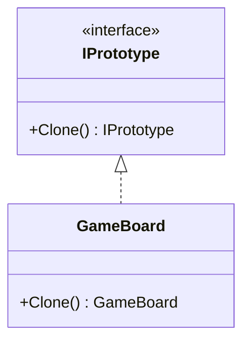
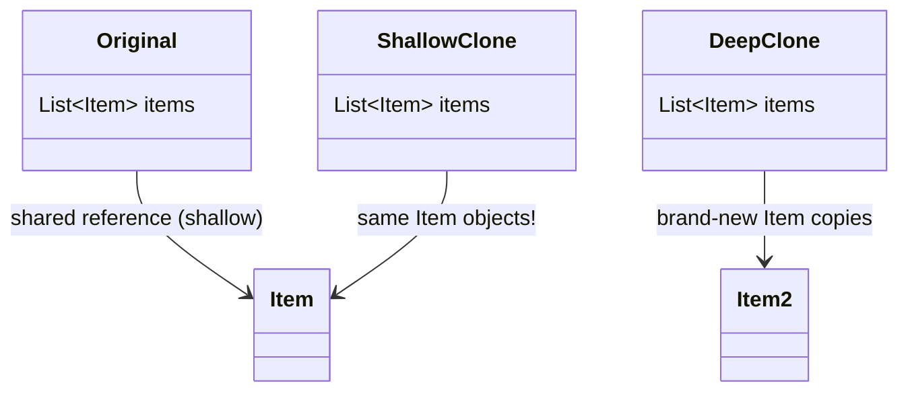

# Prototype

**Category**: Creational
**Intent**: Create new objects by **cloning an existing instance** (a
"prototype") instead of instantiating a class from scratch — useful when
creating an object is expensive, or when you want a copy that starts
identical to a template and is then tweaked.

## Structure

## When to use

- Object creation is expensive (heavy computation, network/DB round trip to
  populate defaults) and you have a ready-made template to copy instead.
- You need many objects that are *mostly* identical to a baseline, each with
  small per-instance tweaks (e.g. spawning enemies from a template in a
  game, duplicating a configured `GameBoard` for a new match, cloning a
  richly-configured object graph for a "duplicate this order" feature).
- Avoiding a subclass explosion where you'd otherwise need a subclass per
  slight variation just to get a different pre-configured object.

## Shallow vs deep copy — the actual interview content here

This pattern is mostly tested through **this exact question**: *"Does your
`Clone()` do a shallow or deep copy, and why does it matter?"*

- **Shallow copy**: copies the object's own fields, but reference-type
  fields still point at the *same* underlying objects as the original.
  Mutating a shared sub-object through the clone also mutates the original —
  usually a bug.
- **Deep copy**: recursively clones every referenced object too, so the
  clone is fully independent.

C#'s `MemberwiseClone()` gives you a shallow copy for free; a correct
`Clone()` for an object with mutable reference fields must manually deep-copy
those fields.

## Interview variations

- "Shallow or deep clone — walk me through the difference with this class."
- "When would Prototype be better than a Factory?" → when a fully
  pre-configured instance already exists and copying it is cheaper/more
  convenient than re-deriving configuration from scratch.
