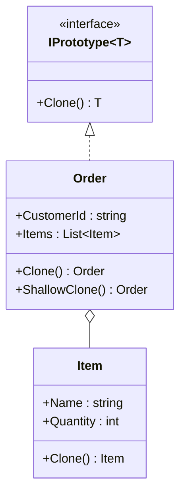
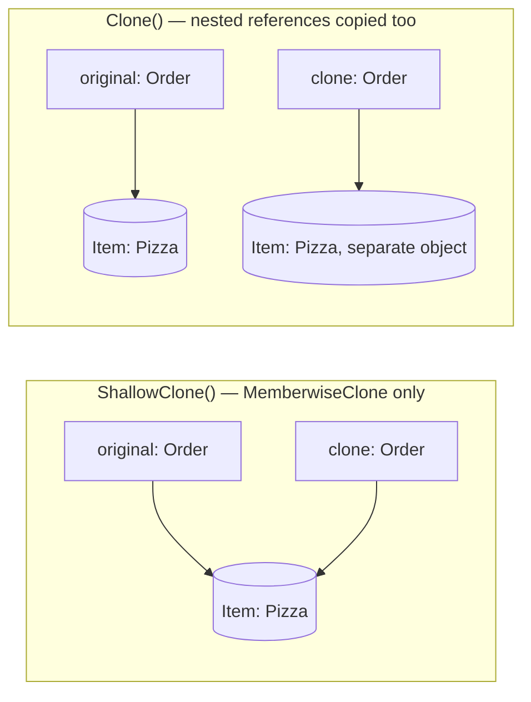

# Prototype

**Category**: Creational
**Intent**: Create new objects by **cloning an existing instance** (a
"prototype") instead of instantiating a class from scratch — useful when
creating an object is expensive, or when you want a copy that starts
identical to a template and is then tweaked.

## Structure



## When to use

- Object creation is expensive (heavy computation, network/DB round trip to
  populate defaults) and you have a ready-made template to copy instead.
- You need many objects that are *mostly* identical to a baseline, each with
  small per-instance tweaks (e.g. spawning enemies from a template in a
  game, duplicating a configured `GameBoard` for a new match, cloning a
  richly-configured object graph for a "duplicate this order" feature).
- Avoiding a subclass explosion where you'd otherwise need a subclass per
  slight variation just to get a different pre-configured object.

## Shallow vs deep copy — the actual interview content here

This pattern is mostly tested through **this exact question**: *"Does your
`Clone()` do a shallow or deep copy, and why does it matter?"*



In the shallow case both `Order` objects point at **one** `Item`, so writing
through either is visible from the other.

```csharp
public class Order : IPrototype<Order>
{
    public string CustomerId { get; set; } = "";
    public List<Item> Items { get; set; } = new();

    // ❌ Shallow: reuses the SAME Item objects.
    public Order ShallowClone() => (Order)MemberwiseClone();

    // ✅ Deep: clone every nested mutable reference too.
    public Order Clone()
    {
        var copy = (Order)MemberwiseClone();
        copy.Items = Items.Select(i => i.Clone()).ToList();
        return copy;
    }
}
```

And the difference you can actually observe:

```csharp
var shallow = original.ShallowClone();
shallow.Items[0].Quantity = 99;
Console.WriteLine(original.Items[0].Quantity);  // 99 — the original mutated too

var deep = original2.Clone();
deep.Items[0].Quantity = 99;
Console.WriteLine(original2.Items[0].Quantity); // 1 — correctly independent
```

- **Shallow copy**: copies the object's own fields, but reference-type
  fields still point at the *same* underlying objects as the original.
  Mutating a shared sub-object through the clone also mutates the original —
  usually a bug.
- **Deep copy**: recursively clones every referenced object too, so the
  clone is fully independent.

C#'s `MemberwiseClone()` gives you a shallow copy for free; a correct
`Clone()` for an object with mutable reference fields must manually deep-copy
those fields.

Note this is the **same underlying trap** as the `.ToList()` in
[Builder](../Builder/notes.md) — a copy that shares a mutable reference isn't
really a copy. Different pattern, identical failure.

📄 [`Prototype.cs`](Prototype.cs) · `dotnet run --project Runner prototype`

> **Try it:** add a `ShippingAddress` class as a mutable reference field on
> `Order` and clone without deep-copying it. `Clone()` is now *partially*
> deep — which is the realistic bug, because it looks correct in review. Deep
> copying is a per-field obligation, not a switch you flip once.

## Interview variations

- "Shallow or deep clone — walk me through the difference with this class."
- "When would Prototype be better than a Factory?" → when a fully
  pre-configured instance already exists and copying it is cheaper/more
  convenient than re-deriving configuration from scratch.
