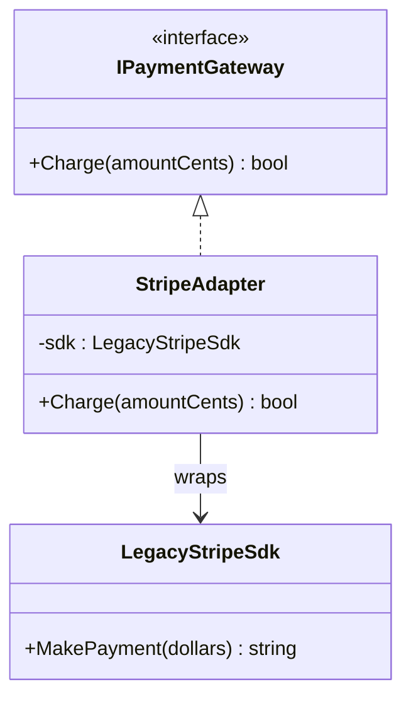

# Adapter

**Category**: Structural
**Intent**: Convert the interface of a class into another interface clients
expect, letting incompatible interfaces work together without modifying
either side.

## Structure



```csharp
// The interface OUR application already codes against.
public interface IPaymentGateway { bool Charge(int amountCents); }

// A third-party SDK we don't control: different name, different units
// (dollars not cents), different return type (string not bool).
public class LegacyStripeSdk
{
    public string MakePayment(decimal amountDollars) { ...; return "SUCCESS"; }
}

// All three translations live in exactly ONE place.
public class StripeAdapter : IPaymentGateway
{
    private readonly LegacyStripeSdk _sdk;

    public bool Charge(int amountCents)
    {
        decimal dollars = amountCents / 100m;      // units
        string result = _sdk.MakePayment(dollars); // name
        return result == "SUCCESS";                // return type
    }
}

// Application code depends only on IPaymentGateway.
new CheckoutService(new StripeAdapter(new LegacyStripeSdk())).Pay(4999);
```

`StripeAdapter` implements the interface your app already expects
(`IPaymentGateway`) and internally translates calls to whatever shape the
third-party SDK actually has. Your app code never touches `LegacyStripeSdk`
directly.

Notice the adapter is also where a whole class of bugs gets **quarantined**:
the cents→dollars conversion is exactly the kind of thing that otherwise gets
duplicated (and eventually done wrong) at every call site.

📄 [`Adapter.cs`](Adapter.cs) · `dotnet run --project Runner adapter`

> **Try it:** add a `PayPalSdk` with yet another shape — say
> `Send(long paise, string currency)` returning an enum — and write a second
> adapter. `CheckoutService` never changes. Then ask the interview question
> back: if you'd coded directly against the Stripe SDK from day one, how many
> files would this have touched?

## When to use

- Integrating a **third-party library or legacy code** whose interface
  doesn't match what the rest of your system expects, and you can't (or
  shouldn't) modify that external code.
- Migrating from an old interface to a new one gradually — the adapter lets
  old and new coexist.

## Object Adapter vs Class Adapter

- **Object Adapter** (shown above): wraps an *instance* of the adaptee via
  composition. This is the version you'll actually write.
- **Class Adapter**: inherits from the adaptee directly. The original GoF
  book assumed C++ multiple inheritance, which C# doesn't have — you can
  approximate it by inheriting the adaptee and implementing the target
  interface, but it inherits the adaptee's whole surface area and couples
  you to its implementation. Mention it exists, then default to Object
  Adapter and say why: composition over inheritance.

## Adapter vs Facade — a common mix-up

| | Adapter | Facade |
|---|---|---|
| Purpose | Make an **incompatible** interface match what you expect | Simplify a **complex but compatible** subsystem |
| Interface count | Wraps one interface into another, same-ish granularity | Collapses many interfaces into one simpler one |
| Motivation | You *have to* — integration constraint | You *choose to* — for usability |

## Interview variations

- "We're integrating a third-party SDK with a totally different method
  signature than our internal `IPaymentGateway` — how do you keep the rest
  of the codebase clean?" → Adapter, by name, with the wrapping diagram.
- "What's the difference between Adapter and Facade?" (see table above).
