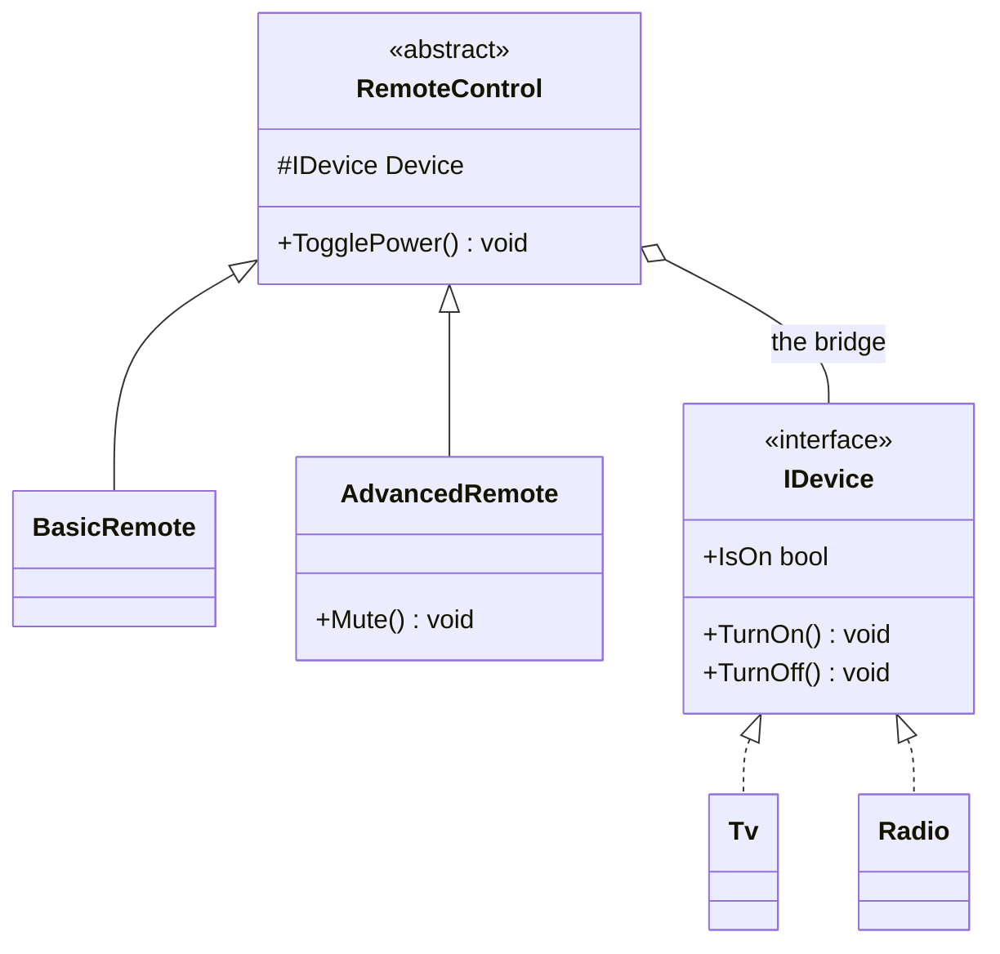

# Bridge

**Category**: Structural
**Intent**: Decouple an abstraction from its implementation so the two can
**vary independently** — instead of a combinatorial class hierarchy for
every abstraction x implementation pairing.

## The problem: a second axis of variation blows up inheritance

Modeling "remote controls x devices" with pure inheritance
(`BasicRemote`, `AdvancedRemote`) x (`TV`, `Radio`) needs a class for every
pairing: `BasicTvRemote`, `AdvancedTvRemote`, `BasicRadioRemote`,
`AdvancedRadioRemote`... — the same combinatorial explosion problem
Decorator solves for "add-ons," but here it's two independent hierarchies
that both want to grow.

## Structure



```csharp
// Implementation hierarchy.
public interface IDevice { bool IsOn { get; } void TurnOn(); void TurnOff(); }
public class Tv    : IDevice { ... }
public class Radio : IDevice { ... }

// Abstraction hierarchy — holds a device (the "bridge") instead of
// inheriting from one.
public abstract class RemoteControl
{
    protected readonly IDevice Device;
    protected RemoteControl(IDevice device) => Device = device;

    public void TogglePower()
    {
        if (Device.IsOn) Device.TurnOff();
        else             Device.TurnOn();
    }
}

public class BasicRemote    : RemoteControl { ... }
public class AdvancedRemote : RemoteControl { public void Mute() => ...; }

// Any remote x any device, at runtime, with zero combinatorial classes.
new BasicRemote(new Tv()).TogglePower();
new AdvancedRemote(new Radio()).TogglePower();
```

`RemoteControl` (the **abstraction** hierarchy) holds a reference to an
`IDevice` (the **implementation** hierarchy) instead of inheriting from it.
Any `RemoteControl` subtype can be paired with any `IDevice` subtype at
runtime, with zero new classes.

📄 [`Bridge.cs`](Bridge.cs) · `dotnet run --project Runner bridge`

> **Try it:** add a `Speaker` device and a `VoiceRemote`. You wrote 2 classes
> and got 9 working pairings; the inheritance version would need 9 classes and
> 3 more for every future device. Write out the N×M arithmetic — that
> calculation is the answer to "why Bridge?", and it's the same argument as
> the two-axis example in
> [`01-OOP-Basics`](../../../01-OOP-Basics/notes.md) §4.

## When to use

- You have (or foresee) **two independent dimensions of variation** and
  don't want their cross-product as concrete classes.
- You want to swap the implementation at runtime without touching the
  abstraction's code (or vice versa).

## Bridge vs Strategy vs Adapter — all "hold a reference to an interface," different intent

| | Bridge | Strategy | Adapter |
|---|---|---|---|
| Intent | Split **two hierarchies** that both grow, so they vary independently | Swap **one algorithm** at runtime | Make an **existing incompatible interface** fit what you need |
| When decided | Usually designed in upfront | Usually designed in upfront | Usually added reactively, for integration |

Structurally these three can look almost identical in a class diagram (a
class holding an interface reference) — the *intent* is what you should
lead with in an interview answer, not the shape.

## Interview variations

- "We have remote types (basic/advanced/voice) and device types
  (TV/radio/speaker) and both keep growing — how do you avoid N×M
  classes?" → Bridge.
- "How is this different from Strategy?" → Bridge is about decoupling two
  hierarchies that each have multiple concrete types and evolve
  independently; Strategy is about swapping a single algorithm/behavior
  used by one class.
