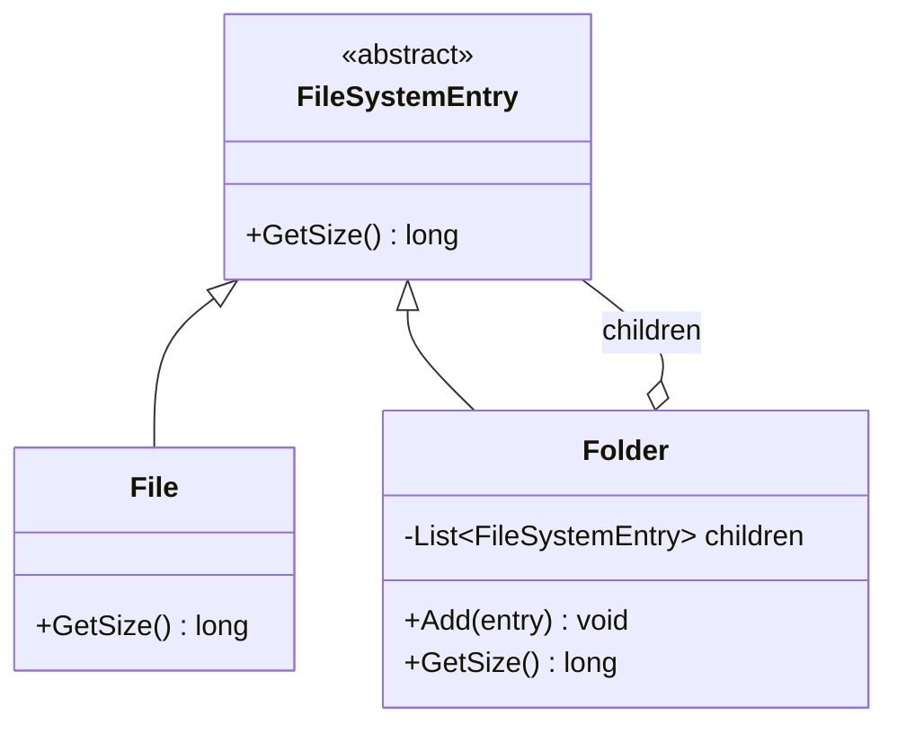

# Composite

**Category**: Structural
**Intent**: Compose objects into tree structures representing part-whole
hierarchies, so clients can treat **individual objects and compositions of
objects uniformly** through one shared interface.

## Structure

A `Folder` contains other `FileSystemEntry`s — which might themselves be
`Folder`s or `File`s. Calling `GetSize()` on a `Folder` recursively sums its
children's sizes; calling it on a `File` returns its own size. Client code
calls `entry.GetSize()` without caring whether `entry` is a leaf or a
subtree.

## When to use

- Data is naturally a **tree/hierarchy** (file systems, org charts, UI
  component trees, menu structures, a company's department hierarchy) and
  you want uniform operations (`render()`, `getSize()`, `getTotalCost()`)
  across leaves and containers without `if (isLeaf)` branching everywhere.

## Interview tell

If you catch yourself writing `if (entry is Folder) { ... } else { ... }`
whenever you operate on tree nodes, that's the signal you're missing a
Composite — the fix is giving `File` and `Folder` a shared method so the
caller never needs to check the type.

## Composite vs Decorator

Both are recursive, tree-shaped structural patterns with a shared base
type. **Composite** models whole-part containment (a folder *contains*
files). **Decorator** models layered wrapping of a *single* object to add
behavior (a coffee wrapped in milk wrapped in sugar) — there's no branching
"multiple children," just one wrapped object per layer.

## Interview variations

- "Design a file system where a folder's size is the sum of its contents,
  recursively." → Composite, straightforwardly.
- "How do you add a new operation (e.g. `Search(name)`) across the whole
  tree without touching every existing node class?" → add it to the shared
  base/interface (still Composite), or consider Visitor if the number of
  *operations* grows faster than the number of *node types* (see
  `../Behavioral/Visitor/notes.md`).
