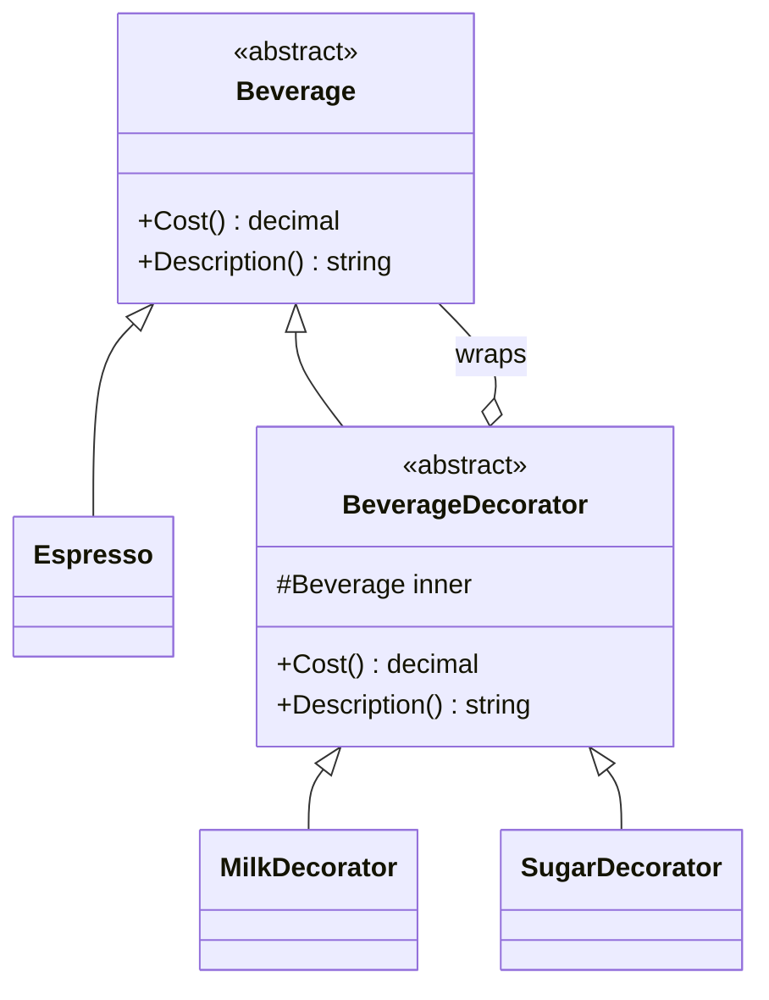

# Decorator

**Category**: Structural
**Intent**: Attach additional responsibilities to an object **dynamically**,
as an alternative to subclassing for every combination of behavior.

## The problem: subclass explosion

Modeling a coffee shop's add-ons with inheritance requires a class per
*combination*: `CoffeeWithMilk`, `CoffeeWithMilkAndSugar`,
`CoffeeWithMilkAndSugarAndWhip`... — combinatorial blowup, and it's fixed at
compile time (can't add "extra shot" to an already-ordered coffee at
runtime).

## Structure

Each decorator **wraps** a `Beverage` (which might itself be another
decorator) and **is-a** `Beverage` itself — so decorators stack:
`new SugarDecorator(new MilkDecorator(new Espresso()))`. Every layer adds
its own cost/description on top of delegating to the wrapped instance.

## When to use

- You need to add responsibilities to **individual objects**, not to every
  instance of a class, and combinations should be composable at runtime
  (any subset of add-ons, in any order).
- Classic real examples: coffee shop add-ons, gift-wrapping an order,
  Java/C# I/O streams (`BufferedStream` wrapping a `FileStream`), adding
  scrollbars/borders to a UI component.

## Decorator vs Inheritance

Inheritance picks behavior **once, at compile time, per class**. Decorator
composes behavior **at runtime, per instance**, and lets you stack any
combination without a new class per combination — directly the "favor
composition over inheritance" principle from `01-OOP-Basics`.

## Decorator vs Proxy — another common mix-up

Both wrap an object behind the same interface. **Decorator adds behavior**
(new responsibilities layered on). **Proxy controls access** (permission
checks, lazy loading, caching) without adding new responsibilities — see
`../Proxy/notes.md`.

## Interview variations

- "Customer wants coffee with milk, extra shot, and whipped cream, in any
  combination — how do you model the pricing without a class per
  combination?" → Decorator, with the stacking diagram.
- "How is this different from just adding optional constructor
  parameters?" → decorators can be added/removed/reordered independently
  and composed at runtime; a parameter list is fixed at construction and
  doesn't scale to many independent optional behaviors.
