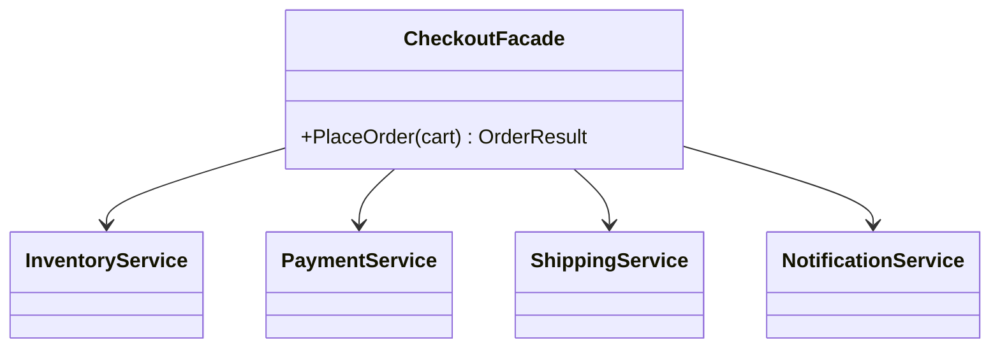

# Facade

**Category**: Structural
**Intent**: Provide a simple, unified interface over a complex subsystem of
many interacting classes, so most callers don't need to know the subsystem's
internals.

## Structure



```csharp
public class CheckoutFacade
{
    private readonly InventoryService _inventory = new();
    private readonly PaymentService _payment = new();
    private readonly ShippingService _shipping = new();
    private readonly NotificationService _notification = new();

    // The ORDER and the failure handling are the value being added here.
    public bool PlaceOrder(string customerId, List<CartItem> cart)
    {
        foreach (var item in cart)
            if (!_inventory.Reserve(item.Sku, item.Quantity))
                return false;                       // stop before charging

        decimal total = cart.Sum(i => i.Price * i.Quantity);
        if (!_payment.Charge(customerId, total))
            return false;                           // stop before shipping

        _shipping.Schedule(customerId);
        _notification.ConfirmOrder(customerId);
        return true;
    }
}

// One call instead of orchestrating four services.
new CheckoutFacade().PlaceOrder("C-1", cart);
```

`CheckoutFacade.PlaceOrder()` internally coordinates reserving inventory,
charging payment, scheduling shipping, and sending a confirmation — in the
right order, handling failures between steps. Callers (e.g. a web
controller) call one method instead of orchestrating four services
themselves.

📄 [`Facade.cs`](Facade.cs) · `dotnet run --project Runner facade`

> **Try it:** make `_payment.Charge` return `false`. Inventory is already
> reserved and never released — a real bug this facade has. Fixing it means
> compensating (releasing the reservation), and now you're holding the
> question the pattern surfaces but doesn't answer: **who owns rollback across
> multiple services?** Say that in an interview and you've moved from naming a
> pattern to reasoning about it.

## When to use

- A subsystem has grown many classes with a specific interaction order/
  error-handling dance, and most callers just want "do the common thing."
- You want to **decouple client code from subsystem internals** — the
  subsystem can be refactored internally as long as the facade's contract
  stays stable.

## Important nuance for interviews

Facade **does not hide** the subsystem — it adds a simpler optional
entry point *in addition to* the existing interfaces. Advanced callers who
need fine-grained control can still use `InventoryService`,
`PaymentService`, etc. directly. This is the detail that separates Facade
from an all-encompassing "god object" — the individual services keep their
own single responsibilities (SRP); the facade only adds orchestration.

## Facade vs Mediator — a common mix-up

| | Facade | Mediator |
|---|---|---|
| Direction | One-way: simplifies calls **into** a subsystem | Two-way: subsystem objects communicate **through** it |
| Subsystem awareness | Subsystem classes don't know the Facade exists | Colleague classes are typically designed to talk to the Mediator |
| Goal | Simplicity for the caller | Decoupling many-to-many chatter between peers |

## Interview variations

- "Your `OrderController` is calling five different services in the right
  order with error handling between each — how do you clean this up?" →
  Facade, and mention it doesn't remove the underlying services, just adds
  a simpler entry point.
- "How is this different from a Mediator?" (see table above).
