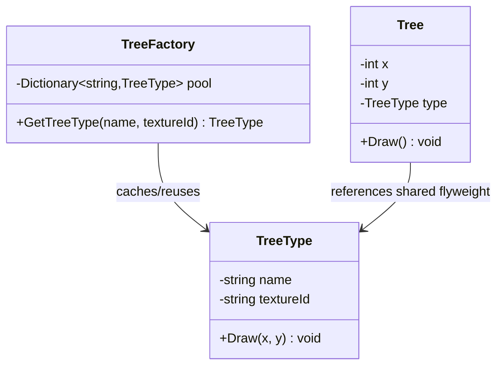

# Flyweight

**Category**: Structural
**Intent**: Use sharing to support large numbers of fine-grained objects
efficiently, by splitting an object's state into:

- **Intrinsic state** — shared, immutable, independent of context (e.g. a
  character glyph's font/shape). Stored once, reused by every user of it.
- **Extrinsic state** — unique per usage, passed in by the caller at call
  time (e.g. that character's *position* on this specific page).

## Structure

A forest with a million trees only needs a handful of `TreeType` objects
(one per species/texture — the expensive, shared intrinsic state). Each of
the million `Tree` instances stores just its `(x, y)` position (extrinsic
state) plus a reference to the shared `TreeType`.

## When to use

- You need to instantiate a **very large number** of similar objects and
  memory is a real constraint.
- A large chunk of each object's state can be **factored out as shared and
  immutable**, with only a small remainder unique per instance.
- Classic real examples: character glyphs in a text editor/renderer, tree/
  particle rendering in games, map tile icons, connection pool objects.

## When NOT to use

- Premature — if you don't actually have a memory problem from a large
  object count, Flyweight adds complexity (a factory/pool, splitting state)
  for no real benefit. Mention this trade-off if asked — interviewers like
  hearing you wouldn't reach for it by default.

## Interview variations

- "You're rendering a million trees in a game world — how do you avoid a
  million heavyweight objects?" → Flyweight, with the intrinsic/extrinsic
  split named explicitly.
- "How is this different from just caching?" → Flyweight specifically
  separates state into shared-immutable vs per-instance-unique and is
  driven from the object-count/memory angle; general caching is a broader
  concept (e.g. caching computed results, not necessarily splitting object
  state).
