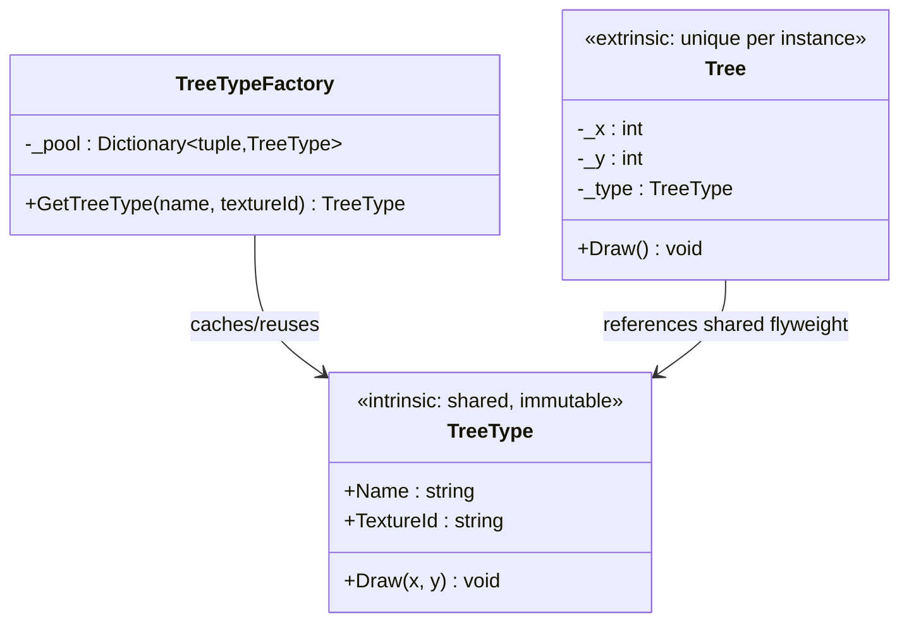

# Flyweight

**Category**: Structural
**Intent**: Use sharing to support large numbers of fine-grained objects
efficiently, by splitting an object's state into:

- **Intrinsic state** — shared, immutable, independent of context (e.g. a
  character glyph's font/shape). Stored once, reused by every user of it.
- **Extrinsic state** — unique per usage, passed in by the caller at call
  time (e.g. that character's *position* on this specific page).

## Structure



```csharp
// The factory is what makes it a Flyweight — without the pool you'd just
// have two classes and no sharing.
public class TreeTypeFactory
{
    // Tuple key, not a concatenated string: no separator-collision bugs
    // ("a:b"+"c" vs "a"+"b:c"), no allocation to build the key.
    private readonly Dictionary<(string Name, string TextureId), TreeType> _pool = new();

    public TreeType GetTreeType(string name, string textureId)
    {
        var key = (name, textureId);
        if (!_pool.TryGetValue(key, out var type))
        {
            type = new TreeType(name, textureId);   // created at most once per key
            _pool[key] = type;
        }
        return type;
    }
}

// Each Tree stores only its position + a pointer to the shared flyweight.
public class Tree
{
    private readonly int _x, _y;
    private readonly TreeType _type;
    public void Draw() => _type.Draw(_x, _y);   // extrinsic state passed in
}

// 100,000 trees; exactly 2 TreeType objects.
for (int i = 0; i < 100_000; i++)
{
    string species = i % 2 == 0 ? "Oak" : "Pine";
    var type = factory.GetTreeType(species, $"{species}Texture");
    forest.Add(new Tree(random.Next(1000), random.Next(1000), type));
}
```

A forest with a million trees only needs a handful of `TreeType` objects
(one per species/texture — the expensive, shared intrinsic state). Each
`Tree` instance stores just its `(x, y)` position (extrinsic state) plus a
reference to the shared `TreeType`.

⚠️ **The flyweight must be immutable.** `TreeType` exposes get-only
properties for a reason: it's shared by 100,000 owners, so a single mutation
would be visible to all of them at once. If you find yourself wanting to
mutate a flyweight, the state you're mutating is extrinsic and belongs in
`Tree`.

📄 [`Flyweight.cs`](Flyweight.cs) · `dotnet run --project Runner flyweight`

> **Try it:** bypass the factory — `new TreeType(species, texture)` inside the
> loop — and watch 100,000 objects get created where 2 would do. Then put a
> mutable `Health` property on `TreeType` and set it on one tree; every tree
> of that species changes. Both failures come from the same split, which is
> why naming intrinsic vs extrinsic is the whole interview answer.

## When to use

- You need to instantiate a **very large number** of similar objects and
  memory is a real constraint.
- A large chunk of each object's state can be **factored out as shared and
  immutable**, with only a small remainder unique per instance.
- Classic real examples: character glyphs in a text editor/renderer, tree/
  particle rendering in games, map tile icons, connection pool objects.

## When NOT to use

- Premature — if you don't actually have a memory problem from a large
  object count, Flyweight adds complexity (a factory/pool, splitting state)
  for no real benefit. Mention this trade-off if asked — interviewers like
  hearing you wouldn't reach for it by default.

## Interview variations

- "You're rendering a million trees in a game world — how do you avoid a
  million heavyweight objects?" → Flyweight, with the intrinsic/extrinsic
  split named explicitly.
- "How is this different from just caching?" → Flyweight specifically
  separates state into shared-immutable vs per-instance-unique and is
  driven from the object-count/memory angle; general caching is a broader
  concept (e.g. caching computed results, not necessarily splitting object
  state).
