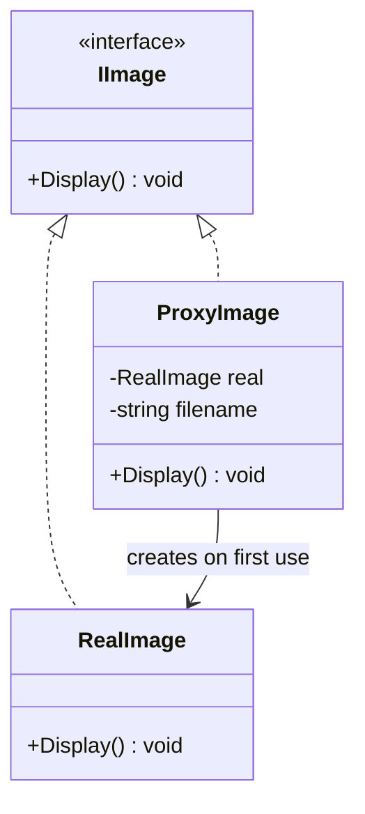

# Proxy

**Category**: Structural
**Intent**: Provide a stand-in/surrogate for another object that **controls
access** to it — without the caller knowing it's not talking to the real
thing directly.

## Structure

Callers depend on `IImage`. `ProxyImage` implements the same interface as
`RealImage`, but defers creating the expensive `RealImage` until `Display()`
is actually called (lazy loading), and can add checks before/after
delegating.

## Common flavors (know the names)

| Flavor | Adds |
|---|---|
| **Virtual Proxy** | Lazily creates an expensive object only when first needed |
| **Protection Proxy** | Checks permissions before delegating the call |
| **Remote Proxy** | Represents an object living in a different address space/process (RPC stubs) |
| **Caching Proxy** | Caches results of expensive calls, serves repeats from cache |
| **Logging Proxy** | Records calls before/after delegating, for auditing |

## When to use

- You need to add a cross-cutting concern (lazy init, access control,
  caching, logging) to an object **without changing its code or its
  callers' code**, and without adding new responsibilities visible to the
  caller (contrast with Decorator, below).

## Proxy vs Decorator — same shape, different intent

Structurally almost identical (both wrap an object behind a shared
interface), which is exactly why interviewers ask you to distinguish them:

| | Proxy | Decorator |
|---|---|---|
| Intent | **Control access** to the same conceptual object | **Add new behavior/responsibility** |
| Caller-visible change | None — same contract, possibly deferred/gated | New capability the base object didn't have |
| Knows about real object at construction? | Often creates/holds it lazily | Always wraps an already-existing object |

## Interview variations

- "Loading a full-resolution image is expensive — how do you avoid loading
  it until it's actually displayed?" → Virtual Proxy.
- "How do you add an authorization check in front of a service without
  modifying the service class?" → Protection Proxy.
- "What's the difference between Proxy and Decorator?" (see table above —
  this is asked constantly).
