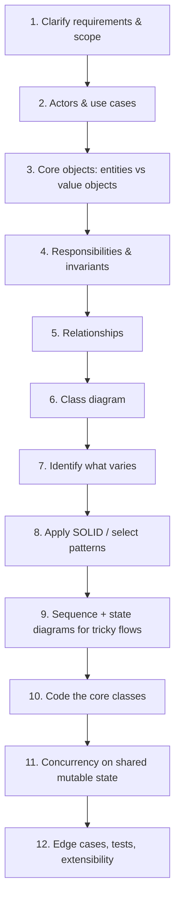

# LLD Interview Approach — the framework to run every case study through

This is the methodology you apply to *every* problem in `01-Case-Studies`.
Internalize this order — it's what turns "design a parking lot" from a
vague prompt into a structured 30-45 minute conversation.

## The end-to-end flow

Steps 4 and 7 are the two most commonly skipped, and they're where the
most marks are. **Invariants** (step 4, see
[`../07-Domain-Modeling/notes.md`](../07-Domain-Modeling/notes.md)) give you
your edge cases and your concurrency discussion for free. **"What varies?"**
(step 7, see
[`../06-Core-Design-Principles/notes.md`](../06-Core-Design-Principles/notes.md))
is what makes pattern selection obvious instead of guessed.

## 1. Clarify requirements (~5 min)

Never start designing off the one-line prompt. Ask questions that narrow
scope — interviewers *expect* this and often grade it explicitly:

- Who are the users/actors?
- What are the **must-have** vs **nice-to-have** features? (Explicitly
  scope out things like payments, multi-location, admin dashboards unless
  asked — say "I'll assume single-location for now, flag me if you want
  multi-location.")
- What's out of scope? (auth, persistence choice, distributed concerns —
  usually out of scope for LLD, in scope for HLD; say so explicitly)
- Any explicit constraints (e.g. "must support 3 vehicle types," "spots can
  be reserved in advance")?

Write down a short **functional requirements list** — this becomes your
checklist for "did I cover everything" at the end.

## 2. Identify actors and use cases (~3-5 min)

Turn requirements into a quick use-case sketch (see
`02-UML-Object-Oriented-Design/notes.md` §3). This catches missing
requirements before you've committed to a class design around the wrong
scope.

## 3. Identify core objects (nouns) and behaviors (verbs)

Extract nouns from the requirements → candidate classes. Extract verbs →
candidate methods. Group attributes with the class they describe. (Full
mechanical steps in `02-UML-Object-Oriented-Design/notes.md` §5.)

## 4-5. Relationships and class diagram

Decide association vs aggregation vs composition vs inheritance for every
pair of related classes (use the "if I delete the container, does the
contained object die too?" test). Draw it — on a whiteboard, in a shared
doc, or just narrate it clearly if there's no drawing surface. **Keep
narrating as you draw** — interviewers grade the reasoning, not just the
final diagram.

## 6. Apply SOLID, reach for patterns *only when they solve something you found*

As you sketch classes, actively look for:
- A `switch`/`if-else` on a type/status field → polymorphism +
  Factory/Strategy/State (pick based on *why* it varies — see the
  comparison tables in each pattern's notes).
- A class doing too many unrelated things → split it (SRP), maybe pull
  orchestration into a Facade.
- A concrete class constructed with `new` deep inside business logic →
  inject an interface instead (DIP).
- Multiple things needing notification on a change → Observer.
- Complex object construction with many optional pieces → Builder.

Say the pattern name **and the specific problem it solves here** — never
just the name. "I'll use Strategy for fee calculation because we have three
interchangeable pricing rules that need to be swappable without touching
`ParkingTicket`" is a strong answer; "I'll use Strategy" alone is not.

Even stronger: add **why you rejected the alternative**. *"Strategy rather
than State, because the pricing rule is chosen once when the ticket is
created — it isn't the ticket changing its own behavior as it moves through
a lifecycle."* That one clause shows you understand both patterns.

And know when to say **no**: *"I could extract a Strategy here, but there's
only one pricing rule in the requirements — I'd keep it a method and pull
the interface out when a second rule appears."* Restraint is a seniority
signal; reflexive abstraction is a mid-level tell. See
[`../03-SOLID-Principles/notes.md`](../03-SOLID-Principles/notes.md) §
"SOLID vs over-engineering".

### Refactoring signals — the fast lookup

Scan your own design (and any code an interviewer hands you) for these.
Each one is a smell with a well-known response:

| What you see | Likely problem | Consider |
|---|---|---|
| A `switch` you'd revisit for each new requirement | OCP | Polymorphism, [Strategy](../04-Design-Patterns/Behavioral/Strategy/notes.md), [Factory](../04-Design-Patterns/Creational/FactoryMethod/notes.md) |
| Repeated `if (status == ...)` across methods | Scattered lifecycle logic | [State](../04-Design-Patterns/Behavioral/State/notes.md) |
| Subclasses differing only by one algorithm | Inheritance used for behavior swap | [Strategy](../04-Design-Patterns/Behavioral/Strategy/notes.md) |
| A constructor with many optional params | Telescoping constructor | [Builder](../04-Design-Patterns/Creational/Builder/notes.md) |
| A class per *combination* of options | Subclass explosion | [Decorator](../04-Design-Patterns/Structural/Decorator/notes.md) |
| Two axes of variation heading to N×M classes | Coupled hierarchies | [Bridge](../04-Design-Patterns/Structural/Bridge/notes.md) |
| Many classes notifying each other directly | Tangled coupling | [Observer](../04-Design-Patterns/Behavioral/Observer/notes.md) or [Mediator](../04-Design-Patterns/Behavioral/Mediator/notes.md) |
| `if (isLeaf)` sprinkled over tree code | Missing uniform abstraction | [Composite](../04-Design-Patterns/Structural/Composite/notes.md) |
| Caller orchestrating 5 services in a fixed order | Leaked complexity | [Facade](../04-Design-Patterns/Structural/Facade/notes.md) |
| `customer.GetX().GetY().GetZ()` | Law of Demeter | Delegate; add a method on `customer` |
| `public List<T> Items { get; set; }` | Leaky encapsulation | Private field + `IReadOnlyList<T>` |
| `new SqlRepository()` inside a service | DIP / untestable | Inject the interface |
| Data-only classes + `XService` holding all logic | [Anemic model](../10-Anti-Patterns/notes.md) | Move behavior onto the entity |
| Important concept as bare `string`/`decimal` | Primitive obsession | Value object ([Money](../07-Domain-Modeling/notes.md)) |
| A class depending on 8 others | Low cohesion / high coupling | Split it (SRP) |
| An interface with one implementation | Speculative generality | Delete it until a second appears |

The last row matters as much as the rest — see
[`../10-Anti-Patterns/notes.md`](../10-Anti-Patterns/notes.md) for the full
set, including the ones you commit while *trying* to look sophisticated.

## 7. Write core class skeletons

Once the diagram is stable, write the actual interfaces/classes for the
2-4 most important pieces (not everything — pick what's central to the
problem, e.g. the spot-assignment logic in Parking Lot, the seat-locking
logic in Movie Ticket Booking). This is where language fluency (C#
`interface`/`abstract class`, access modifiers, generics) matters.

## 8. Edge cases, concurrency, extensibility (~5-10 min, often where seniority is graded)

- **Concurrency**: "what happens if two requests race for the same
  resource?" (two drivers for the last spot, two users booking the last
  seat) → pessimistic locking vs optimistic versioning, where your critical
  section is, and lock granularity. Full treatment in
  [`../08-Concurrency/notes.md`](../08-Concurrency/notes.md) — this is the
  most common senior-level follow-up in the whole interview, so don't wing
  it. Raise it yourself the moment you identify shared mutable state.
- **Extensibility**: "how would this change to support Y?" → your answer
  should be "add a new class implementing an existing interface," not "I'd
  need to rewrite X." If it's the latter, that's a signal to revisit the
  design with OCP in mind.
- **Failure/edge cases**: empty inputs, capacity exhausted, invalid state
  transitions (ties back to State pattern's illegal-transition handling).

## Time budget for a 45-minute interview (rough guide)

| Phase | Time |
|---|---|
| Requirements + use cases | 5-8 min |
| Core classes + relationships (class diagram) | 10-15 min |
| Pattern application + key method code | 10-15 min |
| Edge cases / extensibility / Q&A | 5-10 min |

## Common mistakes that cost points

- **Jumping straight to code** without clarifying requirements or sketching
  relationships — produces a design that solves the wrong problem, or a
  narrower one than intended.
- **Over-engineering**: applying 5 patterns to a problem that needs 2. If
  you can't justify a pattern with a concrete problem it solves *in this
  design*, cut it.
- **Deep inheritance trees** for what should be composition (see
  `01-OOP-Basics/notes.md` §4) — a common tell of under-practiced
  candidates.
- **Public mutable fields / anemic classes with no behavior** — re-read the
  Encapsulation section if this is a habit; interviewers explicitly look
  for behavior-bearing classes, not plain data bags with logic living
  elsewhere.
- **Silence while drawing** — narrate your reasoning continuously; the
  interviewer is grading the thought process, not just the artifact.
- **Not asking about scope** and then running out of time half-designing
  features that weren't required.

## How to practice with this vault

For each case study in `01-Case-Studies`:
1. Read only the **requirements section** first (don't peek at the class
   diagram).
2. Time yourself: 10-15 minutes to produce your own class diagram + pattern
   choices on paper/whiteboard.
3. Compare against the case study's notes — note what you missed, not to
   copy the "answer" but to see which requirement or relationship you
   didn't extract.
4. Only then read the code, to check your method signatures/logic against
   a working reference.
