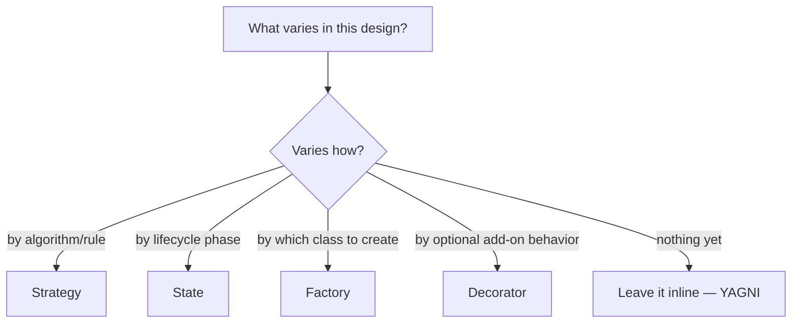
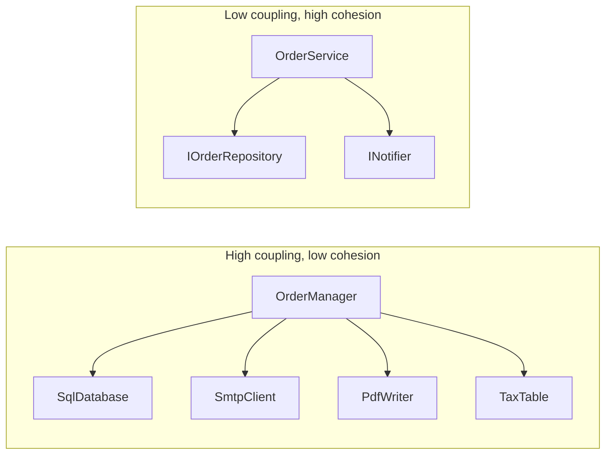

# Core Design Principles (beyond SOLID)

SOLID gets all the attention, but it isn't the whole of object-oriented
design — and several principles here decide more real design arguments
than SOLID does. Most are one-liners you already half-know; the value is
in being able to **name them and apply them under pressure**.

Read this after [`../03-SOLID-Principles/notes.md`](../03-SOLID-Principles/notes.md).

---

## DRY — Don't Repeat Yourself

> Every piece of **knowledge** should have a single, unambiguous
> representation in the system.

The common misreading is "never write similar-looking code twice." DRY is
about **duplicated knowledge**, not duplicated characters. Two methods that
happen to look alike but encode *different rules* that will change for
different reasons should stay separate — merging them creates a coupling
that hurts the moment one rule changes.

```csharp
// NOT a DRY violation — these look identical but encode different rules.
decimal CalculateSalesTax(decimal amount) => amount * 0.18m;
decimal CalculateServiceFee(decimal amount) => amount * 0.18m;
```

If the sales tax changes to 20%, you want exactly one of these to change.

**Interview angle**: when you extract a shared helper, be ready to say
*why* the two callers share a rule, not just that the code looked similar.

---

## KISS — Keep It Simple

Prefer the simplest design that satisfies the **stated** requirements. In
an LLD interview, complexity you can't justify reads as inexperience, not
sophistication.

Concretely: a plain method beats a Strategy interface when there's one
rule; a `List<T>` beats a custom collection class until you need custom
behavior; three classes beat nine when three express the domain.

---

## YAGNI — You Aren't Gonna Need It

Don't build for requirements nobody has asked for. This is the direct
counterweight to over-applying OCP.

```csharp
// YAGNI violation: one implementation, invented "for flexibility."
public interface IParkingSpotIdGenerator { string Next(); }
```

Until a second generator exists, this interface adds a file, an
indirection, and a false signal that the design anticipates variation.

**The nuance interviewers reward**: YAGNI is about *speculative* features,
not about ignoring variation the requirements clearly imply. If the prompt
says "we plan to add monthly passes later," designing a pricing seam now
is good judgment, not YAGNI. Say which one you're doing and why.

---

## Composition over Inheritance

Covered in [`../01-OOP-Basics/notes.md`](../01-OOP-Basics/notes.md) §4, but
it belongs in any principles list. Inheritance binds you to a base class's
implementation permanently and at compile time; composition lets you swap
collaborators at runtime and keeps coupling to an interface.

Use inheritance when there is a **genuine is-a taxonomy with shared
behavior**. Use composition for everything else — which in practice is
most things.

---

## Program to an Interface, Not an Implementation

Depend on the **capability** you need, not the concrete class providing it.

```csharp
// Rigid: locked to List, and to a mutable one at that.
public void Process(List<Order> orders)

// Flexible: any sequence works; signals you only read it.
public void Process(IEnumerable<Order> orders)
```

This also communicates intent: `IEnumerable<T>` says "I will iterate,"
`IReadOnlyList<T>` says "I need count and indexing but won't mutate,"
`ICollection<T>` says "I may add or remove." Choosing the narrowest type
that does the job is a small, constant signal of care that interviewers
notice in method signatures.

---

## Encapsulate What Varies

> Identify the aspects of your application that vary and separate them
> from what stays the same.

This is arguably the **single most useful design heuristic** for LLD
interviews, because it's the question that leads you to the right pattern:



Every pattern in [`../04-Design-Patterns/`](../04-Design-Patterns/README.md)
is essentially a named answer to "this specific thing varies, here's how to
isolate it." Practice asking "what varies?" out loud during case studies —
it's the habit that makes pattern selection feel obvious instead of
memorized.

---

## Tell, Don't Ask

Don't pull an object's state out to make a decision the object should make
itself. Send it a message instead.

```csharp
// Ask — the caller reasons about Order's internals, and this logic gets
// duplicated at every call site.
if (order.Status == OrderStatus.Placed || order.Status == OrderStatus.Paid)
    order.Status = OrderStatus.Cancelled;

// Tell — the Order owns the rule about when cancellation is legal.
order.Cancel();
```

**Why it matters for LLD**: "Ask"-style code produces *anemic* classes —
data bags with no behavior, and all the logic living in service classes.
Interviewers explicitly look for behavior-bearing domain objects. This
principle is also what naturally leads you to the
[State pattern](../04-Design-Patterns/Behavioral/State/notes.md).

---

## Law of Demeter ("don't talk to strangers")

A method should only call methods on: itself, its own fields, its
parameters, and objects it creates. **Not** on objects returned by other
objects.

```csharp
// Violation — this line knows about Account, Wallet, AND Balance.
// Any of those three changing breaks it. Called a "train wreck."
decimal balance = customer.GetAccount().GetWallet().GetBalance();

// Better — ask the customer, let it delegate internally.
decimal balance = customer.GetAvailableBalance();
```

**Nuance worth stating**: this applies to **behavior**, not to fluent
builders (`new PizzaBuilder().WithSize().AddTopping().Build()`) or LINQ
chains (`orders.Where().Select().ToList()`), which return the same
conceptual object or a new value each step. Don't "fix" those.

---

## High Cohesion, Low Coupling

The two properties every other principle is ultimately serving.

- **Cohesion** (want it *high*): how strongly the things inside one class
  belong together. A `Ticket` holding issue time, spot, and vehicle is
  cohesive. A `Utils` class holding date formatting, tax math, and email
  validation is not.
- **Coupling** (want it *low*): how much one class depends on another's
  details. Depending on an interface = low. Depending on a concrete class's
  fields and call order = high.



If you can only remember one framing: **SRP raises cohesion; DIP lowers
coupling.** Everything else is a variation on those two.

---

## Fail Fast

Validate inputs and reject invalid states at the boundary, immediately,
rather than letting a bad value propagate and surface as a confusing error
three layers away.

```csharp
public BankAccount(decimal openingBalance)
{
    if (openingBalance < 0)
        throw new ArgumentException("Opening balance cannot be negative.");
    ...
}
```

This connects directly to **invariants** — see
[`../07-Domain-Modeling/notes.md`](../07-Domain-Modeling/notes.md).

---

## Principle conflicts (the mature answer)

These principles **contradict each other**, on purpose:

| Tension | How to resolve |
|---|---|
| DRY vs KISS | Extracting a shared abstraction can be more complex than a little duplication. Duplicate twice, extract on the third. |
| OCP vs YAGNI | Add the seam when you have a concrete second case or a stated plan — not "just in case." |
| SRP vs KISS | Splitting into many tiny classes can obscure a simple flow. Split along *reasons to change*, not line count. |
| Encapsulation vs testability | Don't make things public "for tests." Test through the public API, or reconsider the design. |

Saying *"these pull against each other and here's how I'd trade off in
this case"* is a senior-level answer. Reciting all of them as absolute
rules is not.

---

## Interview variations

- "What principles besides SOLID do you follow?" — DRY, KISS, YAGNI,
  composition over inheritance, Tell-Don't-Ask, Law of Demeter.
- "Is this duplication a DRY violation?" — depends whether the two copies
  encode the *same knowledge* and will change together.
- "Would you add an interface here?" — YAGNI check; one implementation and
  no stated second → no, and say when you *would*.
- "This class has 12 methods — is that bad?" — cohesion question, not a
  count question. Do they belong to one responsibility?
- "How would you decide between two designs?" — coupling and cohesion,
  plus which one absorbs the likely next requirement.
