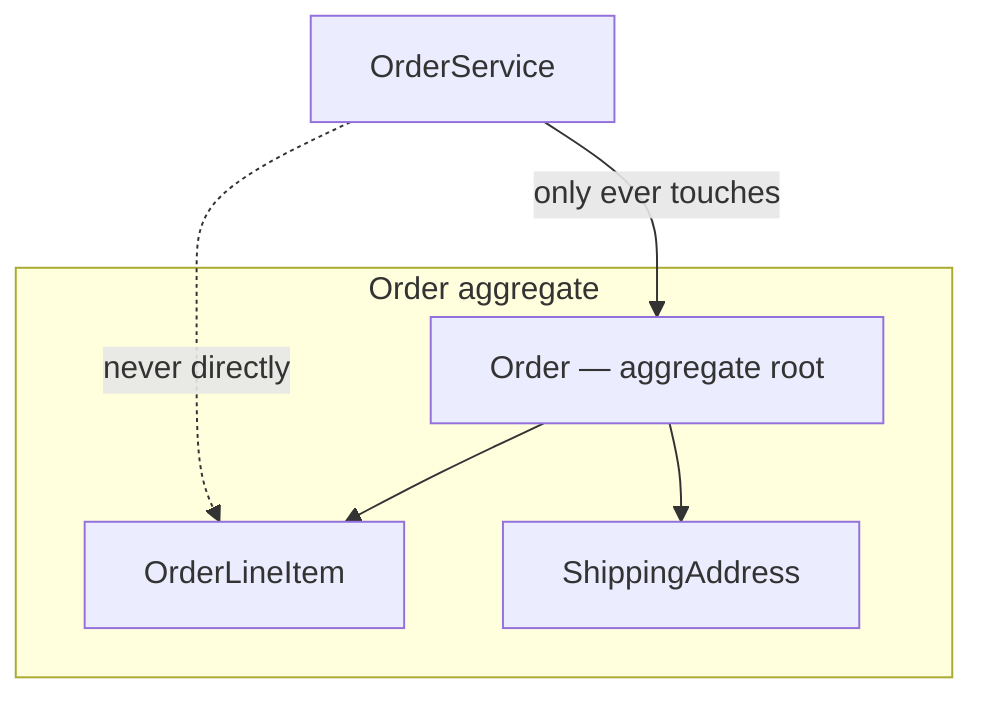
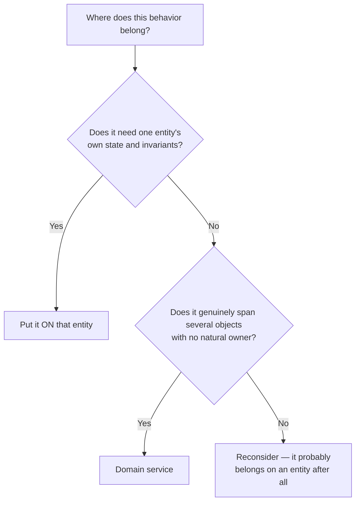
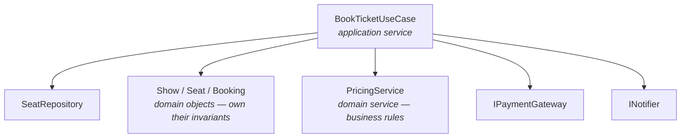

# Domain Modeling

The vocabulary for **what kind of thing each class in your design is**.
LLD interviews rarely ask "what's an aggregate root?" directly — but
candidates who think in these terms produce visibly better class diagrams,
because the terms force you to answer questions you'd otherwise skip:
*does this thing have identity? who's allowed to change it? what must
always be true about it?*

The **invariants** section is the highest-value part of this page.

> ⚠️ **These are modeling tools, not mandatory boxes to fill.** Not every
> design needs an aggregate root, a repository, and a domain service. A
> Parking Lot design may need only entities, two or three value objects,
> and a clear set of invariants — that's a complete answer. Introducing
> DDD vocabulary because the terminology exists is the same
> over-engineering failure that
> [`../06-Core-Design-Principles/notes.md`](../06-Core-Design-Principles/notes.md)
> warns about with interfaces. Reach for each concept when the domain
> actually presents the problem it solves.

---

## Entity vs Value Object ⭐

The first modeling decision for every class you draw.

| | Entity | Value Object |
|---|---|---|
| Identity | Has an **ID**; two entities with identical fields are still different things | Defined **entirely by its values**; two with equal values are interchangeable |
| Mutability | Usually mutable — state changes over its lifetime | Should be **immutable** — "change" means creating a new one |
| Equality | Compare by ID | Compare by all fields |
| Examples | `User`, `Order`, `ParkingTicket`, `Vehicle` | `Money`, `Address`, `DateRange`, `Coordinates`, `LicensePlate` |

```csharp
// Entity: identity survives field changes. Still user #123 after a rename.
public class User
{
    public Guid Id { get; }
    public string Name { get; private set; }
    public void Rename(string name) => Name = name;
}

// Value object: C# records give you value equality + immutability free.
public record Money(decimal Amount, string Currency);

var a = new Money(100, "INR");
var b = new Money(100, "INR");
Console.WriteLine(a == b); // True — same value, therefore the same thing
```

**Why this earns points**: most candidates model *everything* as an entity
with an ID, ending up with `decimal amount` and `string currency` floating
as loose primitives on ten classes. Pulling out a `Money` value object
lets you put currency-mismatch rules and rounding in one place. That's
the "primitive obsession" fix, and it comes up in Splitwise, Amazon
Shopping, ATM, and every payment-touching case study.

**C# note**: `record` is the natural fit for value objects — value-based
`Equals`/`GetHashCode`, `with`-expressions for derived copies, and
immutability by default. Use a `class` for entities, where reference
identity is what you want.

---

## Aggregate and Aggregate Root

An **aggregate** is a cluster of objects treated as one unit for changes.
The **aggregate root** is the single entry point — outside code holds a
reference to the root only, never to the internals.



```csharp
public class Order
{
    private readonly List<OrderLineItem> _items = new();

    // Expose a READ-ONLY view. Callers can look, not mutate.
    public IReadOnlyList<OrderLineItem> Items => _items;

    // All changes go through the root, which can enforce rules
    // (max items, no duplicates, recalculate totals, reject if shipped).
    public void AddItem(string sku, int qty)
    {
        if (_items.Count >= 50)
            throw new InvalidOperationException("Order item limit reached.");
        _items.Add(new OrderLineItem(sku, qty));
    }
}
```

**The common interview mistake this prevents**: exposing
`public List<OrderLineItem> Items { get; set; }`. Any caller can then
`order.Items.Add(...)` or `.Clear()`, bypassing every rule the `Order`
class was supposed to guarantee. Returning `IReadOnlyList<T>` over a
private list is the fix, and it's a small detail interviewers notice.

---

## Invariants ⭐ (the highest-value idea on this page)

An **invariant** is something that must be true about an object **at all
times** — before and after every operation.

Examples from the case studies ahead:

| Class | Invariant |
|---|---|
| `ParkingSpot` | Cannot be occupied by two vehicles at once |
| `BankAccount` | Balance never goes negative |
| `Seat` | Cannot be booked by two customers |
| `Order` | Cannot transition Placed → Delivered directly |
| `Money` | Cannot add amounts of different currencies |
| `Elevator` | Doors cannot open while moving |

**Why interviewers care**: naming invariants is what separates "I drew
some classes" from "I designed a system that can't be corrupted." It also
hands you your edge cases, your validation logic, your state machine, and
your concurrency discussion for free — a race condition is precisely
*"two threads together break an invariant that neither breaks alone."*

**How to apply it**, in three steps:
1. For each core class, ask: *"what must always be true here?"*
2. Ask: *"can a caller break it?"* — if yes, the class is under-encapsulated.
3. Move the rule **inside** the class so it's enforced structurally, not by
   convention or caller discipline.

```csharp
public class ParkingSpot
{
    private Vehicle? _occupant;
    public bool IsFree => _occupant is null;

    // The invariant is enforced here, once. No caller can double-book,
    // and no caller has to remember to check first.
    public void Assign(Vehicle vehicle)
    {
        if (_occupant is not null)
            throw new InvalidOperationException($"Spot already occupied.");
        _occupant = vehicle;
    }
}
```

Say this out loud in an interview: *"the invariant is that a spot holds at
most one vehicle, so `Assign` checks and throws rather than exposing a
settable `Occupant` property."* That single sentence demonstrates
encapsulation, fail-fast, and invariant thinking at once.

---

## Two value objects worth knowing cold

These two show up in more case studies than anything else on this page, and
getting them wrong is the most common source of "primitive obsession."

### Money

Never model money as a bare `decimal` plus a stray `string currency`. That
scatters currency rules across every class that touches a price.

```csharp
public readonly record struct Money(decimal Amount, string Currency)
{
    public static Money operator +(Money a, Money b)
    {
        // The invariant lives here, once, instead of being forgotten
        // at every call site.
        if (a.Currency != b.Currency)
            throw new InvalidOperationException(
                $"Cannot add {a.Currency} to {b.Currency}.");

        return a with { Amount = a.Amount + b.Amount };
    }
}
```

Points interviewers probe:
- **Use `decimal`, never `double`.** Binary floating point can't represent
  0.1 exactly; money arithmetic drifts. Saying this unprompted is a cheap,
  reliable signal.
- **Mixed currencies must be rejected**, not silently added.
- **Rounding**: splitting ₹100 three ways gives 33.33 × 3 = 99.99. Where
  does the missing paisa go? Some rule must exist and be deliberate —
  this is *the* central problem in Splitwise.

Pays off in Splitwise, Amazon Shopping, Restaurant, Hotel, Airline,
Brokerage, ATM, and Parking Lot.

### Dates, times, and durations

```csharp
public readonly record struct DateRange(DateOnly Start, DateOnly End)
{
    public bool Overlaps(DateRange other) =>
        Start < other.End && other.Start < End; // half-open [Start, End)
}
```

Points worth knowing:
- **Pick the narrowest type**: `DateOnly` for a calendar date, `TimeOnly`
  for a wall-clock time, `DateTimeOffset` when an absolute instant matters,
  `TimeSpan` for a duration. Reaching for `DateTime` for everything is a
  small but visible imprecision.
- **Half-open ranges `[start, end)`** make adjacency clean: a 10:00–11:00
  meeting and an 11:00–12:00 meeting **do not** overlap. Decide this
  explicitly — it's the entire correctness question in Meeting Scheduler.
- **Never call `DateTime.Now` inside business logic.** Inject an `IClock`;
  otherwise late fees, expiry, and overdue rules are untestable. See
  [`../09-Testing/notes.md`](../09-Testing/notes.md).

Pays off in Library Management, Meeting Scheduler, Hotel, Car Rental,
Airline, and Movie Booking.

## Domain Service

Behavior that doesn't naturally belong to any single entity. When an
operation involves several entities and picking one to own it feels
arbitrary, it belongs in a service.

```csharp
// Which entity should own this? Not Rider, not Driver — a service.
public class FareCalculator
{
    public Money Calculate(Trip trip, ISurgePolicy surge) { ... }
}
```

**Caution**: services are where anemic designs come from. Before creating
one, check whether the behavior really belongs on an entity
(Tell-Don't-Ask). A design that's all `XService` classes and property-bag
entities is the classic anti-pattern interviewers probe for.

**The decision rule**:



`order.Cancel()` belongs on `Order` — it needs the order's own state and
enforces its own invariant. `FareCalculator.Calculate(trip, surgePolicy)`
is a genuine service — it spans a trip, a pricing policy, and rules that
belong to neither.

---

## Application Service — orchestration vs domain logic ⭐

A **domain service** holds business *rules* that span entities. An
**application service** (a.k.a. use case) holds *orchestration*: the
sequence of steps a single user action requires. They're different jobs
and mixing them is the most common structural mistake in case studies.



```csharp
public class BookTicketUseCase                 // application service
{
    public BookingResult Execute(BookingRequest request)
    {
        var show = _showRepository.FindById(request.ShowId);

        // The DOMAIN decides whether this is legal and enforces it.
        // The use case never inspects seat.Status and reasons about it.
        if (!show.TryHoldSeats(request.SeatIds, request.UserId))
            return BookingResult.SeatsUnavailable();

        Money total = _pricing.Calculate(show, request.SeatIds); // domain service

        if (!_payments.Charge(request.UserId, total))
        {
            show.ReleaseHold(request.SeatIds, request.UserId);   // compensate
            return BookingResult.PaymentFailed();
        }

        var booking = show.ConfirmBooking(request.SeatIds, request.UserId);
        _bookingRepository.Save(booking);
        _notifier.BookingConfirmed(booking);                     // orchestration
        return BookingResult.Success(booking);
    }
}
```

**The rule of thumb**: the application service contains *no business
decisions* — only sequencing, delegation, and translating results. Every
"is this allowed?" question is answered inside a domain object. If your
use case is full of `if (seat.Status == ...)`, the rule has leaked out of
the domain and you're heading for an
[anemic model](../10-Anti-Patterns/notes.md).

| | Domain Service | Application Service |
|---|---|---|
| Contains | Business rules spanning entities | Step sequencing for one use case |
| Example | `PricingService`, `FareCalculator` | `BookTicketUseCase`, `CheckoutOrder` |
| Talks to repositories/gateways? | No | Yes — that's its job |
| Would it change if we swapped the UI or database? | No | Possibly |

Note this is also what a [Facade](../04-Design-Patterns/Structural/Facade/notes.md)
often turns out to be in practice — one entry point that sequences a
subsystem without owning its rules.

## Repository

An abstraction over persistence: to the domain, it looks like an
in-memory collection.

```csharp
public interface ITicketRepository
{
    Ticket? FindById(string id);
    void Save(Ticket ticket);
}
```

Two implementations — `SqlTicketRepository` for production,
`InMemoryTicketRepository` for tests — is the concrete payoff, and it's
exactly DIP from [`../03-SOLID-Principles/notes.md`](../03-SOLID-Principles/notes.md).

**Scoping note for interviews**: persistence is usually *out of scope* for
LLD. Define the repository **interface** to show you know where the seam
goes, implement an in-memory version so your code runs, and say "a SQL
implementation would go here" — don't spend interview minutes on schemas.

---

## Putting it together: how to read a prompt

For "design a parking lot":

| Question | Answer |
|---|---|
| Entities? | `ParkingLot`, `ParkingFloor`, `ParkingSpot`, `Vehicle`, `Ticket` |
| Value objects? | `Money` (fee), `LicensePlate`, `TimeRange` (duration) |
| Aggregate roots? | `ParkingLot` (owns floors → spots), `Ticket` |
| Invariants? | A spot holds ≤ 1 vehicle; a ticket has one issue time and at most one exit time; fee ≥ 0 |
| Domain services? | `FeeCalculator` (spans ticket + pricing rules) |
| Application services? | `ParkVehicleUseCase`, `ExitAndPayUseCase` |
| Repositories? | `ITicketRepository` — interface only, in-memory impl |

Running these questions over any prompt gives you a class diagram skeleton
in about three minutes, and it's far more systematic than "extract the
nouns." Remember the warning at the top: a small design may legitimately
answer "none" to aggregates, domain services, or repositories.

---

## Interview variations

- "Is `Money` an entity or a value object? Why?" — value object; two
  ₹100 notes are interchangeable, so identity is meaningless.
- "How do you stop callers from corrupting an `Order`'s line items?" —
  private list, `IReadOnlyList<T>` accessor, mutation through the root.
- "What must always be true about this class?" — invariants, verbatim.
- "Where does fee calculation live — on `Ticket` or elsewhere?" — either
  is defensible; justify with cohesion. A domain service is right when it
  needs data from several entities plus a policy.
- "Would you add a database here?" — define the repository interface,
  declare persistence out of scope.
