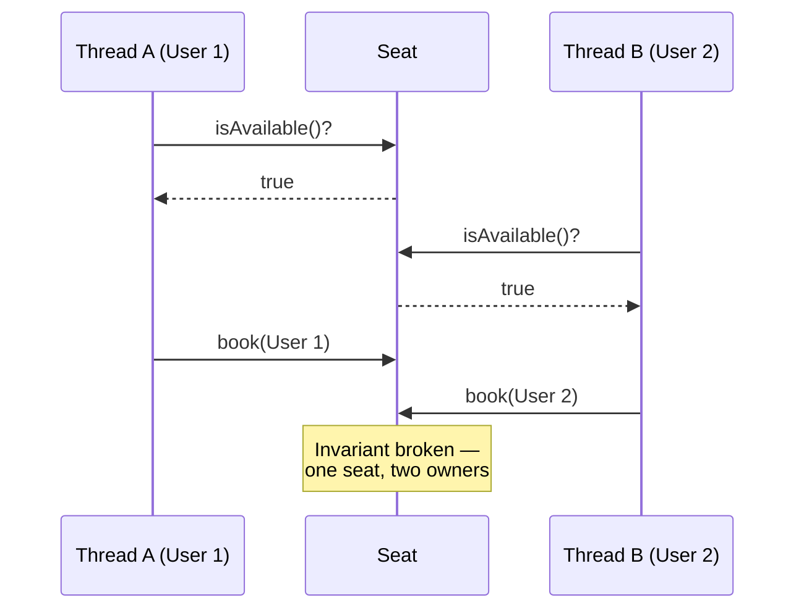
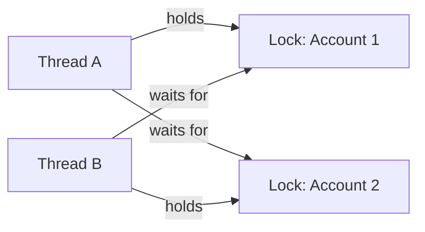
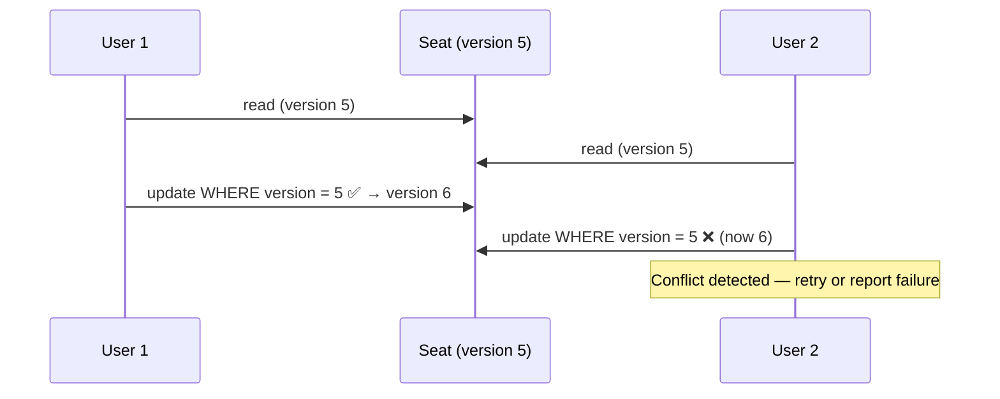
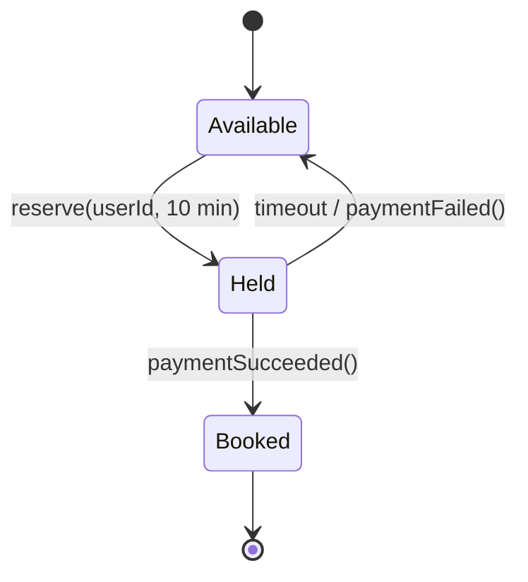

# Concurrency for LLD Interviews

You do **not** need to be a concurrency expert. You need to handle this
exchange confidently, because it's the single most common senior-level
follow-up in an LLD interview:

> *"Two users try to book the last seat at the same time. What happens?"*

That question appears in Movie Booking, Parking Lot, ATM, Amazon Locker,
Cab Booking, Hotel, Airline — nearly every case study. This page covers
exactly enough to answer it well, and no more.

> **How to read this chapter.** Every section is self-contained: the broken
> version, the fix, and the command to run both. One file backs the whole
> page — [`csharp/ConcurrencyExamples.cs`](csharp/ConcurrencyExamples.cs),
> runnable with `dotnet run --project Runner concurrency`.
>
> ⚠️ **Do the Try-it prompts here more than anywhere else in the vault** —
> but expect the opposite of what you'd guess. The races in this chapter
> mostly *don't* reproduce on a single run; the broken seat below survives
> ~97% of 1,000-thread trials looking perfectly correct. That's precisely
> what makes concurrency bugs dangerous, and why a passing test is not
> evidence of safety. These examples have already shipped two real bugs that
> passing tests hid.

---

## 1. Race condition — the thing you must be able to explain

A race condition is two threads interleaving such that they **together
break an invariant** neither would break alone.



The bug is that **check and act are two separate steps**, and another
thread can slip between them. This is called a *check-then-act* race, and
naming it that way in an interview is worth doing.

```csharp
// BROKEN under concurrency
if (seat.IsAvailable)      // ← Thread B can run between these
    seat.Book(userId);     // ← two lines
```

Note this is the same shape as the naive
[Singleton](../04-Design-Patterns/Creational/Singleton/notes.md)
(`if (_instance == null) _instance = new(...)`) and the naive lazy
[Proxy](../04-Design-Patterns/Structural/Proxy/notes.md) — once you
recognize check-then-act, you spot it everywhere.

📄 `UnsafeSeat` in [`csharp/ConcurrencyExamples.cs`](csharp/ConcurrencyExamples.cs) · `dotnet run --project Runner concurrency`

> **Try it — and note how hard the bug is to catch.** The demo runs the
> 1,000-thread booking **200 times** and reports how many of those trials
> handed the seat to more than one user. Measured on this machine, that's
> typically **only ~5 trials out of 200 — around 2–3%** (your number will
> vary with core count and load).
>
> Run it once and it almost certainly looks fine. The first thread sets
> `_bookedBy` within nanoseconds, so the check-then-act window is tiny — but
> it is real, and at production scale "1 in 100" is a double-booked seat every
> few minutes.
>
> Two things follow, and both are worth saying in an interview:
> 1. **A green test proves nothing about a race.** You cannot conclude
>    "no race" from a passing run; you can only conclude "didn't hit it."
> 2. **A varying winner is not evidence of the bug.** The owner changes from
>    run to run even when only one thread ever passed the check — that's just
>    scheduling. You have to count how many threads *believed* they won, which
>    is why the demo does exactly that.

---

## 2. Critical section and mutual exclusion

The **critical section** is the code that must not run concurrently — here,
the check *and* the act, together, as one indivisible unit.

```csharp
private readonly object _lock = new();

public bool TryBook(string userId)
{
    lock (_lock)                 // only one thread inside at a time
    {
        if (_bookedBy is not null)
            return false;
        _bookedBy = userId;
        return true;
    }
}
```

Key points to state out loud:
- The check and the mutation are **inside the same lock**. Locking only the
  mutation fixes nothing.
- The method returns `bool` rather than exposing `IsAvailable` for callers
  to check first — **the atomic operation is the API**. If callers can
  still ask "is it free?" and then act, you've handed them the race back.
  This is Tell-Don't-Ask applied to concurrency.

In the code, `SafeSeat` has no public `IsAvailable` at all — only `TryBook`,
`Release`, and a `BookedBy` that reads under the lock. The absence is
deliberate design, not an oversight.

📄 `SafeSeat` in [`csharp/ConcurrencyExamples.cs`](csharp/ConcurrencyExamples.cs)

> **Try it:** add `public bool IsAvailable => _bookedBy is null;` to
> `SafeSeat` and use it check-then-act style from the demo. You've
> reintroduced the exact bug, on a class whose internals are still perfectly
> locked. Locking the state doesn't save you if the API invites callers to
> race — **the atomic operation has to be the public method.**

---

## 3. Lock granularity — the follow-up question

> *"You locked the whole theatre. Doesn't that serialize every booking?"*

Yes. Granularity is the trade-off:

| Granularity | Correctness | Throughput |
|---|---|---|
| One global lock | Easy to get right | Poor — every booking waits on every other |
| Per-show / per-screen lock | Still manageable | Much better — independent shows don't block |
| Per-seat lock | Maximum parallelism | Deadlock risk when booking multiple seats |

**The good answer**: lock at the granularity of the invariant you're
protecting. The invariant is "one seat, one owner," so a per-show lock
(or per-seat with an ordering rule) is right; a global lock is
correct-but-slow, and worth saying you'd start there and refine.

---

## 4. Deadlock and lock ordering

Two threads each hold a lock the other needs, and neither can proceed.



**The precondition is what people get wrong**: deadlock requires a thread
to hold **several locks simultaneously**. If every operation takes one
lock and releases it before taking the next, deadlock is impossible — and
so lock ordering buys you nothing there. Know this, because "just order
your locks" applied to code that never holds two at once is a confident
non-answer.

The classic case that *does* qualify is a transfer between two accounts,
which must hold both locks to be atomic:

```csharp
// DEADLOCK-PRONE: locks in argument order.
// Transfer(A, B) on one thread and Transfer(B, A) on another can hang.
lock (from.Lock) { lock (to.Lock) { ... } }

// SAFE: still holds both simultaneously, but always acquires them in a
// globally consistent order, so no wait cycle can form.
var (first, second) = string.CompareOrdinal(from.Id, to.Id) < 0
    ? (from, to) : (to, from);
lock (first.Lock) { lock (second.Lock) { ... } }
```

Both versions are in
[`ConcurrencyExamples.cs`](csharp/ConcurrencyExamples.cs) (`LockOrdering`),
as `TransferDeadlockProne` and `Transfer`.

> **Try it — this one actually hangs, which is the point.** In
> `ConcurrencyDemo.Run()`, swap `LockOrdering.Transfer` for
> `LockOrdering.TransferDeadlockProne`. The demo runs 2,000 transfers in
> opposing directions and will freeze, usually within the first few. Kill it
> with `Ctrl+C`, then switch back and watch the ordered version complete and
> conserve the total balance.
>
> A hang is a *good* failure mode to have seen once — it looks nothing like a
> crash or a wrong number, which is why deadlock in production is so often
> first reported as "the service just stopped responding."

### Multi-resource booking without simultaneous locks

Booking several seats is a *different* problem, because each seat is
claimed under its own lock, one at a time. There's no deadlock risk —
but there's also no atomicity. If seat 3 is taken, you must **give back**
seats 1 and 2 you already claimed:

```csharp
foreach (var seat in ordered)
{
    if (seat.TryBook(userId)) { acquired.Add(seat); continue; }
    foreach (var taken in acquired) taken.Release(userId);  // compensate
    return false;
}
```

**Be precise about what this is**: a *compensating transaction*, not an
atomic one. It restores the correct end state, but another thread can
still observe the intermediate state where you briefly held seats 1 and 2.
Saying that distinction out loud is a strong senior signal — and it's
exactly why real systems use the Held-with-timeout model in §6 or a
database transaction instead.

📄 `SeatBooking.TryBookAll` in [`csharp/ConcurrencyExamples.cs`](csharp/ConcurrencyExamples.cs)

> **Try it:** replace the `taken.Release(userId)` line with a
> `Console.WriteLine($"Rolling back {taken.Id}")`. Every test that checks
> "did `TryBookAll` return false?" still passes — but the caller now silently
> owns seats it was told it didn't get.
>
> This is not hypothetical: **that was a real bug in this file**, and the
> original test missed it because it only ever failed on the *first* seat, so
> the rollback path never ran. `Release` also refuses to free a seat owned by
> someone else — try weakening that check and you get a worse bug than the one
> rollback was added to fix. Rollback paths need tests that actually reach
> them.

---

## 5. Optimistic vs Pessimistic concurrency ⭐

The framing interviewers most want to hear.

### Pessimistic — "assume conflict, lock first"

Take the lock (or a DB row lock) before reading; hold it until done.

- ✅ Simple, no retries, conflict impossible.
- ❌ Blocks other threads; doesn't scale across processes without a
  distributed lock; risk of deadlock.
- **Fits**: high contention, short critical sections, single process.

### Optimistic — "assume no conflict, verify at write time"

Read freely with a version number; on write, verify the version hasn't
changed. If it has, the write fails and you retry.



- ✅ No blocking; works naturally across processes/services; no deadlocks.
- ❌ Wasted work on conflict; caller must handle retry.
- **Fits**: low contention, distributed systems, long "think time" between
  read and write.

**The one-liner**: *pessimistic prevents conflicts, optimistic detects
them.* Choose by expected contention.

### Implementing it correctly

The code has **two** versioned classes, and the difference between them is
the actual lesson.

`VersionedSeat` is the simple one — separate `_version` and `_bookedBy`
fields:

```csharp
public bool TryBook(string userId, int expectedVersion)
{
    // (a) optimistic check — did anything change since we read?
    if (Volatile.Read(ref _version) != expectedVersion)
        return false;

    // (b) domain invariant — exactly one thread can flip null -> userId.
    //     MUST be a CAS. Writing `if (_bookedBy is null) _bookedBy = ...`
    //     reintroduces check-then-act between (a) and (b).
    if (Interlocked.CompareExchange(ref _bookedBy, userId, null) is not null)
        return false;

    Interlocked.Increment(ref _version);
    return true;
}
```

This is correct **only because a seat goes unbooked → booked exactly once**,
so the CAS on `_bookedBy` is itself what picks the winner. The version check
and the state change are *not* one atomic step. Add a second mutable field —
price, status, cancellation — and the shape breaks: there's a window between
checking the version and writing, where someone else can commit. That's a
lost update, the exact bug OCC exists to prevent.

Knowing *why the simple version happens to work* — and exactly when it stops
working — is a much stronger answer than reciting the general solution.

The general fix is to put **all mutable state in one immutable object**
and swap the whole reference atomically:

```csharp
public sealed record SeatState(string? BookedBy, decimal Price, int Version);

// One atomic swap of the ENTIRE state — no window, no torn reads.
return ReferenceEquals(
    Interlocked.CompareExchange(ref _state, next, expected), expected);
```

This is the in-memory equivalent of:

```sql
UPDATE seats SET ... , version = version + 1
WHERE id = @id AND version = @expectedVersion   -- 0 rows affected = conflict
```

Callers wrap it in a **retry loop**: re-read, recompute, try again. Note
you should only retry on a *concurrency* conflict — if the seat is
genuinely already booked, retrying can't help and you should fail fast:

```csharp
for (int attempt = 0; attempt < maxAttempts; attempt++)
{
    SeatState current = Current;

    if (current.BookedBy is not null)
        return false;   // domain rule: retrying cannot help. Fail fast.

    var next = current with { BookedBy = userId, Version = current.Version + 1 };

    if (TryUpdate(current, next))
        return true;
                        // lost the race: re-read and recompute
}
```

📄 `VersionedSeat` and `VersionedSeatState` in [`csharp/ConcurrencyExamples.cs`](csharp/ConcurrencyExamples.cs)

> **Try it:** add a `Price` to `VersionedSeat` and a `TryChangePrice` that
> bumps `_version`. Now run price changes and bookings concurrently and check
> whether a booking can commit against a version that changed between its
> check and its CAS. Then do the same on `VersionedSeatState`, where the whole
> state swaps in one `CompareExchange`, and watch the problem not exist.
>
> Second one, quicker: delete the `if (current.BookedBy is not null)` fail-fast
> above. The retry loop now spins `maxAttempts` times on a seat that will never
> become free. Distinguishing "conflict, retry" from "denied, stop" is a
> correctness *and* a performance point.

---

## 6. Seat/resource locking with a timeout — the real-world answer

Booking flows (BookMyShow, IRCTC) don't hold a lock while the user types
card details. They use a **temporary reservation with expiry**:



Bringing this up unprompted in Movie Ticket Booking is one of the
highest-value moves available in that interview — it shows you're thinking
about a real product, not a toy. Note it's a **State machine** plus a
timeout, connecting straight back to
[the State pattern](../04-Design-Patterns/Behavioral/State/notes.md).

---

## 7. C# toolkit — just enough

| Tool | Use for |
|---|---|
| `lock (obj) { }` | The default. Syntactic sugar over `Monitor.Enter/Exit`. |
| `Interlocked.Increment/CompareExchange` | Lock-free atomic ops on a single variable (counters, ID generation) |
| `ConcurrentDictionary<K,V>` | Thread-safe map; `GetOrAdd` / `TryAdd` are atomic |
| `ConcurrentQueue<T>` / `ConcurrentBag<T>` | Thread-safe producer/consumer collections |
| `SemaphoreSlim` | Allow N concurrent holders, not just one; has an async-friendly `WaitAsync` |
| `ReaderWriterLockSlim` | Many concurrent readers, exclusive writer — good for read-heavy caches |
| `Lazy<T>` | Thread-safe lazy initialization (the clean Singleton/Proxy fix) |

Rules of thumb worth saying:
- **Never lock on `this` or on a public object** — external code could lock
  the same reference and deadlock you. Use a `private readonly object`.
- **`lock` doesn't work with `await`** inside it — it's a compile error.
  Use `SemaphoreSlim.WaitAsync` for async critical sections.
- **A concurrent collection makes individual operations atomic, not your
  compound logic.** `if (!dict.ContainsKey(k)) dict.Add(k, v)` is still a
  race; `dict.TryAdd(k, v)` is not.

That last rule has both versions in the code:

```csharp
// WRONG: check-then-act, even though the collection IS thread-safe.
public void RegisterUnsafe(string id, string owner)
{
    if (!_tickets.ContainsKey(id))
        _tickets[id] = owner;
}

// RIGHT: one atomic operation the collection guarantees for you.
public bool Register(string id, string owner) => _tickets.TryAdd(id, owner);
```

📄 `TicketRegistry` in [`csharp/ConcurrencyExamples.cs`](csharp/ConcurrencyExamples.cs)

> **Try it:** the demo registers the same ticket id from 500 threads and
> reports exactly one winner. Now switch it to `RegisterUnsafe` — and notice
> the failure is *invisible*: you still end up with one entry, because the
> losers silently overwrote each other. It can't even tell you a winner.
>
> A race that produces a plausible-looking result is far more dangerous than
> one that crashes, and "thread-safe collection" is the phrase that most often
> lulls people into it.

---

## 8. How to raise this in an interview

Don't bolt concurrency on at the end. The natural moment is right after
you've identified a **shared mutable resource**:

> "`ParkingSpot` is shared mutable state, so `assign` needs to be atomic —
> otherwise two entry gates could hand out the same spot. I'd make the
> check-and-assign a single locked operation and return a bool rather than
> exposing an `IsFree` property for callers to check first."

Two sentences, and you've demonstrated race awareness, critical sections,
and API design together.

**Scope control**: if the interviewer says "assume single-threaded," take
it and move on — but say you noticed. Recognizing a shared-state hazard and
correctly scoping it out is still a win.

---

## Recap — the code, and what each class is evidence of

Everything on this page lives in one file:
[`csharp/ConcurrencyExamples.cs`](csharp/ConcurrencyExamples.cs), run with
`dotnet run --project Runner concurrency`.

| § | Class | The claim it demonstrates |
|---|---|---|
| 1 | `UnsafeSeat` | Check-then-act loses the seat under contention — and *only* under contention |
| 2 | `SafeSeat` | The atomic operation is the API; there is deliberately no public `IsAvailable` |
| 4 | `SeatBooking` | Compensating rollback restores the end state, but not atomicity |
| 4 | `LockOrdering` | Deadlock needs two locks held at once; consistent ordering removes the cycle |
| 5 | `VersionedSeat` | A one-shot claim can get away with separate version/state fields |
| 5 | `VersionedSeatState` | The general fix: all mutable state in one record, swapped by a single CAS |
| 7 | `TicketRegistry` | A thread-safe collection makes operations atomic, not your compound logic |

Tests are in
[`Tests/LLD.Foundations.Tests/ConcurrencyTests.cs`](../../Tests/LLD.Foundations.Tests/ConcurrencyTests.cs)
— worth reading for the comment on `TryBookAll_ReleasesSeatsAlreadyTaken`,
which documents a real bug this file shipped and the reason the original test
failed to catch it.

**Before moving on**, check you can answer without looking: where exactly is
the critical section in `SafeSeat`, and why does `VersionedSeat` get away with
something `VersionedSeatState` has to do properly?

---

## Interview variations

- "Two users book the last seat simultaneously — walk me through it."
- "Where exactly is your critical section?"
- "Optimistic or pessimistic locking here, and why?"
- "Your lock serializes everything — how would you improve throughput?"
- "How do you avoid deadlock when booking multiple seats?" → lock ordering.
- "Is your Singleton thread-safe?" → `Lazy<T>` / double-checked locking;
  see [Singleton](../04-Design-Patterns/Creational/Singleton/notes.md).
- "What if the system runs on multiple servers?" → in-process `lock` no
  longer helps; you need DB-level constraints (unique index, `SELECT ... FOR
  UPDATE`), optimistic versioning, or a distributed lock. Naming that
  boundary — where LLD ends and HLD begins — is itself a good answer.
